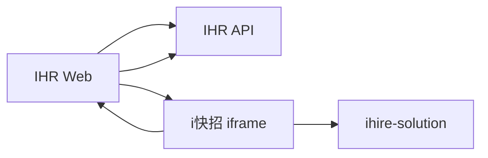
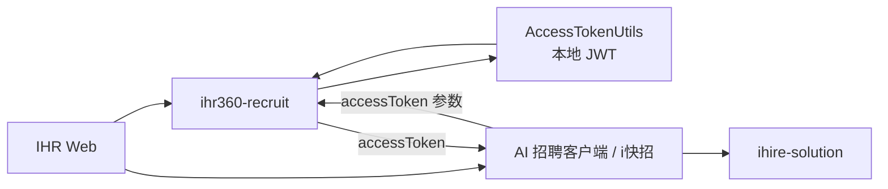

# sprint_1622 接口变动与字段级契约

日期：2026-05-11

## 1. 设计来源

- 需求范围：[`01-scope.md`](/Users/zhangziheng/workspace/iterations/ai-recruit-sso/docs/sprint_1622/01-scope.md)
- 范围澄清：[`02-backend-scope.md`](/Users/zhangziheng/workspace/iterations/ai-recruit-sso/docs/sprint_1622/02-backend-scope.md)
- 方案设计：[`03-solution-design.md`](/Users/zhangziheng/workspace/iterations/ai-recruit-sso/docs/sprint_1622/03-solution-design.md)
- 表字段设计：[`06-db-design.md`](/Users/zhangziheng/workspace/iterations/ai-recruit-sso/docs/sprint_1622/06-db-design.md)
- 设计评审总览：[`08-design-review.md`](/Users/zhangziheng/workspace/iterations/ai-recruit-sso/docs/sprint_1622/08-design-review.md)
- 旧 iframe 基线：[`00-current-state.md`](/Users/zhangziheng/workspace/iterations/ai-recruit-sso/docs/00-current-state.md)

代码参考：

- [`SsoController.java`](/Users/zhangziheng/workspace/iterations/ai-recruit-sso/repos/ihire-solution/ihire-solution-start/src/main/java/ihire/solution/start/controller/SsoController.java)
- [`ChatController.java`](/Users/zhangziheng/workspace/iterations/ai-recruit-sso/repos/ihire-solution/ihire-solution-start/src/main/java/ihire/solution/start/controller/ChatController.java)
- [`SearchController.java`](/Users/zhangziheng/workspace/iterations/ai-recruit-sso/repos/ihire-solution/ihire-solution-start/src/main/java/ihire/solution/start/controller/SearchController.java)
- [`ResumeController.java`](/Users/zhangziheng/workspace/iterations/ai-recruit-sso/repos/ihire-solution/ihire-solution-start/src/main/java/ihire/solution/start/controller/ResumeController.java)
- [`AccessTokenUtils.java`](/Users/zhangziheng/workspace/iterations/ai-recruit-sso/repos/ihr360-recruit/ihr360-recruit-parent/ihr360-recruit-common/src/main/java/com/ihr360/recruit/common/utils/AccessTokenUtils.java)
- [`RecruitAccessTokenArgumentResolver.java`](/Users/zhangziheng/workspace/iterations/ai-recruit-sso/repos/ihr360-recruit/ihr360-recruit-parent/ihr360-recruit-application-parent/ihr360-recruit-provider/src/main/java/com/ihr360/recruit/config/RecruitAccessTokenArgumentResolver.java)
- [`RecruitContextUtils.java`](/Users/zhangziheng/workspace/iterations/ai-recruit-sso/repos/ihr360-recruit/ihr360-recruit-parent/ihr360-recruit-common/src/main/java/com/ihr360/recruit/common/utils/RecruitContextUtils.java)

本文档的目标是把本轮真正会变动的客户端接入鉴权、`ihire-solution` 搜索任务链路、会话打开、结果集合、任务渠道和 AI 计划字段级契约收口成后续开发依据。客户端安装下载类接口已移出本轮范围。

说明：IHR token 接入已恢复进入本迭代，但 token 落地采用 `ihr360-recruit` 本地 JWT。`ihr360-recruit` 在 IHR Web 已登录态下直接签发 `accessToken`，独立客户端后续只访问新增的 4 个 `client/noauth` 包装接口，并通过请求参数 `accessToken` 鉴权；旧 4 个 IHR 接口保持原 Web / iframe 调用方式，`i快招` 自己的 SSO 仍沿用 `ihire-solution` 现有接口。

## 2. 通信面收口

### 2.1 当前 iframe 模式



当前真实链路分成 5 段：

1. `IHR Web -> IHR API`
   - `GET /application/position`
   - `POST /headcount/v2/batch/getDetailByIds`

2. `IHR Web -> i快招 iframe`
   - `postMessage("init", { positionList, sysConfig, ssoConfig, companyConfig })`

3. `i快招 iframe -> ihire-solution`
   - `POST /sso/generateToken`
   - `POST /sso/login`
   - `POST /ihire/chat/createChatPlus`
   - `GET /ihire/chat/chatList`
   - `POST /search/saveSearchPlus`
   - `POST /resume/saveResumeDetailPlus`
   - `POST /resume/queryScoreList`

4. `i快招 iframe -> IHR Web`
   - `postMessage` 回传导入、加入人才库等动作

5. `IHR Web -> IHR API`
   - `POST /candidate/AiManager/import`
   - `POST /candidate/AiManager/addPools`

设计结论：

- 旧 iframe 模式保留，不下线。
- 本轮不强制旧 iframe 调用方升级字段。

### 2.2 新客户端模式



新客户端模式在后端契约中同时收口 `IHR -> 客户端 -> IHR API` 和 `i快招 -> ihire-solution`：

1. `IHR Web -> ihr360-recruit`
   - 在当前 IHR 登录态下签发客户端 `accessToken`。
   - 返回 `accessToken`。

2. `ihr360-recruit` 本地 token
   - 创建 `AiRecruitClientAccessToken` payload。
   - 调用 `AccessTokenUtils.createJwtToken` 签发本地 JWT。
   - payload 中写入 `type=AI_RECRUIT_CLIENT`、可信身份上下文和 `scopes=IHR_AI_RECRUIT_API`。

3. `客户端 -> IHR API`
   - 访问职位列表、JD 详情、导入、加入人才库时携带请求参数 `accessToken`。
   - 独立客户端只调用新增 `client/noauth` 包装接口，旧 4 个 IHR 接口不直接挂客户端 token 拦截器。
   - `ihr360-recruit` 校验 token 后恢复公司、用户、员工和 HR 身份上下文。

4. `i快招 -> ihire-solution`
   - `i快招` 自己的 SSO 不变，继续走现有登录链路。
   - 本轮新增职位会话打开、任务化搜索、渠道 AI 计划、结果回传、详情回传、汇总结果查询。

### 2.3 本轮后端通信接口总表

#### 2.3.1 核心通信接口

| 方向 | 用途 | 接口 |
| --- | --- | --- |
| `IHR Web -> IHR API` | 签发客户端 accessToken | `POST /candidate/AiManager/client/launch` |
| `i快招 -> IHR API` | 查 IHR 职位列表 | `GET /candidate/AiManager/client/noauth/application/position?accessToken=...` |
| `i快招 -> IHR API` | 批量查 JD 详情 | `POST /candidate/AiManager/client/noauth/headcount/v2/batch/getDetailByIds?accessToken=...` |
| `i快招 -> IHR API` | 导入候选人 | `POST /candidate/AiManager/client/noauth/import?accessToken=...` |
| `i快招 -> IHR API` | 加入人才库 | `POST /candidate/AiManager/client/noauth/addPools?accessToken=...` |
| `i快招 -> ihire-solution` | SSO 生成 token | `POST /sso/generateToken` |
| `i快招 -> ihire-solution` | 建立登录态 | `POST /sso/login` |
| `i快招 -> ihire-solution` | 读取聊天历史并按需生成初始画像 | `GET /ihire/chat/getChatHistory` |
| `i快招 -> ihire-solution` | 查询 AI 运行策略配置 | `GET /ai/runtimePolicy/config` |
| `i快招 -> ihire-solution` | 保存 AI 工作时段配置 | `PUT /ai/runtimePolicy/config` |
| `i快招 -> ihire-solution` | 创建搜索任务并进入排队 | `POST /search/task/create` |
| `i快招 -> ihire-solution` | 查询当前最高优先级未结束任务 | `GET /search/task/current` |
| `i快招 -> ihire-solution` | 查询当前用户任务队列和预计时间 | `GET /search/task/queue` |
| `i快招 -> ihire-solution` | 建立通用 SSE，接收 AI 任务推送 | `GET /sseManager/connect?satoken=...` |
| `i快招 -> ihire-solution` | 回传前端步骤执行结果 | `POST /search/taskChannel/{taskChannelId}/commandResult` |
| `i快招 -> ihire-solution` | 回传渠道结果 | `POST /search/taskChannel/{taskChannelId}/results` |
| `i快招 -> ihire-solution` | 回传任务详情 | `POST /resume/task/{taskResumeId}/detail` |
| `i快招 -> ihire-solution` | 查询汇总结果 | `POST /search/resultSet/query` |

### 2.4 结论

当前结论更新为：

1. `i快招` 的 SSO 不变。
2. IHR 侧只承担客户端访问 IHR API 的 token 签发和校验；不提供额外启动上下文接口。
3. 本轮不走 gateway 完整登录会话，客户端通过 `accessToken` 参数访问新增的 4 个 `client/noauth` 包装接口。
4. `ihire-solution` 继续承担会话、搜索任务、结果集合、渠道计划、结果详情和评分链路。

## 3. Token 与鉴权契约

### 3.1 本轮保留的凭证分工

| 名称 | 由谁发放 | 给谁使用 | 用途 | 本轮口径 |
| --- | --- | --- | --- | --- |
| `ssoConfig` | 既有入口配置 | `i快招` | 沿用旧 `i快招` SSO 配置 | 保留 |
| `Sa-Token` | `ihire-solution` | `i快招` | `ihire-solution` 登录态 | 保留 |
| `accessToken` | `ihr360-recruit` 本地 JWT | `i快招客户端` | 访问 IHR 招聘 API | 复用 `AccessTokenUtils` |

关键约束：

1. `ssoConfig` 只用于 `i快招 -> ihire-solution` 既有 SSO。
2. `Sa-Token` 只用于访问 `ihire-solution`。
3. `accessToken` 对应 `ihr360-recruit` 本地 JWT，不是认证中心 token。
4. `accessToken` 通过 query/form 参数传递，参数名固定 `accessToken`。
5. 不新增 `ihire-solution` 的 `ihireExchangeToken`、`callbackToken`、`/sso/client/exchange` 这套换票协议。
6. 不接认证中心业务类型、状态、吊销、审计生命周期能力；如后续需要再升级。

### 3.2 本地 JWT token 契约

本轮新增 `AiRecruitClientAccessToken`，使用 `AccessTokenUtils.createJwtToken / parseJwt` 生成和校验。token 不落表，payload 直接保存可信身份上下文和访问 scope。

token payload：

| 字段 | 类型 | 必填 | 说明 |
| --- | --- | --- | --- |
| `type` | `string` | 是 | 固定 `AI_RECRUIT_CLIENT` |
| `companyId` | `string` | 是 | IHR 公司 ID |
| `companyName` | `string` | 否 | 公司名称快照 |
| `userId` | `string` | 是 | IHR 用户 ID |
| `userName` | `string` | 否 | 用户名称快照 |
| `staffId` | `string` | 是 | 员工 ID |
| `isHr` | `boolean` | 是 | 是否 HR |
| `issuedAt` | `number` | 是 | 签发时间戳 |
| `expireAt` | `number` | 是 | 过期时间戳 |
| `scopes` | `array<string>` | 是 | 固定包含 `IHR_AI_RECRUIT_API` |

校验规则：

1. JWT 签名必须正确，且未过期。
2. `type` 必须等于 `AI_RECRUIT_CLIENT`。
3. `companyId / userId / staffId` 必须存在。
4. `scopes` 必须包含 `IHR_AI_RECRUIT_API`。
5. token TTL 通过 `ai.recruit.client.access-token.ttl-seconds` 配置。

### 3.3 IHR API 访问契约

客户端通过 `accessToken` 参数访问 IHR 招聘 API：

```http
GET /candidate/AiManager/client/noauth/application/position?accessToken=<local-jwt>
```

1. 每次访问 4 个 `client/noauth` 包装接口前，`ihr360-recruit` 校验 `accessToken`。
2. `ihr360-recruit` 从 token payload 恢复 `companyId / userId / staffId / isHr`。
3. 需要同步恢复 `RecruitContextUtils`、`DBContextHolder` 和权限上下文。
4. 客户端自传的 `companyId / userId` 不作为可信身份。
5. 旧 4 个 IHR 接口仍走原有 Web / iframe 上下文初始化逻辑，不挂客户端 token 拦截器。
6. 因 token 在 query 参数中传递，网关、Nginx 和应用 access log 必须对 `accessToken` 脱敏。

## 4. `ihr360-recruit` 接口契约

### 4.1 客户端启动和 IHR 鉴权接口

#### 4.1.1 创建客户端 accessToken

- 方法：`POST`
- provider 路径：`/candidate/AiManager/client/launch`
- 调用方：`IHR Web`
- 用途：IHR 页面决定进入客户端模式时，基于当前登录态签发 `accessToken`；IHR Web 再把 `accessToken` 传给客户端。

本轮不再设计额外启动码，也不保存服务端启动会话。客户端后续直接用 `accessToken` 参数访问新增的 4 个 `client/noauth` 包装接口。

#### 请求体

无。

#### 返回体

| 字段 | 类型 | 说明 |
| --- | --- | --- |
| `accessToken` | `string` | IHR API 本地 JWT |
| `accessTokenExpireAt` | `string(datetime)` | token 过期时间 |
| `authMode` | `string` | 固定 `IHR_RECRUIT_LOCAL_JWT` |
| `tokenParamName` | `string` | 固定 `accessToken` |

#### 业务规则

1. 当前请求必须已经有 IHR Web 登录上下文。
2. `ihr360-recruit` 调用 `AccessTokenUtils.createJwtToken` 创建本地 JWT，并把 token 值作为 `accessToken` 返回。
3. token payload 中写入 `type=AI_RECRUIT_CLIENT`、当前登录用户身份和 `scopes=IHR_AI_RECRUIT_API`。
4. 客户端启动协议只有 `accessToken`，不再传额外启动码。
5. 返回体不包含客户端安装下载信息。

#### 4.1.2 客户端 noauth 包装接口

下面 4 个现有接口保留原 Web / iframe 调用方式；独立客户端走新增的 `client/noauth` 包装接口。

| 能力 | 旧 provider 路径 | 客户端 noauth 路径 |
| --- | --- | --- |
| 职位列表 | `GET /application/position` | `GET /candidate/AiManager/client/noauth/application/position?accessToken=...` |
| 批量 JD 详情 | `POST /headcount/v2/batch/getDetailByIds` | `POST /candidate/AiManager/client/noauth/headcount/v2/batch/getDetailByIds?accessToken=...` |
| 导入候选人 | `POST /candidate/AiManager/import` | `POST /candidate/AiManager/client/noauth/import?accessToken=...` |
| 加入人才库 | `POST /candidate/AiManager/addPools` | `POST /candidate/AiManager/client/noauth/addPools?accessToken=...` |

请求规则：

1. 独立客户端只调用 `client/noauth` 包装接口，且必须携带 `accessToken`。
2. token 无效、过期、错误签名、错误 `type`、scope 缺失时返回无权访问。
3. 旧 4 个 IHR 接口不直接承接客户端 token 模式。
4. 旧 Web / iframe 调用继续走原有上下文和原有权限链路。
5. noauth 包装接口不声明 `RecruitUserAuth / AccessTokenJwtBase / RecruitJwtBase` 参数，避免同一个 `accessToken` 被旧参数解析器再次消费。

## 5. `ihire-solution` 接口契约

### 5.1 `i快招` SSO 保持不变

#### 5.1.1 生成 SSO token

- 方法：`POST`
- 路径：`/sso/generateToken`

#### 请求体

| 字段 | 类型 | 必填 | 说明 |
| --- | --- | --- | --- |
| `tenantCode` | `string` | 是 | 租户标识 |
| `apiKey` | `string` | 是 | 现有 SSO 参数 |
| `timestamp` | `string` | 是 | 时间戳 |
| `signature` | `string` | 是 | 现有签名 |
| `thirdPartyUserId` | `string` | 是 | 第三方用户 ID |
| `userData` | `object|string` | 是 | 透传用户数据 |

#### 5.1.2 建立登录态

- 方法：`POST`
- 路径：`/sso/login`

#### 请求体

| 字段 | 类型 | 必填 | 说明 |
| --- | --- | --- | --- |
| `token` | `string` | 是 | `/sso/generateToken` 返回的 token |

说明：

- 这一组接口结构保持不变。
- 新客户端仍然沿用这组接口，不新增 `client exchange`。

### 5.2 读取聊天历史并按需生成初始画像

#### 5.2.1 读取聊天历史

- 方法：`GET`
- 路径：`/ihire/chat/getChatHistory`
- 用途：客户端打开已有职位会话时读取聊天历史；如果该会话还没有任何聊天记录，后端基于 `conversation_history.jd` 生成初始搜索画像，并作为一条 AI 助手消息返回。

#### 请求参数

| 字段 | 类型 | 必填 | 说明 |
| --- | --- | --- | --- |
| `chatId` | `string` | 是 | 已存在的职位会话 ID |
| `count` | `number` | 否 | 返回最近 N 轮聊天，默认 10 |

#### 返回体

使用 `Response<ChatHistoryVO>`：

| 字段 | 类型 | 说明 |
| --- | --- | --- |
| `data.chatHistory` | `array` | 聊天消息列表 |

`chatHistory[]` 字段：

| 字段 | 类型 | 说明 |
| --- | --- | --- |
| `role` | `string` | `user / assistant` |
| `content` | `string` | 聊天内容；初始画像消息包含 `[&AI_SEARCH&]`，用于前端展示编辑/聚合搜索按钮 |
| `timestamp` | `string` | 消息时间 |
| `searchConditionId` | `string(int64)` | 初始画像生成的搜索条件 ID；旧历史消息可为空 |

#### 业务规则

1. 职位会话仍由旧 `createChatPlus` 同步创建，本轮不新增 `openConversation` 接口。
2. “没有聊天记录”按当前 `conversation_history.message` 判断：字段为空，或解析后无历史消息，视为无记录。
3. 无聊天记录且 `conversation_history.jd` 非空时，后端直接基于该 JD 生成初始招聘 JD / 搜索画像。
4. 生成结果写回 `conversation_history.message`，创建当前会话下的 `search_condition`，并设置 `source_type=INITIAL_JD`。
5. 生成成功后回写 `conversation_history.initial_search_condition_id`。
6. 如果已有聊天记录，不重复生成。
7. 如果生成失败，不写 `initial_search_condition_id`，按接口错误或下次打开重试处理。

### 5.2.2 AI 运行策略配置

当前运行策略只开放工作时段配置，按固定 `companyId=system-default-company-id` 读取和保存。`runtimePolicy` 是任务执行模块的硬门禁：任务准备启动时必须先通过策略判定；大模型生成 AI Plan 时只拿它作为上下文，不能覆盖策略。

#### 查询运行策略配置

- 方法：`GET`
- 路径：`/ai/runtimePolicy/config`

#### 返回体

| 字段 | 类型 | 说明 |
| --- | --- | --- |
| `data.companyId` | `string` | 固定 `system-default-company-id` |
| `data.workPeriods` | `array<object>` | 当前工作时段 |
| `data.allowWeekend` | `boolean` | 是否允许周末执行；当前固定 `false` |
| `data.allowHoliday` | `boolean` | 是否允许节假日执行；当前固定 `false` |
| `data.strategy` | `object` | 系统固定执行策略 |
| `data.editableFields` | `array<string>` | 当前只返回 `["workPeriods"]` |

`workPeriods[]` 字段：

| 字段 | 类型 | 必填 | 说明 |
| --- | --- | --- | --- |
| `startTime` | `string` | 是 | `HH:mm`，如 `09:00` |
| `endTime` | `string` | 是 | `HH:mm`，如 `12:00` |

默认返回：

```json
{
  "companyId": "system-default-company-id",
  "workPeriods": [
    { "startTime": "09:00", "endTime": "12:00" },
    { "startTime": "13:00", "endTime": "18:00" }
  ],
  "allowWeekend": false,
  "allowHoliday": false,
  "strategy": {
    "boundaryJitterMinutes": 15,
    "microRestMinutesRange": [3, 5],
    "avgSecondsPerResume": 60,
    "executionMode": "SERIAL",
    "stopConditions": [
      "LOGIN_EXPIRED",
      "ACCOUNT_ABNORMAL",
      "HUMAN_VERIFICATION_REQUIRED",
      "CHANNEL_PAGE_UNAVAILABLE",
      "USER_INTERRUPTED"
    ]
  },
  "editableFields": ["workPeriods"]
}
```

#### 保存运行策略配置

- 方法：`PUT`
- 路径：`/ai/runtimePolicy/config`

#### 请求体

当前只允许提交：

```json
{
  "workPeriods": [
    { "startTime": "09:00", "endTime": "12:00" },
    { "startTime": "13:00", "endTime": "18:00" }
  ]
}
```

校验规则：

1. `workPeriods` 至少 1 段，最多 2 段。
2. `startTime / endTime` 必须是 `HH:mm`，24 小时制。
3. 每段必须满足 `startTime < endTime`。
4. 多个时间段不能重叠。
5. 当前存在 `RUNNING` 任务时不允许修改。
6. `allowWeekend / allowHoliday / strategy` 不接收前端修改。

### 5.3 任务化搜索 V2

#### 5.3.1 创建搜索任务并创建渠道单元

- 方法：`POST`
- 路径：`/search/task/create`
- 用途：创建一次 `INITIAL / CONTINUE / RESTART` 搜索任务，并一次性创建本次任务的渠道执行单元。创建完成后任务进入 `WAITING` 排队状态，不在创建阶段生成 `aiPlan`

#### 请求体

| 字段 | 类型 | 必填 | 说明 |
| --- | --- | --- | --- |
| `chatId` | `string` | 是 | 职位会话 ID |
| `positionId` | `string` | 否 | IHR 职位 ID 快照 |
| `taskType` | `string` | 是 | `INITIAL / CONTINUE / RESTART`，对应 `search_task.task_type` |
| `triggerSource` | `string` | 否 | `FIRST_OPEN / CHAT / USER_CLICK / SYSTEM` |
| `channels` | `array` | 是 | 本次任务要启动的渠道单元 |

`channels[]` 字段：

| 字段 | 类型 | 必填 | 说明 |
| --- | --- | --- | --- |
| `businessChannel` | `string` | 是 | `SEARCH / RECOMMEND` |
| `searchConditionId` | `string(int64)` | 是 | 该渠道单元实际执行条件 |
| `channelSubType` | `string` | 是 | 平台子类型，如 `BOSS / ZHILIAN / JOB51 / LIEPIN` |
| `searchTaskConfig` | `string(json)` | 否 | 渠道任务配置 JSON 文本，例如 `matchedPosition` 和 `maxResumeCount`；`matchedPosition` 是字符串，推荐牛人预计时长从 `maxResumeCount` 读取 |

#### 返回体

| 字段 | 类型 | 说明 |
| --- | --- | --- |
| `data.resultSetId` | `string(int64)` | 当前结果集合 ID |
| `data.taskId` | `string(int64)` | 新任务 ID |
| `data.taskType` | `string` | 任务类型 |
| `data.taskStatus` | `string` | 创建后默认为 `WAITING` |
| `data.canExecuteNow` | `boolean` | 创建后通常为 `false`；实际执行由任务调度门禁决定 |
| `data.blockedReason` | `string` | 当前等待原因；创建阶段可为空 |
| `data.nextExecutableTime` | `string(datetime)` | 下次预计可启动时间；创建阶段可为空 |
| `data.queuePosition` | `number` | 当前用户队列序号；进行中为 `0`，排队中从 `1` 开始 |
| `data.estimatedDurationMinutes` | `number` | 预计执行时长，单位分钟 |
| `data.estimatedStartTime` | `string(datetime)` | 预计开始时间；异常等待且无法估算恢复时间时为空 |
| `data.estimatedEndTime` | `string(datetime)` | 预计结束时间；异常等待且无法估算恢复时间时为空 |
| `data.resultRoundNo` | `number` | 当前结果轮次 |
| `data.visibleResultReset` | `boolean` | 是否清空了当前可见结果 |
| `data.channels` | `array` | 生成后的任务渠道列表 |

说明：`channelSubType` 与原有 `channel` 是同一业务含义。后端根据 `channelSubType` 临时映射旧 `SearchChannelEnum / resume_blind2.channel`，但不在新表增加兼容数字渠道字段。

`data.channels[]` 字段：

| 字段 | 类型 | 说明 |
| --- | --- | --- |
| `taskChannelId` | `string(int64)` | 渠道任务主键 |
| `businessChannel` | `string` | 业务大通道 |
| `channelSubType` | `string` | 平台子类型 |
| `searchConditionId` | `string(int64)` | 实际执行条件 |
| `searchTaskConfig` | `string(json)` | 渠道任务配置 JSON 文本 |
| `effectiveMaxResumeCount` | `number` | 推荐牛人实际用于估算的份数；`maxResumeCount` 缺失或为 `0` 时返回 `20`，非推荐渠道为空 |
| `estimatedDurationMinutes` | `number` | 当前渠道贡献的预计时长，单位分钟；多个 `SEARCH` 渠道时只有第一个计入 `12` 分钟，其余为 `0` |
| `status` | `string` | `WAITING / RUNNING / RESTING / COMPLETED / STOPPED / FAILED` |

说明：任务和渠道任务的接口返回、库表字段统一使用这一套状态枚举，不再做展示状态和落库状态映射。

预计时间计算规则：

1. 队列范围先按当前登录 `userId` 统计，未结束任务最多 20 个，超过时创建任务失败。
2. 一个任务内只要包含 `businessChannel=SEARCH`，搜索牛人时长固定按 `0.2h` 计算一次。
3. `businessChannel=RECOMMEND` 的推荐牛人时长从 `searchTaskConfig.maxResumeCount` 读取；缺失或为 `0` 时按 `20` 份计算。
4. 推荐牛人时长 = `effectiveMaxResumeCount * 60秒`，转分钟后按 `30分钟` 向上取整。
5. 同时勾选搜索牛人和推荐牛人时，任务预计时长 = 搜索牛人时长 + 推荐牛人时长。
6. `estimatedStartTime` 从前序任务结束时间顺推；前序任务有实际结束时间时用实际结束时间，否则用预计结束时间。
7. 如果候选开始时间不在任何已勾选 `workPeriods` 内，则顺延到下一个可工作时段开始。
8. 任务一旦开始执行，预计结束时间不因午休、夜间休息等工作时段边界截断。
9. 任务完成、停止、异常恢复或工作时段配置变更后，需要重新计算当前用户未结束队列的预计时间。
10. 渠道账号异常、人机校验等无法估算恢复时间的异常等待任务不被后续任务越过；异常任务及其后续任务的 `estimatedStartTime / estimatedEndTime` 可以为空，恢复后从该任务重新计算。

#### 5.3.2 查询当前未结束任务

- 方法：`GET`
- 路径：`/search/task/current`
- 用途：客户端进入后查询当前登录用户下所有职位会话里优先级最高的 `WAITING / RUNNING / RESTING` 任务，用于恢复任务展示和等待后端通过通用 SSE 推送指令

#### 请求参数

无。

#### 返回体

无当前任务时 `data=null`；有当前任务时返回字段同 `POST /search/task/create`，包含 `taskId / taskStatus / canExecuteNow / blockedReason / nextExecutableTime / channels`。

门禁字段：

| 字段 | 类型 | 说明 |
| --- | --- | --- |
| `data.canExecuteNow` | `boolean` | 当前是否满足运行策略和渠道状态，可以进入执行并通过通用 SSE 接收任务指令 |
| `data.blockedReason` | `string` | 不可执行原因，见下方枚举 |
| `data.nextExecutableTime` | `string(datetime)` | 下次预计可启动时间，无法计算时为空 |

`blockedReason` 枚举：

| 枚举 | 说明 |
| --- | --- |
| `NONE` | 可执行 |
| `TASK_ALREADY_RUNNING` | 已有任务执行中，当前任务继续排队 |
| `OUT_OF_WORK_PERIOD` | 当前不在工作时段 |
| `WEEKEND_NOT_ALLOWED` | 周末不允许执行 |
| `HOLIDAY_NOT_ALLOWED` | 节假日不允许执行 |
| `CHANNEL_LOGIN_REQUIRED` | 渠道未登录 |
| `CHANNEL_ACCOUNT_ABNORMAL` | 渠道账号异常 |
| `HUMAN_VERIFICATION_REQUIRED` | 需要人工处理 |
| `CHANNEL_PAGE_UNAVAILABLE` | 渠道页面不可用或目标页面结构变化 |
| `USER_INTERRUPTED` | 用户手动中断 |

排序规则：

1. 不按 `chatId` 过滤，所有职位会话一起排队。
2. 当前未落 `priority` 字段，先按状态和创建时间排序：`RUNNING` 优先，其次 `WAITING`，再 `RESTING`；同状态按 `create_time ASC`。
3. 后续如果增加 `priority` 字段，排序调整为 `priority DESC, create_time ASC`。

#### 5.3.2.1 查询当前用户任务队列和预计时间

- 方法：`GET`
- 路径：`/search/task/queue`
- 用途：查询当前登录用户下所有未结束任务，用于客户端展示队列、预计开始时间和预计结束时间。

#### 请求参数

无。队列范围按当前登录 `userId` 过滤，不按 `chatId` 过滤。

#### 返回体

| 字段 | 类型 | 说明 |
| --- | --- | --- |
| `data.totalCount` | `number` | 当前用户未结束任务数 |
| `data.maxQueueCount` | `number` | 当前限制，固定返回 `20` |
| `data.queueFull` | `boolean` | 是否已达到队列上限 |
| `data.items` | `array` | 队列任务列表 |

`data.items[]` 字段同 `POST /search/task/create` 返回体，至少包含：

| 字段 | 类型 | 说明 |
| --- | --- | --- |
| `taskId` | `string(int64)` | 任务 ID |
| `chatId` | `string` | 职位会话 ID |
| `taskType` | `string` | `INITIAL / CONTINUE / RESTART` |
| `taskStatus` | `string` | `WAITING / RUNNING / RESTING` |
| `queuePosition` | `number` | 进行中为 `0`，排队中从 `1` 开始 |
| `canExecuteNow` | `boolean` | 当前是否可以进入执行并通过通用 SSE 接收任务指令 |
| `blockedReason` | `string` | 当前不可执行原因 |
| `nextExecutableTime` | `string(datetime)` | 门禁计算出的下次可执行时间 |
| `estimatedDurationMinutes` | `number` | 预计执行时长 |
| `estimatedStartTime` | `string(datetime)` | 预计开始时间 |
| `estimatedEndTime` | `string(datetime)` | 预计结束时间 |
| `channels` | `array` | 渠道任务列表，包含 `effectiveMaxResumeCount / estimatedDurationMinutes` |

说明：

1. 返回顺序就是客户端展示顺序：`RUNNING` 优先，其次按排队顺序。
2. 账号异常、人机校验等异常等待任务会阻塞后续任务；无法估算恢复时间时，异常任务及其后续任务预计时间为空。
3. 工作时段配置变更后，后端按最新配置重算 `WAITING / RESTING` 任务，`RUNNING` 任务不受影响。

#### 5.3.3 SSE 连接与任务指令推送

- 方法：`GET`
- 路径：`/sseManager/connect`
- 用途：客户端登录后建立通用 SSE 连接，后端在任务进入执行阶段后复用该连接推送 AI 任务指令。

#### 请求参数

| 字段 | 类型 | 必填 | 说明 |
| --- | --- | --- | --- |
| `satoken` | `string` | 是 | 当前 `ihire-solution` 登录 token |

说明：

1. AI 任务不再新增 `/sseManager/task/connect`，统一复用原有 `/sseManager/connect`。
2. SSE 是服务端到前端的单向通道，只负责推送任务上下文、渠道上下文和步骤指令。
3. `taskChannelId` 不作为 SSE 建连参数；后端推送指令时必须放在 `data.context.taskChannelId`。
4. `WAITING / RESTING / 需要重跑的 RUNNING` 任务进入执行阶段前必须先通过 `TaskExecutionGuard`。
5. Guard 读取 `runtimePolicy(companyId=system-default-company-id)`，检查串行执行、工作时段、周末/节假日，以及前端已回传的渠道不可执行状态。
6. Guard 不通过时，任务保持 `WAITING`，数据库写入 `waiting_reason / next_executable_time`，接口返回 `blockedReason / nextExecutableTime`，不下发执行步骤。
7. Guard 通过时，服务端将 `search_task.task_status` 更新为 `RUNNING`，保存 `runtimePolicy` 快照。
8. 执行阶段按当前待执行 `taskChannelId` 生成或重新生成 `channel_ai_plan`，再通过通用 SSE 下发 `STEP_COMMAND`。
9. `channel_ai_plan` 是执行阶段内部能力，不作为前端主链路接口。
10. SSE 断线不做断点续跑；前端恢复后重新建立通用 SSE，并通过 `/search/task/current` 恢复当前任务上下文。

#### 5.3.3.1 SSE 指令推送契约

本轮确认前后端任务指令走 SSE，并复用当前项目已有 SSE 通道：

- 连接：`GET /sseManager/connect?satoken=xxx`
- 事件名：复用现有 `MESSAGE`
- 消息体：复用 `SseMessageDTO`
- 业务大类：通过 `scenario` 区分
- 任务内具体指令类型：通过 `data.commandType` 区分
- 送达确认：如消息带 `id`，前端可继续调用 `POST /sseManager/ack`

`MessageScenarioEnum` 本轮只新增一个大类型：

| scenario | 用途 |
| --- | --- |
| `AI_TASK` | AI 任务指令、任务状态和任务结果回传协调 |

`data.commandType` 用于区分具体推送类型：

| commandType | 用途 |
| --- | --- |
| `TASK_CONTEXT` | 推送任务上下文，通常为建连后第一条业务消息 |
| `CHANNEL_CONTEXT` | 推送当前渠道上下文和 AI 计划摘要 |
| `STEP_COMMAND` | 推送单步执行指令 |
| `CHANNEL_DONE` | 当前渠道任务完成 |
| `CHANNEL_FAILED` | 当前渠道任务失败 |
| `TASK_DONE` | 整个任务完成 |
| `TASK_FAILED` | 整个任务失败 |

`SseMessageDTO.data` 基础结构：

| 字段 | 类型 | 必填 | 说明 |
| --- | --- | --- | --- |
| `commandType` | `string` | 是 | `TASK_CONTEXT / CHANNEL_CONTEXT / STEP_COMMAND / CHANNEL_DONE / CHANNEL_FAILED / TASK_DONE / TASK_FAILED` |
| `context` | `object` | 是 | 任务上下文 |
| `step` | `object` | 否 | 当前步骤元信息，`STEP_COMMAND` 时必填 |
| `actionList` | `array<object>` | 否 | 前端需要串行执行的动作列表 |
| `resultPolicy` | `object` | 否 | 该步骤执行结果的回传要求 |
| `message` | `string` | 否 | 人类可读提示 |
| `error` | `object` | 否 | 失败信息 |

`context` 字段：

| 字段 | 类型 | 必填 | 说明 |
| --- | --- | --- | --- |
| `companyId` | `string(int64)` | 是 | 公司 ID |
| `searchConditionId` | `string(int64)` | 是 | 当前执行条件 |
| `taskId` | `string(int64)` | 是 | 搜索任务 ID |
| `taskChannelId` | `string(int64)` | 是 | 渠道任务 ID |
| `businessChannel` | `string` | 是 | `SEARCH / RECOMMEND` |
| `channelSubType` | `string` | 是 | 平台子类型，如 `BOSS` |
| `searchTaskConfig` | `string(json)` | 否 | 渠道任务配置 JSON 文本，透传给前端执行 |

`step` 字段：

| 字段 | 类型 | 必填 | 说明 |
| --- | --- | --- | --- |
| `stepNo` | `number` | 是 | 步骤序号 |
| `stepCode` | `string` | 是 | 步骤编码，例如 `boss.openRecommend` |
| `stepName` | `string` | 是 | 步骤名称 |
| `instructionId` | `string` | 否 | 本次步骤指令 ID，用于回传和排障 |

`actionList[]` 通用字段：

| 字段 | 类型 | 必填 | 说明 |
| --- | --- | --- | --- |
| `actionCode` | `string` | 是 | 动作编码，例如 `boss.openRecommend` |
| `params` | `object` | 否 | 动作参数，不能放 `taskChannelId` |
| `humanLike` | `object` | 否 | 拟人化执行参数，结构待前端定稿 |
| `timeoutMs` | `number` | 否 | 单动作超时时间 |

一期 `actionCode` 只允许使用以下白名单，后端在 AI Plan 入库和 SSE 下发前必须校验：

| actionCode | 说明 |
| --- | --- |
| `OPEN_CHANNEL_PAGE` | 打开渠道页面 |
| `CHECK_LOGIN_STATUS` | 检查渠道登录态 |
| `SELECT_EXTERNAL_POSITION` | 选择推荐牛人关联职位 |
| `FILL_SEARCH_CONDITION` | 填充搜索条件 |
| `SUBMIT_SEARCH` | 发起搜索 |
| `WAIT_RESULT_READY` | 等待结果出现 |
| `COLLECT_VISIBLE_ITEMS` | 采集当前列表 |
| `OPEN_CANDIDATE_DETAIL` | 打开候选人详情 |
| `COLLECT_CANDIDATE_DETAIL` | 采集详情 |
| `GO_NEXT_PAGE` | 下一页或加载更多 |
| `STOP_AND_REPORT` | 停止并回传原因 |

`FILL_SEARCH_CONDITION.params` 一期字段：

| 字段 | 类型 | 必填 | 说明 |
| --- | --- | --- | --- |
| `targetOptionsVersion` | `string` | 是 | 目标页面选项集版本，一期为 `BOSS_RECOMMEND_FILTER_V1` |
| `fields` | `array<object>` | 是 | 需要设置的筛选字段 |

`fields[]` 字段：

| 字段 | 类型 | 必填 | 说明 |
| --- | --- | --- | --- |
| `fieldCode` | `string` | 是 | `experience / degree / intention / salary` |
| `selectedOption` | `string` | 是 | 必须完全等于目标选项文案 |

`BOSS_RECOMMEND_FILTER_V1` 目标选项：

说明：一期仅用于 `BOSS + 推荐牛人页`。其他渠道或其他页面后续新增独立选项集版本。

| fieldCode | 字段名 | 可选项 |
| --- | --- | --- |
| `experience` | 经验要求 | `不限 / 在校/应届 / 25年毕业 / 26年毕业 / 26年后毕业 / 1年以内 / 1-3年 / 3-5年 / 5-10年 / 10年以上` |
| `degree` | 学历要求 | `不限 / 初中及以下 / 中专/中技 / 高中 / 大专 / 本科 / 硕士 / 博士` |
| `intention` | 求职意向 | `不限 / 离职-随时到岗 / 在职-暂不考虑 / 在职-考虑机会 / 在职-月内到岗` |
| `salary` | 薪资待遇 | `不限 / 3K以下 / 3-5K / 5-10K / 10-20K / 20-50K / 50K以上` |

`search_condition` 映射口径：

| fieldCode | 优先来源 | 兜底来源 | 规则 |
| --- | --- | --- | --- |
| `experience` | `experience_range` / `experienceFrom` / `experienceTo` | `criteria.工作经验范围` | 选择与区间交集最大的目标选项；证据不足选 `不限` |
| `degree` | `degree` | `criteria.学历` | 可还原为目标学历时选择对应项；“本科及以上”选 `本科`；证据不足选 `不限` |
| `intention` | `availability_status` | `criteria.工作状态` / `criteria.求职状态` | 只有明确离职、在职考虑、在职暂不考虑、月内到岗时设置；否则选 `不限` |
| `salary` | `expected_salary_range` / `expectedSalaryFrom` / `expectedSalaryTo` | `criteria.薪资范围` | 选择与期望薪资区间交集最大的目标选项；证据不足选 `不限` |

示例：

```json
{
  "actionCode": "FILL_SEARCH_CONDITION",
  "params": {
    "targetOptionsVersion": "BOSS_RECOMMEND_FILTER_V1",
    "fields": [
      { "fieldCode": "experience", "selectedOption": "3-5年" },
      { "fieldCode": "degree", "selectedOption": "本科" },
      { "fieldCode": "intention", "selectedOption": "不限" },
      { "fieldCode": "salary", "selectedOption": "20-50K" }
    ]
  }
}
```

约束：

1. `selectedOption` 只能从目标选项中选择，不能新增或改写文案。
2. 证据不足时选择 `不限`。
3. 不允许在 `params` 中出现 DOM selector、CSS class、XPath、脚本或 `taskChannelId`。

`resultPolicy` 字段：

| 字段 | 类型 | 必填 | 说明 |
| --- | --- | --- | --- |
| `needAck` | `boolean` | 否 | 是否需要业务确认 |
| `needItems` | `boolean` | 否 | 是否需要回传候选人列表 |
| `needSnapshot` | `boolean` | 否 | 是否需要回传页面快照或调试信息 |
| `resultEndpoint` | `string` | 否 | 推荐为 `/search/taskChannel/{taskChannelId}/commandResult` |
| `resultsEndpoint` | `string` | 否 | 推荐为 `/search/taskChannel/{taskChannelId}/results` |

说明：

1. 这里先定传输和上下文壳，`FILL_SEARCH_CONDITION` 已定义一期字段级 Schema，其他 action 的 `params` 一期先使用宽 JSON。
2. `scenario` 只作为业务大类，不承载具体步骤。
3. 具体步骤放入 `data.step` 和 `data.actionList`。
4. `taskChannelId` 必须放在 `context`，不放进某个 action 的 `params`。
5. 聊天对话的 `/ihire/chat/streamChat` 不承接任务指令流；任务指令统一走 `/sseManager/connect`。
6. `/sseManager/ack` 只表示 SSE 消息送达确认，不表示前端已完成业务步骤。
7. AI Plan 不允许输出任意 JavaScript、CSS selector、Cookie、Token、账号密码读取、绕过登录或人机校验的动作。

#### 5.3.4 前端指令执行结果回传

- 方法：`POST`
- 路径：`/search/taskChannel/{taskChannelId}/commandResult`
- 用途：前端执行 SSE 指令后，回传步骤执行结果、采集列表、分页信息或失败原因

#### 请求体

| 字段 | 类型 | 必填 | 说明 |
| --- | --- | --- | --- |
| `taskId` | `string(int64)` | 是 | 搜索任务 ID |
| `searchConditionId` | `string(int64)` | 是 | 当前执行条件 |
| `commandType` | `string` | 是 | 对应 SSE 中的 `data.commandType` |
| `step` | `object` | 否 | 对应 SSE 中的 `data.step` |
| `instructionId` | `string` | 否 | 对应 SSE 指令 ID |
| `status` | `string` | 是 | `RECEIVED / RUNNING / SUCCESS / FAILED / SKIPPED / TIMEOUT` |
| `items` | `array<object>` | 否 | 当前步骤采集到的候选人或推荐项摘要；最终结果保存不依赖该字段 |
| `pageMeta` | `object` | 否 | 当前页、是否还有下一页、加载更多状态等 |
| `snapshot` | `object` | 否 | 页面快照、DOM 摘要、调试信息 |
| `error` | `object` | 否 | 失败信息 |

`step` 字段：

| 字段 | 类型 | 必填 | 说明 |
| --- | --- | --- | --- |
| `stepNo` | `number` | 是 | 步骤序号 |
| `stepCode` | `string` | 是 | 步骤编码 |
| `stepName` | `string` | 否 | 步骤名称 |

`pageMeta` 字段：

| 字段 | 类型 | 必填 | 说明 |
| --- | --- | --- | --- |
| `pageNo` | `number` | 否 | 当前页码或批次号 |
| `hasMore` | `boolean` | 否 | 是否还有更多 |
| `totalVisible` | `number` | 否 | 当前页面可见数量 |
| `loadedCount` | `number` | 否 | 已加载数量 |

`error` 字段：

| 字段 | 类型 | 必填 | 说明 |
| --- | --- | --- | --- |
| `code` | `string` | 是 | 错误码 |
| `message` | `string` | 是 | 错误描述 |
| `retryable` | `boolean` | 否 | 是否可重试 |

#### 返回体

| 字段 | 类型 | 说明 |
| --- | --- | --- |
| `data.accepted` | `boolean` | 是否接收成功 |
| `data.nextCommandExpected` | `boolean` | 后端是否还会继续推送下一步 |
| `data.nextTaskChannelId` | `string(int64)` | `nextCommandExpected=true` 时返回下一条待执行渠道任务 ID |
| `data.taskChannelStatus` | `string` | 当前渠道任务状态 |

#### 业务规则

1. 这个接口表示“业务步骤执行结果”，和 `/sseManager/ack` 的“消息送达确认”分开。
2. `taskChannelId` 以 path 为准，请求体里的上下文字段只做一致性校验。
3. 如果 `status=FAILED / TIMEOUT`，必须带 `error`。
4. 如果该步骤采集到候选人列表，可以先通过 `items` 回传摘要或小批量调试数据；最终保存结果仍按 `5.3.5 保存搜索结果` 的接口落库。
5. 后端接收结果后更新 `search_task_channel` 状态，并按需继续通过 SSE 推送下一步。
6. 前端回传渠道未登录、账号异常、人机验证、页面不可用等停止类错误时，`commandResult.status` 可使用 `FAILED`，后端根据 `error.code` 将对应渠道任务置为 `STOPPED`。
7. SSE 断线后当前渠道任务置为 `STOPPED`，前端恢复后重新发起执行。

#### 5.3.5 保存搜索结果

- 方法：`POST`
- 路径：`/search/taskChannel/{taskChannelId}/results`

#### 请求体

| 字段 | 类型 | 必填 | 说明 |
| --- | --- | --- | --- |
| `chatId` | `string` | 是 | 职位会话 ID |
| `taskId` | `string(int64)` | 是 | 所属任务 |
| `searchConditionId` | `string(int64)` | 是 | 实际搜索条件 |
| `businessChannel` | `string` | 是 | `SEARCH / RECOMMEND` |
| `channelSubType` | `string` | 是 | 平台子类型，和 `taskChannel` 一致 |
| `serializeChannel` | `string` | 是 | 旧 ihire 反序列化通道名 |
| `filterByRead` | `boolean` | 否 | 是否过滤已读 |
| `finished` | `boolean` | 否 | 是否确认本渠道结果已保存完毕；默认 `false`，只保存结果不推进渠道完成 |
| `resultItems` | `array` | 条件必填 | 结果列表；`finished=true` 且无结果时可为空，用于完成零结果渠道 |

`resultItems[]` 字段：

| 字段 | 类型 | 必填 | 说明 |
| --- | --- | --- | --- |
| `rawResume` | `object` | 是 | 原始简历 JSON |

#### 返回体

| 字段 | 类型 | 说明 |
| --- | --- | --- |
| `data.taskResumes` | `array` | 每条结果的任务结果映射 |
| `data.accepted` | `boolean` | 是否接受本次保存请求 |
| `data.nextCommandExpected` | `boolean` | 本次请求是否已触发后续渠道执行 |
| `data.nextTaskChannelId` | `string(int64)` | `nextCommandExpected=true` 时返回下一条待执行渠道任务 ID |
| `data.taskId` | `string(int64)` | 所属任务 |
| `data.taskChannelId` | `string(int64)` | 所属渠道任务 |
| `data.taskStatus` | `string` | `finished=true` 时返回最新任务状态 |
| `data.taskChannelStatus` | `string` | 渠道任务状态 |

`taskResumes[]` 字段：

| 字段 | 类型 | 说明 |
| --- | --- | --- |
| `taskResumeId` | `string(int64)` | 后续详情与查分主键 |
| `resumeBlindId` | `string(int64)` | 摘要简历主键 |
| `outId` | `string` | 平台外部简历 ID |
| `channelSubType` | `string` | 平台子类型 |
| `duplicateFlag` | `boolean` | 是否命中同一 `resultSet` 去重 |
| `visibleInResultSet` | `boolean` | 是否当前结果集中可见 |

#### 5.3.6 保存任务详情

- 方法：`POST`
- 路径：`/resume/task/{taskResumeId}/detail`

#### 请求体

| 字段 | 类型 | 必填 | 说明 |
| --- | --- | --- | --- |
| `serializeChannel` | `string` | 是 | 旧详情反序列化通道名 |
| `channelSubType` | `string` | 是 | 平台子类型 |
| `content` | `object` | 是 | 原始详情内容 |
| `resume` | `object` | 是 | 摘要信息 |

`resume` 字段：

| 字段 | 类型 | 必填 | 说明 |
| --- | --- | --- | --- |
| `id` | `string(int64)` | 否 | `resumeBlindId` |
| `outId` | `string` | 否 | 平台简历 ID |

#### 返回体

`Response.success()`

#### 5.3.7 按任务结果查分

- 方法：`POST`
- 路径：`/resume/queryTaskScoreList`

#### 请求体

| 字段 | 类型 | 必填 | 说明 |
| --- | --- | --- | --- |
| `taskResumeIds` | `array<string(int64)>` | 是 | 任务结果行主键列表 |

#### 返回体

| 字段 | 类型 | 说明 |
| --- | --- | --- |
| `data` | `array` | 评分结果列表 |

`data[]` 字段：

| 字段 | 类型 | 说明 |
| --- | --- | --- |
| `taskResumeId` | `string(int64)` | 任务结果行主键 |
| `resumeBlindId` | `string(int64)` | 摘要简历主键 |
| `score` | `number` | 分数 |
| `scoreJson` | `object` | 评分明细 |
| `scoreStatus` | `string` | `WAITING / SCORING / SUCCESS / FAILED / NOT_SUPPORTED` |

说明：

1. `scoreStatus` 是查询接口的派生状态，不单独落库。
2. 优先读取 `task_resume_detail.score / score_json / detail_status`；兼容旧数据时只兜底读取 `condition_resume.score / score_json`。
3. 没有详情快照且没有分数时返回 `WAITING`。
4. `task_resume_detail.detail_status=FETCHED` 且分数未写入时返回 `SCORING`。
5. 已写入 `score` 时返回 `SUCCESS`；`task_resume_detail.detail_status=FAILED` 时返回 `FAILED`。

#### 5.3.8 查询当前结果集合

- 方法：`POST`
- 路径：`/search/resultSet/query`

#### 请求体

| 字段 | 类型 | 必填 | 说明 |
| --- | --- | --- | --- |
| `resultSetId` | `string(int64)` | 否 | 结果集合 ID |
| `chatId` | `string` | 否 | 职位会话 ID，和 `resultSetId` 二选一 |
| `businessChannel` | `string` | 否 | 只查某个大通道 |
| `channelSubType` | `string` | 否 | 平台子类型 |
| `visibleOnly` | `boolean` | 否 | 默认 `true` |
| `filterByRead` | `boolean` | 否 | 是否过滤已读 |
| `orderByScore` | `boolean` | 否 | 是否按评分排序 |
| `offset` | `number` | 否 | 分页偏移 |
| `size` | `number` | 否 | 分页大小 |

#### 返回体

| 字段 | 类型 | 说明 |
| --- | --- | --- |
| `data.total` | `number` | 总数 |
| `data.list` | `array` | 结果项列表 |

`list[]` 字段：

| 字段 | 类型 | 说明 |
| --- | --- | --- |
| `taskResumeId` | `string(int64)` | 任务结果行主键 |
| `taskId` | `string(int64)` | 所属任务 |
| `taskChannelId` | `string(int64)` | 所属渠道任务 |
| `searchConditionId` | `string(int64)` | 所属搜索条件 |
| `businessChannel` | `string` | 业务大通道 |
| `channelSubType` | `string` | 平台子类型 |
| `duplicateFlag` | `boolean` | 是否重复覆盖结果 |
| `visibleInResultSet` | `boolean` | 当前是否可见 |
| `resumeBlind` | `object` | 现有 `ResumeBlindVO` 投影 |

## 6. Controller / DTO 生成建议

### 6.1 `ihr360-recruit`

建议新增：

1. 客户端启动 Controller
   - `POST /candidate/AiManager/client/launch`

2. IHR token 接入
   - 复用 `AccessTokenUtils.createJwtToken / parseJwt`。
   - 新增 `AiRecruitClientAccessToken` 专用 token model。
   - 客户端通过 `accessToken` 参数访问新增 `client/noauth` 包装接口。
   - 不接认证中心业务 token 生命周期能力。
   - `ihr360-recruit` 在进入 noauth 包装接口前校验 token，并恢复用户、DB schema 和权限上下文。

3. IHR 客户端 noauth 包装接口
   - 统一放在 `CandidateAiManagerClientController`。
   - 复用现有 `ApplicationContextRepresentationService`、`HeadcountRepresentationV2Service`、`CandidateAiManagerApplication`。
   - 旧业务 Controller 不挂客户端 token 拦截器，不改方法签名。

建议 DTO：

- `AiRecruitClientAccessToken`
- `ClientLaunchResponse`
- `ClientTokenCreateResult`
- `AiRecruitClientTokenContext`

### 6.2 `ihire-solution`

建议新增或扩展：

1. `ChatController`
   - 扩展 `GET /ihire/chat/getChatHistory`，在空聊天历史场景自动生成初始 JD 搜索画像

2. `SearchTaskController`
   - `POST /search/task/create`
   - `GET /search/task/current`
   - `POST /search/taskChannel/{taskChannelId}/commandResult`
   - `POST /search/taskChannel/{taskChannelId}/results`

3. `TaskResumeController`
   - `POST /resume/task/{taskResumeId}/detail`
   - `POST /resume/queryTaskScoreList`

4. `SearchResultSetController`
   - `POST /search/resultSet/query`

建议 DTO：

- `SearchTaskStartRequest`
- `SearchTaskChannelCreateItemRequest`
- `AiTaskSsePayload`
- `AiTaskContext`
- `AiTaskStep`
- `AiTaskResultPolicy`
- `TaskCommandResultRequest`
- `TaskCommandResultResponse`
- `TaskChannelResultSaveRequest`
- `TaskResumeDetailSaveRequest`
- `TaskScoreQueryRequest`
- `ResultSetQueryRequest`

## 7. 待确认项

1. `search_condition.degree / availability_status` 的存量编码到 `BOSS_RECOMMEND_FILTER_V1` 中文选项的映射需要开发时结合现有字典再核一次；核不准时按 `不限`。
2. 其他渠道或其他页面的 `targetConditionOptions` 选项集后续补充；一期只做 `BOSS_RECOMMEND_FILTER_V1`。
3. `ai.recruit.client.access-token.ttl-seconds`、外部网关 query 透传和日志脱敏仍按 IHR client 接入专项确认，不阻塞 AI Plan / task 模块开发。
