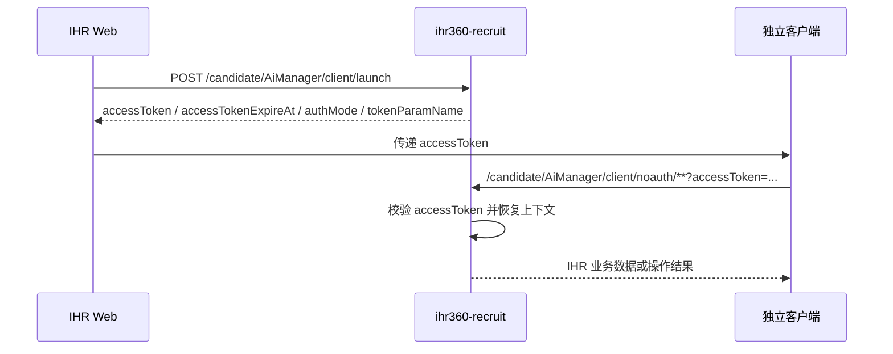

# 07 IHR 客户端接入使用说明

本文面向 IHR Web、独立客户端和联调人员，说明如何获取 `accessToken`，以及如何调用 6 个新增 `client/noauth` 包装接口。

> **更新历史**
> - 2026-05-15：上线首批 4 个 `client/noauth/*` 接口（application/position、batch/getDetailByIds、import、addPools）。
> - 2026-05-18：新增 `resume/init`、`resume/upload` 两个 `client/noauth/*` 接口，"加入人才库"全链路从此与 cookie 解耦。

## 1. 接入结论

1. IHR Web 在已登录态下调用 `client/launch` 获取 `accessToken`。
2. IHR Web 把 `accessToken` 传给独立客户端。
3. 独立客户端只调用新增的 4 个 `client/noauth` 包装接口。
4. `accessToken` 通过请求参数传递，参数名固定为 `accessToken`，不放 header。
5. 旧 4 个 IHR 接口继续服务 Web / iframe，不直接给独立客户端带 `accessToken` 调用。
6. `accessToken` 只用于访问 IHR 招聘 API，不替代 `ihire-solution` 的 Sa-Token。



## 2. 接口总览

| 用途 | 方法 | 路径 | 调用方 | 是否需要 `accessToken` |
| --- | --- | --- | --- | --- |
| 获取客户端 token | `POST` | `/candidate/AiManager/client/launch` | IHR Web | 否，要求 IHR Web 已登录 |
| 查询可见在招职位 | `GET` | `/candidate/AiManager/client/noauth/application/position` | 独立客户端 | 是 |
| 批量查询 JD / HC 详情 | `POST` | `/candidate/AiManager/client/noauth/headcount/v2/batch/getDetailByIds` | 独立客户端 | 是 |
| 分配职位 / 导入候选人 | `POST` | `/candidate/AiManager/client/noauth/import` | 独立客户端 | 是 |
| 加入人才库 | `POST` | `/candidate/AiManager/client/noauth/addPools` | 独立客户端 | 是 |
| 简历入参元数据（人才库 / 渠道 / 是否中央上传） | `GET` | `/candidate/AiManager/client/noauth/resume/init` | 独立客户端 | 是 |
| 简历文件上传（multipart `file`，返回 `fileId`） | `POST` | `/candidate/AiManager/client/noauth/resume/upload` | 独立客户端 | 是 |

说明：

1. 表中的路径是 provider 路径；如果经过网关，外层域名和前缀按环境路由配置处理。
2. 6 个 `client/noauth` 包装接口的业务请求体 / 响应体均沿用旧接口（`candidate/resume/init`、`candidate/resume/upload` 等），不重新定义字段。
3. `accessToken` 可以放在 query 参数中；POST 请求（包括 multipart）也按 `?accessToken=...` 传递，避免依赖网关透传 header。

## 3. 获取 accessToken

### 3.1 接口说明

- 方法：`POST`
- 路径：`/candidate/AiManager/client/launch`
- 调用方：IHR Web
- 用途：基于当前 IHR Web 登录态签发独立客户端访问 IHR API 的本地 JWT。
- 请求体：无。

### 3.2 返回体

| 字段 | 类型 | 说明 |
| --- | --- | --- |
| `accessToken` | `string` | 独立客户端访问 IHR noauth 包装接口的凭证 |
| `accessTokenExpireAt` | `datetime` | token 过期时间 |
| `authMode` | `string` | 固定 `IHR_RECRUIT_LOCAL_JWT` |
| `tokenParamName` | `string` | 固定 `accessToken` |

示例：

```json
{
  "accessToken": "<local-jwt>",
  "accessTokenExpireAt": "2026-05-15T11:40:00+08:00",
  "authMode": "IHR_RECRUIT_LOCAL_JWT",
  "tokenParamName": "accessToken"
}
```

### 3.3 curl 示例

```bash
curl -X POST 'https://<ihr-domain>/candidate/AiManager/client/launch' \
  -H 'Content-Type: application/json' \
  --cookie '<IHR Web 登录态 cookie>'
```

## 4. 查询可见在招职位

### 4.1 接口说明

- 方法：`GET`
- 路径：`/candidate/AiManager/client/noauth/application/position`
- 用途：查询当前 token 用户可见的在招职位列表。

### 4.2 请求参数

| 字段 | 位置 | 类型 | 必填 | 说明 |
| --- | --- | --- | --- | --- |
| `accessToken` | query | `string` | 是 | `client/launch` 返回的 token |
| `workflowId` | query | `number` | 否 | 自定义流程 ID |
| `isDefault` | query | `boolean` | 否 | 是否只查询默认流程 |

### 4.3 返回体

返回 `ApplicationHeadcountVo[]`，主要字段如下：

| 字段 | 类型 | 说明 |
| --- | --- | --- |
| `headcountId` | `string` | HC ID，长整型序列化为字符串 |
| `positionId` | `string` | 职位 ID |
| `positionName` | `string` | 职位名称 |
| `departmentName` | `string` | 所属部门 |
| `departmentPathName` | `string` | 所属部门路径 |
| `totalCount` | `string` | HC 总数 |
| `entryCount` | `string` | 已招入职人数 |
| `urgencyLevel` | `string/object` | 紧急度，按现有枚举序列化 |
| `isDirector` | `boolean` | 当前用户是否负责人 |
| `isCollaborator` | `boolean` | 当前用户是否协同人 |
| `headcountStatus` | `number` | HC 状态：1 招聘中、2 暂停中、3 已关闭 |
| `workflowId` | `string` | 自定义流程 ID |
| `workflowName` | `string` | 自定义流程名称 |
| `stageStatuses` | `array` | 流程阶段信息 |

### 4.4 curl 示例

```bash
curl 'https://<ihr-domain>/candidate/AiManager/client/noauth/application/position?accessToken=<local-jwt>&isDefault=false'
```

## 5. 批量查询 JD / HC 详情

### 5.1 接口说明

- 方法：`POST`
- 路径：`/candidate/AiManager/client/noauth/headcount/v2/batch/getDetailByIds`
- 用途：按 HC ID 批量查询职位详情、招聘需求、人才库候选项、流程等信息。

### 5.2 请求参数

| 字段 | 位置 | 类型 | 必填 | 说明 |
| --- | --- | --- | --- | --- |
| `accessToken` | query | `string` | 是 | `client/launch` 返回的 token |

请求体是 HC ID 数组：

```json
[
  123456789,
  987654321
]
```

### 5.3 返回体

返回 `HeadcountVo[]`，主要字段如下：

| 字段 | 类型 | 说明 |
| --- | --- | --- |
| `headcountBasic` | `object` | 职位管理信息 |
| `positionBasic` | `object` | 组织职位信息 |
| `isOperation` | `boolean` | 是否可操作 |
| `resumeTemplates` | `array` | 简历模板下拉列表 |
| `headcountJobs` | `array` | 招聘需求 / JD 列表 |
| `talentPools` | `array` | 自定义人才库树 |
| `workflowNames` | `array` | 流程信息 |

### 5.4 curl 示例

```bash
curl -X POST 'https://<ihr-domain>/candidate/AiManager/client/noauth/headcount/v2/batch/getDetailByIds?accessToken=<local-jwt>' \
  -H 'Content-Type: application/json' \
  -d '[123456789,987654321]'
```

## 6. 分配职位 / 导入候选人

### 6.1 接口说明

- 方法：`POST`
- 路径：`/candidate/AiManager/client/noauth/import`
- 用途：复用现有 AI 招聘助手导入逻辑，把简历解析、去重后的候选人导入到指定 HC。

该接口沿用旧接口的两阶段语义：

1. `isSelectPosition=false`：上传简历信息后先解析和去重，返回 `newResumeInfos / maybeResumeInfos / repeatResumeInfos`。
2. `isSelectPosition=true`：客户端基于第一阶段返回结果确认导入，后端执行真正导入。

### 6.2 请求参数

| 字段 | 位置 | 类型 | 必填 | 说明 |
| --- | --- | --- | --- | --- |
| `accessToken` | query | `string` | 是 | `client/launch` 返回的 token |

请求体 `CandidateResumeAiManagerListCommand`：

| 字段 | 类型 | 必填 | 说明 |
| --- | --- | --- | --- |
| `headcountId` | `number/string` | 分配职位时是 | 目标 HC ID |
| `resumeInfo` | `array` | 第一阶段是 | i快招各渠道简历文件信息 |
| `resumeInfo[].id` | `number/string` | 是 | i快招简历 ID |
| `resumeInfo[].fileId` | `string` | 是 | 上传文件 ID |
| `resumeInfo[].channel` | `number/string` | 是 | 渠道 ID |
| `resumeInfo[].link` | `string` | 否 | 候选人详情页链接 |
| `resumeInfo[].type` | `string` | 否 | `normal` 或 `similar` |
| `isSelectPosition` | `boolean` | 是 | 是否确认分配职位 |
| `isMaybeResumeInfos` | `boolean` | 第二阶段按需 | 是否导入疑似重复简历 |
| `talentPoolIds` | `array<number>` | 否 | 同步加入的人才库 ID |
| `newResumeInfos` | `array` | 第二阶段按需 | 第一阶段返回的新简历集合 |
| `maybeResumeInfos` | `array` | 第二阶段按需 | 第一阶段返回的疑似重复简历集合 |
| `repeatResumeInfos` | `array` | 第二阶段按需 | 第一阶段返回的重复简历集合 |
| `stageId` | `number/string` | 否 | 阶段 ID |

### 6.3 第一阶段请求示例

```json
{
  "headcountId": 123456789,
  "isSelectPosition": false,
  "stageId": 1,
  "talentPoolIds": [1001],
  "resumeInfo": [
    {
      "id": 90001,
      "fileId": "file-001",
      "channel": 12,
      "link": "https://example.com/resume/90001",
      "type": "normal"
    }
  ]
}
```

### 6.4 第二阶段请求示例

```json
{
  "headcountId": 123456789,
  "isSelectPosition": true,
  "isMaybeResumeInfos": true,
  "talentPoolIds": [1001],
  "newResumeInfos": [],
  "maybeResumeInfos": [],
  "repeatResumeInfos": []
}
```

### 6.5 返回体

返回 `CandidateAiManagerResult`：

| 字段 | 类型 | 说明 |
| --- | --- | --- |
| `headcountId` | `string` | 目标 HC ID |
| `talentPoolIds` | `array<string>` | 人才库 ID |
| `newResumeInfos` | `array` | 新简历集合 |
| `maybeResumeInfos` | `array` | 疑似重复简历集合 |
| `repeatResumeInfos` | `array` | 重复简历集合 |
| `successResumeIds` | `array<string>` | 成功导入的 i快招简历 ID |
| `failRepeatResumeIds` | `array<string>` | 因重复失败的 i快招简历 ID |
| `failParseResumeIds` | `array<string>` | 解析失败的 i快招简历 ID |
| `failOtherResumeIds` | `array<string>` | 其他失败的 i快招简历 ID |
| `success` | `boolean` | 是否成功，按现有序列化字段为准 |
| `errorMsg` | `string` | 错误信息 |
| `type` | `string` | 结果类型，分配职位或加入人才库 |

### 6.6 curl 示例

```bash
curl -X POST 'https://<ihr-domain>/candidate/AiManager/client/noauth/import?accessToken=<local-jwt>' \
  -H 'Content-Type: application/json' \
  -d '{"headcountId":123456789,"isSelectPosition":false,"resumeInfo":[{"id":90001,"fileId":"file-001","channel":12,"type":"normal"}]}'
```

## 7. 加入人才库

### 7.1 接口说明

- 方法：`POST`
- 路径：`/candidate/AiManager/client/noauth/addPools`
- 用途：复用现有 AI 招聘助手导入逻辑，把候选人加入指定人才库。

加入人才库和分配职位使用同一个业务命令对象。差异是：

1. `talentPoolIds` 需要传目标人才库。
2. 不需要分配职位时，`headcountId` 不传或传 `null`。
3. 两阶段确认逻辑与 `/client/noauth/import` 保持一致。

### 7.2 请求体

同 `CandidateResumeAiManagerListCommand`。典型第二阶段示例：

```json
{
  "isSelectPosition": true,
  "isMaybeResumeInfos": true,
  "talentPoolIds": [1001, 1002],
  "newResumeInfos": [],
  "maybeResumeInfos": [],
  "repeatResumeInfos": []
}
```

### 7.3 curl 示例

```bash
curl -X POST 'https://<ihr-domain>/candidate/AiManager/client/noauth/addPools?accessToken=<local-jwt>' \
  -H 'Content-Type: application/json' \
  -d '{"isSelectPosition":true,"talentPoolIds":[1001],"newResumeInfos":[],"maybeResumeInfos":[],"repeatResumeInfos":[]}'
```

## 7.4 简历入参元数据（resume/init）

### 7.4.1 接口说明

- 方法：`GET`
- 路径：`/candidate/AiManager/client/noauth/resume/init`
- 用途：包装 `GET /candidate/resume/init`，让客户端拿到调 `addPools / import` 前需要的：
  - `talentPools`：可见人才库树（IrsTreeSelect 结构）
  - `channels`：渠道 label → id 映射表（`[{label,value}]`）
  - `resumeCenteralUpload`：是否走中央简历库上传（决定 `resume/upload` 后端落库位置）

### 7.4.2 请求参数

| 字段 | 位置 | 类型 | 必填 | 说明 |
| --- | --- | --- | --- | --- |
| `accessToken` | query | `string` | 是 | `client/launch` 返回的 token |

### 7.4.3 返回结构

跟旧 `/candidate/resume/init` 完全一致，原样透传 `talentPools / channels / resumeCenteralUpload`。

### 7.4.4 curl 示例

```bash
curl 'https://<ihr-domain>/candidate/AiManager/client/noauth/resume/init?accessToken=<local-jwt>'
```

## 7.5 简历文件上传（resume/upload）

### 7.5.1 接口说明

- 方法：`POST`
- 路径：`/candidate/AiManager/client/noauth/resume/upload`
- Content-Type：`multipart/form-data`
- 用途：包装 `POST /candidate/resume/upload`，返回 `fileId` 供 `resumeInfo[].fileId` 使用。

### 7.5.2 请求参数

| 字段 | 位置 | 类型 | 必填 | 说明 |
| --- | --- | --- | --- | --- |
| `accessToken` | query | `string` | 是 | `client/launch` 返回的 token |
| `file` | form | `file` | 是 | 简历文件（字段名固定为 `file`） |

### 7.5.3 返回结构

跟旧 `/candidate/resume/upload` 完全一致：

```json
{ "code": 0, "data": "<fileId>" }
```

> ⚠️ `fileId` 是字符串，直接塞进 `resumeInfo[].fileId`。

### 7.5.4 curl 示例

```bash
curl -X POST 'https://<ihr-domain>/candidate/AiManager/client/noauth/resume/upload?accessToken=<local-jwt>' \
  -F 'file=@/tmp/resume.html;type=text/html'
```

## 8. token 校验和错误处理

6 个 `client/noauth` 包装接口进入业务逻辑前会先校验 `accessToken`：

| 场景 | 处理 |
| --- | --- |
| 未传 `accessToken` | 按现有无 token 错误返回 |
| token 签名错误 | 按现有错误 token 返回 |
| token 过期 | 按现有 token 过期 / 无权访问口径返回 |
| `type` 不是 `AI_RECRUIT_CLIENT` | 拒绝访问 |
| `scopes` 不包含 `IHR_AI_RECRUIT_API` | 拒绝访问 |

具体错误 JSON 结构沿用 `ihr360-recruit` 全局异常包装。

## 9. 联调注意事项

1. 不要把 `accessToken` 放到 header；当前方案要求 query/form 参数。
2. 不要把客户端请求打到旧接口，例如 `/application/position?accessToken=...`；旧接口不挂客户端 token 拦截器。
3. 网关、Nginx、应用 access log 需要对 `accessToken` 做脱敏。
4. 客户端不要信任或自传 `companyId / userId / staffId / isHr` 作为身份；后端只信任 token payload。
5. token 默认 TTL 当前配置为 `1800` 秒；过期后重新从 IHR Web 触发 `client/launch` 获取新 token。
6. 如果 POST 请求经过网关后 query 丢失，需要先修网关透传，不要改成 header。
