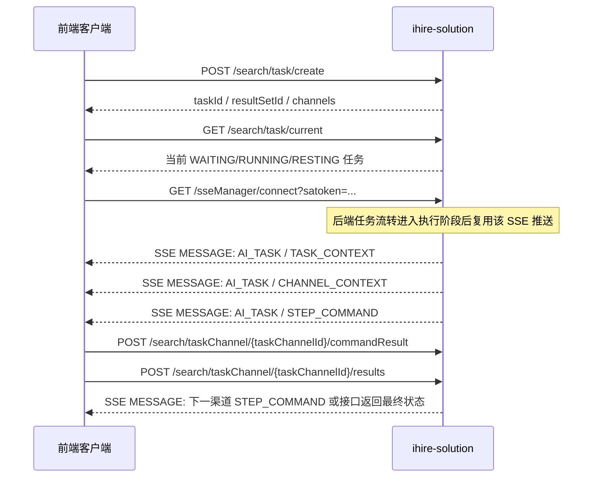
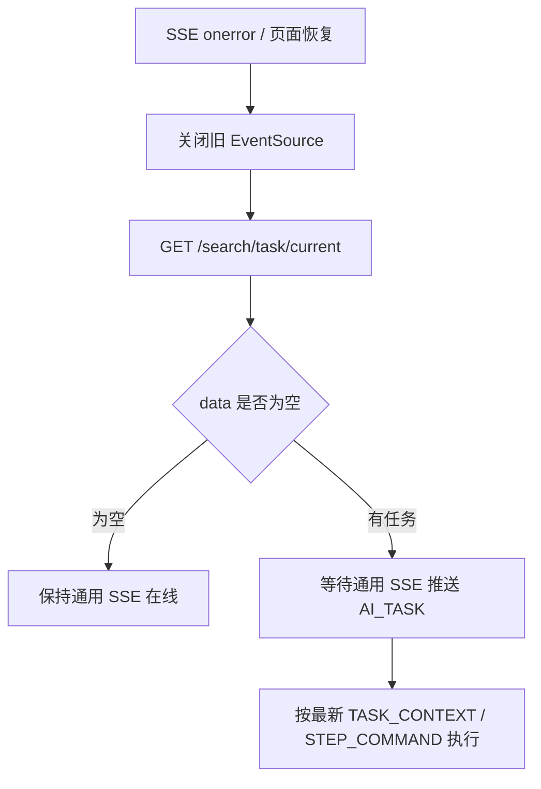

# 前端创建任务与 SSE 指令对接说明

日期：2026-05-18

本文面向前端接入 `ihire-solution` 的任务化搜索链路。当前任务通信不是前端轮询拉取步骤，也不是双向 SSE；真实形态是：

- 前端通过 HTTP 创建任务、查询当前任务、回传步骤结果和搜索结果。
- 后端复用原有 SSE 主动推送任务上下文、渠道上下文和步骤指令。
- 前端建立 `GET /sseManager/connect?satoken=...` 后，只表示客户端在线并可接收推送；不再通过 SSE 建连触发某个渠道任务执行。

## 1. 接入顺序



前端主流程：

1. 完成 `ihire-solution` SSO 登录，拿到当前 `satoken`。
2. 用户触发搜索时调用 `POST /search/task/create` 创建任务。
3. 需要展示队列时调用 `GET /search/task/queue`，读取 `queuePosition / estimatedStartTime / estimatedEndTime`。
4. 客户端启动或重连时建立通用 SSE：`GET /sseManager/connect?satoken=...`。
5. 客户端启动或重连时再调用 `GET /search/task/current` 恢复当前未结束任务上下文。
6. 只处理 `event: MESSAGE` 且消息体 `scenario=AI_TASK` 的任务指令。
7. 收到 `STEP_COMMAND` 后按 `data.actionList` 执行动作。
8. 每个业务步骤执行后调用 `POST /search/taskChannel/{taskChannelId}/commandResult`。
9. 采集到候选人列表后调用 `POST /search/taskChannel/{taskChannelId}/results` 保存结果。
10. SSE 断线后关闭旧连接，重新建立 `/sseManager/connect`，再调用 `GET /search/task/current` 恢复上下文。

## 2. 创建任务

接口：

```http
POST /search/task/create
Content-Type: application/json
```

请求体：

```json
{
  "chatId": "9f6d2b3e0b4f4a8a9c1a",
  "positionId": "100001",
  "taskType": "INITIAL",
  "triggerSource": "USER_CLICK",
  "channels": [
    {
      "businessChannel": "SEARCH",
      "channelSubType": "BOSS",
      "searchConditionId": "187001"
    },
    {
      "businessChannel": "RECOMMEND",
      "channelSubType": "BOSS",
      "searchConditionId": "187002",
      "searchTaskConfig": "{\"matchedPosition\":\"boss-position-value\",\"maxResumeCount\":20}"
    }
  ]
}
```

字段说明：

| 字段 | 必填 | 说明 |
| --- | --- | --- |
| `chatId` | 是 | 职位会话 ID。当前后端会校验必填。 |
| `positionId` | 否 | IHR 职位 ID 快照。 |
| `taskType` | 是 | `INITIAL / CONTINUE / RESTART`。 |
| `triggerSource` | 否 | `FIRST_OPEN / CHAT / USER_CLICK / SYSTEM`。 |
| `channels` | 是 | 本次任务要执行的渠道单元，至少 1 条。 |
| `channels[].businessChannel` | 是 | `SEARCH / RECOMMEND`。 |
| `channels[].channelSubType` | 是 | `BOSS / ZHILIAN / JOB51 / LIEPIN`。 |
| `channels[].searchConditionId` | 是 | 该渠道实际执行条件。 |
| `channels[].searchTaskConfig` | 否 | 渠道任务配置 JSON 文本；`matchedPosition` 是字符串，推荐牛人预计时长读取 `maxResumeCount`，缺失或为 `0` 时按 `20`。 |

返回体核心字段：

```json
{
  "data": {
    "resultSetId": "90001",
    "taskId": "80001",
    "taskType": "INITIAL",
    "taskStatus": "WAITING",
    "queuePosition": 1,
    "estimatedDurationMinutes": 42,
    "estimatedStartTime": "2026-05-18 13:00:00",
    "estimatedEndTime": "2026-05-18 13:42:00",
    "resultRoundNo": 1,
    "visibleResultReset": false,
    "channels": [
      {
        "taskChannelId": "81001",
        "searchConditionId": "187001",
        "businessChannel": "SEARCH",
        "channelSubType": "BOSS",
        "estimatedDurationMinutes": 12,
        "taskChannelStatus": "WAITING"
      },
      {
        "taskChannelId": "81002",
        "searchConditionId": "187002",
        "businessChannel": "RECOMMEND",
        "channelSubType": "BOSS",
        "effectiveMaxResumeCount": 20,
        "estimatedDurationMinutes": 30,
        "taskChannelStatus": "WAITING"
      }
    ]
  }
}
```

说明：

- `taskChannelId` 用于后续步骤回传和结果保存；执行指令中以 `data.context.taskChannelId` 为准，也可以从 `/search/task/queue` 的 `channels[]` 中获取用于展示。
- `taskStatus / taskChannelStatus` 使用同一套状态：`WAITING / RUNNING / RESTING / COMPLETED / STOPPED / FAILED`。
- `estimatedStartTime / estimatedEndTime` 只用于展示，任务能否执行仍以 `canExecuteNow / blockedReason / nextExecutableTime` 和 SSE 建连后的 Guard 判定为准。

## 3. 查询当前任务

接口：

```http
GET /search/task/current
```

用途：

- 客户端启动后检查是否有未结束任务。
- SSE 断线重连后恢复执行。
- 用户切换页面后重新绑定当前最高优先级任务。

返回规则：

- 无当前任务：`data=null`。
- 有当前任务：结构同创建任务返回体，包含 `taskId / taskStatus / channels`。
- 当前排序口径：`RUNNING` 优先，其次 `WAITING`，再 `RESTING`，同状态按创建时间升序。

## 3.1 查询任务队列

接口：

```http
GET /search/task/queue
```

用途：

- 展示当前登录用户下所有未结束任务。
- 展示队列序号、预计开始时间、预计结束时间。
- 判断当前用户是否达到 20 个未结束任务上限。

返回体核心字段：

```json
{
  "data": {
    "totalCount": 2,
    "maxQueueCount": 20,
    "queueFull": false,
    "items": [
      {
        "taskId": "80001",
        "taskStatus": "RUNNING",
        "queuePosition": 0,
        "estimatedDurationMinutes": 42,
        "estimatedStartTime": "2026-05-18 13:00:00",
        "estimatedEndTime": "2026-05-18 13:42:00"
      },
      {
        "taskId": "80002",
        "taskStatus": "WAITING",
        "queuePosition": 1,
        "estimatedDurationMinutes": 30,
        "estimatedStartTime": "2026-05-18 13:42:00",
        "estimatedEndTime": "2026-05-18 14:12:00"
      }
    ]
  }
}
```

说明：

- 队列按当前登录 `userId` 统计，不按当前 `chatId`。
- 如果某个任务因渠道账号异常、人机校验等等待恢复，后续任务不能越过它；无法估算恢复时间时预计开始/结束时间为空。

## 4. 建立通用 SSE

接口：

```http
GET /sseManager/connect?satoken=<satoken>
Accept: text/event-stream
```

关键规则：

- `satoken` 必填。`EventSource` 不能稳定携带自定义 header，因此当前接口通过 query 参数接收。
- SSE 建连不传 `taskId/taskChannelId`，建连成功后只注册当前用户连接。
- AI 任务指令复用该通用 SSE 连接推送。
- `taskChannelId` 从后端推送的 `data.context.taskChannelId` 读取，用于后续 `/commandResult` 和 `/results` 回传。
- 聊天流 `/ihire/chat/streamChat` 不承接任务指令。

前端示例：

```js
let taskEventSource = null;

function connectTaskSse({ baseUrl, satoken }) {
  if (taskEventSource) {
    taskEventSource.close();
  }

  const url = `${baseUrl}/sseManager/connect?satoken=${encodeURIComponent(satoken)}`;
  taskEventSource = new EventSource(url);

  taskEventSource.addEventListener("MESSAGE", async (event) => {
    const message = JSON.parse(event.data);
    if (message.scenario !== "AI_TASK") {
      return;
    }
    await handleAiTaskMessage(message);
  });

  taskEventSource.addEventListener("HEARTBEAT", () => {
    // 可用于更新本地连接状态，不参与业务步骤流转。
  });

  taskEventSource.onerror = () => {
    taskEventSource.close();
    taskEventSource = null;
    // 建议做退避重连：重新建立 /sseManager/connect，再调用 /search/task/current 恢复任务上下文。
  };
}
```

## 5. SSE 消息结构

后端发送的 SSE 事件名固定为 `MESSAGE`，`event.data` 是 JSON 字符串，外层结构为 `SseMessageDTO`：

```json
{
  "scenario": "AI_TASK",
  "id": "5b637f6d-6f5a-45ed-8a1e-9d6535e74a41",
  "timestamp": 1779080000000,
  "requireAck": false,
  "data": {
    "commandType": "STEP_COMMAND",
    "context": {},
    "step": {},
    "actionList": [],
    "resultPolicy": {}
  }
}
```

`scenario`：

| 值 | 说明 |
| --- | --- |
| `AI_TASK` | AI 任务指令、任务状态和任务回传协调。前端任务模块只消费这个场景。 |

`data.commandType`：

| 值 | 前端动作 |
| --- | --- |
| `TASK_CONTEXT` | 记录任务上下文和渠道列表，初始化任务执行 UI 状态。 |
| `CHANNEL_CONTEXT` | 记录当前渠道上下文，可展示当前执行渠道。 |
| `STEP_COMMAND` | 执行 `actionList`，并通过 `commandResult` 回传结果。 |
| `CHANNEL_DONE` | 标记当前渠道完成。 |
| `CHANNEL_FAILED` | 标记当前渠道失败。 |
| `TASK_DONE` | 标记整个任务完成；通用 SSE 可继续保持在线。 |
| `TASK_FAILED` | 标记整个任务失败，关闭或等待用户重试。 |

说明：`/results finished=true` 或 `/commandResult` 只表示当前 `taskChannel` 收口；后端刷新父任务后，若 `search_task.task_status=COMPLETED` 且没有下一条渠道指令，会额外推送 `TASK_DONE`。前端仍应同时以接口返回的 `taskStatus / taskChannelStatus` 作为兜底判断依据。

`data.context` 是双方通信的共享上下文，前端后续回传必须以它为准：

| 字段 | 必填 | 说明 |
| --- | --- | --- |
| `companyId` | 是 | 公司 ID。 |
| `searchConditionId` | 是 | 当前执行条件 ID。 |
| `taskId` | 是 | 搜索任务 ID。 |
| `taskChannelId` | 是 | 渠道任务 ID。 |
| `businessChannel` | 是 | `SEARCH / RECOMMEND`。 |
| `channelSubType` | 是 | `BOSS / ZHILIAN / JOB51 / LIEPIN`。 |
| `searchTaskConfig` | 否 | 渠道任务配置 JSON 文本，透传给前端执行。 |

约束：

- `taskChannelId` 必须从 `data.context.taskChannelId` 读取，不能从 action `params` 猜。
- 回传接口 path 里的 `taskChannelId` 以 `context.taskChannelId` 为准。
- `taskId / searchConditionId` 回传时也用 `context` 中的值。

## 6. 处理 STEP_COMMAND

`STEP_COMMAND` 示例：

```json
{
  "scenario": "AI_TASK",
  "id": "5b637f6d-6f5a-45ed-8a1e-9d6535e74a41",
  "timestamp": 1779080000000,
  "requireAck": false,
  "data": {
    "commandType": "STEP_COMMAND",
    "context": {
      "companyId": "10001",
      "searchConditionId": "187001",
      "taskId": "80001",
      "taskChannelId": "81001",
      "businessChannel": "SEARCH",
      "channelSubType": "BOSS",
      "searchTaskConfig": "{\"maxResumeCount\":20}"
    },
    "step": {
      "stepNo": 1,
      "stepCode": "boss.fillSearchCondition",
      "stepName": "填充搜索条件并搜索",
      "instructionId": "fbd1bb5d-3305-4284-b9ef-23d1249fd7c2"
    },
    "actionList": [
      {
        "actionCode": "FILL_SEARCH_CONDITION",
        "params": {
          "targetOptionsVersion": "BOSS_RECOMMEND_FILTER_V1",
          "fields": [
            { "fieldCode": "experience", "selectedOption": "3-5年" },
            { "fieldCode": "degree", "selectedOption": "本科" },
            { "fieldCode": "intention", "selectedOption": "不限" },
            { "fieldCode": "salary", "selectedOption": "20-50K" }
          ]
        },
        "humanLike": {
          "enabled": true,
          "protocolStatus": "PENDING_FRONTEND_PROTOCOL"
        },
        "timeoutMs": 60000
      }
    ],
    "resultPolicy": {
      "needAck": true,
      "needItems": false,
      "needSnapshot": false,
      "resultEndpoint": "/search/taskChannel/81001/commandResult",
      "resultsEndpoint": "/search/taskChannel/81001/results"
    },
    "message": "填充搜索条件并搜索"
  }
}
```

前端处理建议：

1. 先缓存 `message.id` 和 `data.step.instructionId`，用于日志和结果回传。
2. 用 `data.context` 建立当前执行上下文。
3. 串行执行 `actionList`。
4. 业务开始执行时可先回传 `status=RUNNING`。
5. 执行成功后回传 `status=SUCCESS`。
6. 执行失败或超时时回传 `status=FAILED / TIMEOUT`，并带 `error`。
7. 如果本步骤采集到了候选人列表，可在 `commandResult.items` 先回传摘要；最终落库仍调用 `/results`。

当前代码注意点：

- 前端实现时按白名单 `actionCode` 做分发，例如 `FILL_SEARCH_CONDITION / SUBMIT_SEARCH / COLLECT_VISIBLE_ITEMS`。
- `taskChannelId / taskId / searchConditionId` 只能从 `data.context` 读取，不要混入 action 参数。
- `FILL_SEARCH_CONDITION` 不传 DOM selector、CSS class、XPath 或脚本；客户端执行器按 `fieldCode + selectedOption` 自行定位页面元素。

### 6.1 条件设置动作

`FILL_SEARCH_CONDITION` 用于根据后端 AI Plan 设置渠道页面筛选条件。一期目标选项集为 `BOSS_RECOMMEND_FILTER_V1`。

| fieldCode | 字段名 | 可选项 |
| --- | --- | --- |
| `experience` | 经验要求 | `不限 / 在校/应届 / 25年毕业 / 26年毕业 / 26年后毕业 / 1年以内 / 1-3年 / 3-5年 / 5-10年 / 10年以上` |
| `degree` | 学历要求 | `不限 / 初中及以下 / 中专/中技 / 高中 / 大专 / 本科 / 硕士 / 博士` |
| `intention` | 求职意向 | `不限 / 离职-随时到岗 / 在职-暂不考虑 / 在职-考虑机会 / 在职-月内到岗` |
| `salary` | 薪资待遇 | `不限 / 3K以下 / 3-5K / 5-10K / 10-20K / 20-50K / 50K以上` |

前端执行规则：

1. `fieldCode` 不认识时，当前步骤按 `FAILED` 回传。
2. `selectedOption` 不在目标选项中时，当前步骤按 `FAILED` 回传。
3. `selectedOption=不限` 时，点击对应字段的默认选项或保持默认不限状态。
4. 字段缺失时，不主动推断；以后端 action 中的 `fields` 为准。
5. 如果页面结构变化导致无法定位目标选项，按 `FAILED` 回传，并带 `error.code=CHANNEL_PAGE_UNAVAILABLE`。

## 7. 回传步骤执行结果

接口：

```http
POST /search/taskChannel/{taskChannelId}/commandResult
Content-Type: application/json
```

成功回传示例：

```json
{
  "taskId": "80001",
  "searchConditionId": "187001",
  "commandType": "STEP_COMMAND",
  "instructionId": "fbd1bb5d-3305-4284-b9ef-23d1249fd7c2",
  "step": {
    "stepNo": 1,
    "stepCode": "boss.fillSearchCondition",
    "stepName": "填充搜索条件并搜索"
  },
  "status": "SUCCESS",
  "pageMeta": {
    "pageNo": 1,
    "hasMore": true,
    "totalVisible": 30,
    "loadedCount": 30
  },
  "snapshot": {
    "url": "https://www.zhipin.com/web/geek/recommend",
    "title": "BOSS 推荐牛人"
  }
}
```

失败回传示例：

```json
{
  "taskId": "80001",
  "searchConditionId": "187001",
  "commandType": "STEP_COMMAND",
  "instructionId": "fbd1bb5d-3305-4284-b9ef-23d1249fd7c2",
  "step": {
    "stepNo": 1,
    "stepCode": "boss.fillSearchCondition",
    "stepName": "填充搜索条件并搜索"
  },
  "status": "FAILED",
  "error": {
    "code": "CHANNEL_LOGIN_REQUIRED",
    "message": "渠道登录态已失效",
    "retryable": true
  }
}
```

字段规则：

| 字段 | 必填 | 说明 |
| --- | --- | --- |
| `taskId` | 是 | 从 `data.context.taskId` 取。 |
| `searchConditionId` | 是 | 从 `data.context.searchConditionId` 取。 |
| `commandType` | 是 | 对应 SSE 的 `data.commandType`。 |
| `instructionId` | 否 | 优先用 `data.step.instructionId`。 |
| `step` | 否 | 对应 SSE 的 `data.step`。 |
| `status` | 是 | `RECEIVED / RUNNING / SUCCESS / FAILED / SKIPPED / TIMEOUT`。 |
| `items` | 否 | 当前步骤采集到的候选人或推荐项。 |
| `pageMeta` | 否 | 页码、是否还有更多、已加载数量等。 |
| `snapshot` | 否 | 页面快照、URL、标题、DOM 摘要等调试信息。 |
| `error` | 条件必填 | `FAILED / TIMEOUT` 时必须带。 |

返回体：

```json
{
  "data": {
    "accepted": true,
    "nextCommandExpected": true,
    "taskId": "80001",
    "taskChannelId": "81001",
    "taskStatus": "RUNNING",
    "taskChannelStatus": "COMPLETED"
  }
}
```

语义说明：

- `/sseManager/ack` 只表示 SSE 消息送达，不表示步骤执行成功。
- `/commandResult` 才表示业务步骤执行结果。
- `status=RECEIVED / RUNNING` 会把渠道保持在 `RUNNING`。
- `status=SUCCESS / SKIPPED` 会把当前渠道推进到 `COMPLETED`。
- `status=FAILED / TIMEOUT` 会把当前渠道推进到 `FAILED`。
- 如果返回 `nextCommandExpected=true`，后端会继续尝试触发下一步或下一渠道指令。

## 8. 保存搜索结果

接口：

```http
POST /search/taskChannel/{taskChannelId}/results
Content-Type: application/json
```

请求体：

```json
{
  "chatId": "9f6d2b3e0b4f4a8a9c1a",
  "taskId": "80001",
  "searchConditionId": "187001",
  "businessChannel": "SEARCH",
  "channelSubType": "BOSS",
  "serializeChannel": "BOSS",
  "filterByRead": false,
  "finished": false,
  "resultItems": [
    {
      "rawResume": {
        "outId": "boss-geek-001",
        "name": "候选人A"
      }
    }
  ]
}
```

规则：

- `taskChannelId` 仍以 path 为准。
- `taskId / searchConditionId / businessChannel / channelSubType` 用 SSE `context` 中的值。
- `serializeChannel` 用于旧简历反序列化，通常与渠道一致，例如 `BOSS / ZHILIAN / JOB51 / LIEPIN`。
- `finished=false` 表示只保存一批结果，不结束当前渠道。
- `finished=true` 表示当前渠道结果保存完毕；即使零结果也可以传空 `resultItems` 来完成渠道。后端会按父任务 `taskStatus` 判断整个任务是否完成，完成后通过 SSE 推送 `TASK_DONE`。

返回体核心字段：

```json
{
  "data": {
    "accepted": true,
    "nextCommandExpected": false,
    "taskId": "80001",
    "taskChannelId": "81001",
    "taskChannelStatus": "RUNNING",
    "taskResumes": [
      {
        "taskResumeId": "99001",
        "resumeBlindId": "88001",
        "outId": "boss-geek-001",
        "channelSubType": "BOSS",
        "duplicateFlag": false,
        "visibleInResultSet": true
      }
    ]
  }
}
```

## 9. 断线、重连和幂等建议



前端建议：

- 同一时间只保留一个通用 SSE 连接。
- 重连后先调 `/search/task/current` 恢复任务上下文，不要把旧 `taskChannelId` 当成建连参数。
- 本地用 `message.id + instructionId` 做去重日志，避免重复执行同一条步骤。
- 如果业务动作已经完成但回传失败，优先重试 `/commandResult`，不要重新执行页面动作。
- 采集结果保存可以分批调用 `/results`，最后一批传 `finished=true`。
- 用户手动停止、渠道登录失效、人机校验、账号异常等情况，前端用 `FAILED` 或 `TIMEOUT` 回传，并把具体原因放入 `error.code/message`。

## 10. 前端最小处理框架

```js
async function handleAiTaskMessage(message) {
  const data = message.data || {};
  const context = data.context || {};

  switch (data.commandType) {
    case "TASK_CONTEXT":
      saveTaskContext(data);
      return;
    case "CHANNEL_CONTEXT":
      saveChannelContext(data);
      return;
    case "STEP_COMMAND":
      await executeStepCommand(message.id, context, data);
      return;
    case "CHANNEL_DONE":
    case "TASK_DONE":
      markDone(data.commandType, context);
      return;
    case "CHANNEL_FAILED":
    case "TASK_FAILED":
      markFailed(data.commandType, data.error, context);
      return;
    default:
      return;
  }
}

async function executeStepCommand(messageId, context, data) {
  const taskChannelId = context.taskChannelId;
  const endpoint = data.resultPolicy?.resultEndpoint || `/search/taskChannel/${taskChannelId}/commandResult`;

  try {
    await postJson(endpoint, {
      taskId: context.taskId,
      searchConditionId: context.searchConditionId,
      commandType: data.commandType,
      instructionId: data.step?.instructionId,
      step: data.step,
      status: "RUNNING"
    });

    const result = await runActionList(data.actionList || [], context);

    await postJson(endpoint, {
      taskId: context.taskId,
      searchConditionId: context.searchConditionId,
      commandType: data.commandType,
      instructionId: data.step?.instructionId,
      step: data.step,
      status: "SUCCESS",
      items: result.items,
      pageMeta: result.pageMeta,
      snapshot: result.snapshot
    });
  } catch (error) {
    await postJson(endpoint, {
      taskId: context.taskId,
      searchConditionId: context.searchConditionId,
      commandType: data.commandType,
      instructionId: data.step?.instructionId,
      step: data.step,
      status: error.timeout ? "TIMEOUT" : "FAILED",
      error: {
        code: error.code || "FRONTEND_EXECUTE_FAILED",
        message: error.message || "前端执行步骤失败",
        retryable: Boolean(error.retryable)
      }
    });
  }
}
```

## 11. 联调检查点

- 创建任务后能拿到 `taskId` 和至少一个 `taskChannelId`。
- 建立通用 SSE 时只传 `satoken`，不传 `taskId/taskChannelId`。
- 建立 `/sseManager/connect` 后能收到 `event: MESSAGE`。
- 前端只消费 `scenario=AI_TASK`。
- `taskChannelId` 从 `data.context` 读取，并作为 `/commandResult`、`/results` 的 path 参数。
- `STEP_COMMAND` 执行后必须调用 `/commandResult`。
- `/sseManager/ack` 不替代 `/commandResult`。
- 搜索结果最终通过 `/results` 落库，必要时最后一批带 `finished=true`。
- 断线重连走 `/search/task/current`，不直接盲连旧任务。
