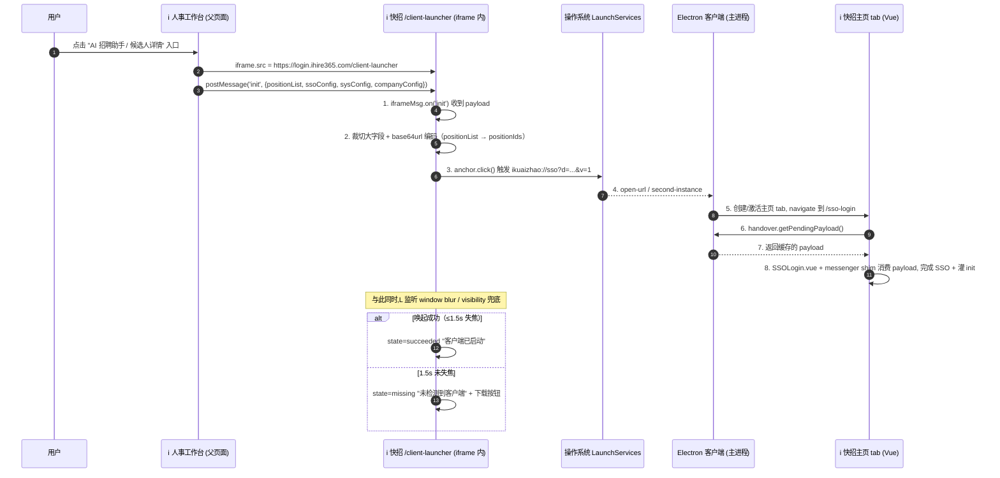

# i快招客户端唤起流程（/client-launcher）

> 状态：设计中 · 待 D1~D7 决策点确认后落地
> 关联项目：
> - `ihr360-recruit-static`（i人事招聘工作台 / React + Redux，唤起源）
> - `irecruiting360-web-static`（i快招 H5 + Electron 客户端壳，被唤起方）
> 参考文档：
> - [`docs/electron-handover-plan.md`](./electron-handover-plan.md)（deep link 协议骨架）
> - [`docs/plugin-bridge.md`](./plugin-bridge.md)（客户端原生招聘桥）
> - [`docs/ihr-integration.md`](./ihr-integration.md)（i人事融合现状）

---

## 1. 背景

### 现状（iframe 模式，将逐步淘汰）

i人事招聘工作台 `/recruit/recruit-assistant` 用 iframe 嵌入 `https://login.ihire365.com/sso-login`，
父端通过 `IframeMessenger` 把 `init` payload（positionList / sysConfig / ssoConfig / companyConfig）
postMessage 给 iframe 内的 i快招 H5。

```
父页面 React  ──iframe──>  i快招 Vue (sso-login)
                postMessage(init/themeColor/ihrSuccessIds)
                postMessage(resumeList/iframe-back)
```

### 目标（客户端模式 — 最小侵入版）

**核心原则：i 人事侧零代码改动**，所有改动收敛到 i 快招项目。

i 人事工作台 `/recruit/recruit-assistant` 的 iframe **沿用 postMessage init 推送**机制，仅把 iframe `src`
从 `https://login.ihire365.com/sso-login` 替换为 `https://login.ihire365.com/client-launcher`：

```
原:  <iframe src="https://login.ihire365.com/sso-login" />
新:  <iframe src="https://login.ihire365.com/client-launcher" />
```

i 人事侧 init / themeColor / resumeList / iframe-back 等 postMessage 消息**全部不变**，
i 快招的 `/client-launcher` 页面接管 init 后触发 deep link 唤起客户端。

```
i 人事工作台 /recruit/recruit-assistant?...
     │  <iframe src=https://login.ihire365.com/client-launcher>
     │  postMessage(init) {positionList, ssoConfig, sysConfig, companyConfig}
     ▼
i 快招 H5 /client-launcher  (浏览器 / iframe 内)
     │  接收 init → 拼 deep link
     ▼  ikuaizhao://sso?d=<base64url>&v=1
┌──────────────────────────┐
│  i 快招 Electron 客户端    │
│  主页 tab → /sso-login   │ → SSOLogin.vue 消费 payload
└──────────────────────────┘
```

老的 `/sso-login` 入口**保留**做浏览器/插件降级路径，对未启用客户端的租户继续生效。

---

## 2. 整体流程（新）



---

## 3. /client-launcher 页面规范（i人事侧 React）

### 3.1 路由

```ts
// ihr360-recruit-static/src/router/...
{
  path: '/client-launcher',
  component: ClientLauncher,
  exact: true
}
```

### 3.2 URL 参数

| 参数 | 必需 | 说明 | 示例 |
|---|---|---|---|
| `headcountId` | 否 | 候选人来时携带的职位 id（同原 `match.params.headcountId`） | `H123456` |
| `from` | 否 | 入口标识（同原 `extendData.from`） | `recruit-workflow` / `recruit-assistant` |
| `intent` | 否 | 客户端唤起后想直达的页面 action | `sso`（默认）/ `import-resume` / `open-chat` |
| `auto` | 否 | 是否页面加载即自动唤起（默认 `1`） | `0` 时只渲染"打开客户端"按钮 |

例：

```
/client-launcher?headcountId=H123456&from=recruit-workflow
```

### 3.3 页面状态机

```
                        ┌──────────────────────┐
                        │  loading             │ 收数据 + 组装 payload
                        └──────────┬───────────┘
                                   ▼
                        ┌──────────────────────┐
                        │  launching           │ 触发 deep link, 等失焦
                        └──┬───────────┬───────┘
                ≤1.5s 失焦 │           │ 超时未失焦
                           ▼           ▼
                ┌────────────────┐  ┌─────────────────────┐
                │  succeeded     │  │  missing            │
                │ "客户端已打开"  │  │ "未检测到客户端"     │
                │ 5s 后自动关闭页 │  │ 显示"下载安装"按钮   │
                └────────────────┘  └─────────────────────┘
```

> 决策点 D8：失焦兜底超时（1500ms / 3000ms） — 默认 1500ms

### 3.4 关键代码骨架

```tsx
// pages/client-launcher/index.tsx
import { useEffect, useState } from 'react'
import { buildClientLauncherPayload } from './buildPayload'
import { encodeBase64Url } from './codec'

const PROTOCOL = 'ikuaizhao'
const VERSION = 1
const DETECT_TIMEOUT_MS = 1500
const DOWNLOAD_URL = 'https://download.ihire365.com/ikuaizhao'  // D9 待确认

type Status = 'loading' | 'launching' | 'succeeded' | 'missing'

export default function ClientLauncher() {
  const [status, setStatus] = useState<Status>('loading')

  useEffect(() => {
    const params = new URLSearchParams(location.search)
    const intent = (params.get('intent') as string) || 'sso'
    const auto = params.get('auto') !== '0'

    void (async () => {
      const payload = await buildClientLauncherPayload(params)  // 见 3.5
      const url = `${PROTOCOL}://${intent}?d=${encodeBase64Url(payload)}&v=${VERSION}`

      if (auto) {
        setStatus('launching')
        await tryLaunchAndDetect(url, DETECT_TIMEOUT_MS)
          .then((ok) => setStatus(ok ? 'succeeded' : 'missing'))
      } else {
        setStatus('missing')
      }
    })()
  }, [])

  return (
    <div className='client-launcher'>
      {status === 'loading' && <Loading text='正在准备...' />}
      {status === 'launching' && <Launching text='正在打开 i 快招客户端...' />}
      {status === 'succeeded' && <Succeeded />}
      {status === 'missing' && (
        <Missing
          downloadUrl={DOWNLOAD_URL}
          onRetry={() => location.reload()}
        />
      )}
    </div>
  )
}

// 失焦兜底探测（与 i快招 H5 src/hooks/useClientLauncher.js 等价逻辑）
function tryLaunchAndDetect(url: string, timeoutMs: number): Promise<boolean> {
  return new Promise((resolve) => {
    let settled = false
    const finish = (ok: boolean) => {
      if (settled) return
      settled = true
      cleanup()
      resolve(ok)
    }
    const onBlur = () => finish(true)
    const onVisChange = () => {
      if (document.visibilityState === 'hidden') finish(true)
    }
    const cleanup = () => {
      window.removeEventListener('blur', onBlur)
      document.removeEventListener('visibilitychange', onVisChange)
    }
    window.addEventListener('blur', onBlur)
    document.addEventListener('visibilitychange', onVisChange)
    setTimeout(() => finish(false), timeoutMs)

    // 用 anchor.click 触发协议（绕过 Chrome third-party initiated navigation 限制）
    const a = document.createElement('a')
    a.href = url
    a.style.display = 'none'
    document.body.appendChild(a)
    a.click()
    a.remove()
  })
}
```

### 3.5 数据收集（buildPayload）

在 `/client-launcher` 挂载时**复用**原 `recruit-assistant/index.tsx` 的数据组装逻辑：

```ts
// pages/client-launcher/buildPayload.ts
export async function buildClientLauncherPayload(query: URLSearchParams) {
  // 与原 recruit-assistant/index.tsx 一致：
  const [positionRes, talentRes, sharedRes] = await Promise.all([
    getApplicationPosition().data,            // 招聘中职位
    getSharedCandidateResume().data,          // 渠道 + 人才库 + 上传配置
    sharedCandidateResumeInit(null).data
  ])

  // 过滤 + 排序（同原逻辑）
  const positionIds = []
  const positionList = (positionRes?.data ?? [])
    .filter((item) => {
      const ok = item.headcountStatus !== 3 && item.headcountStatus !== 2
      return (!item.isDeleted && ok) || item.isClose
    })
    .map((item) => {
      positionIds.push(item.headcountId)
      return {
        positionId: item.headcountId,
        name: `${item.positionName} (${item.headcountCode})`,
        headcountCode: item.headcountCode,
        positionName: item.positionName,
        // ❌ 不要把 jd 放在这里(太大):后续在客户端按需调 batchGetPositionDetailByIds
      }
    })

  const { currentCompany, locale, ...args } = IrsDataStorage.getLocal('USER_ME')
  const PRIMARY_THEME = IrsDataStorage.getLocal('PRIMARY_THEME')?.data

  return {
    v: 1,
    ts: Date.now(),
    source: 'ihr-recruit-assistant',
    intent: query.get('intent') || 'sso',

    // === 业务初始化（同原 init payload）===
    positionList,
    positionIds,                              // 客户端拿来调 batchGetPositionDetailByIds 拉 JD
    sysConfig: PRIMARY_THEME,                 // 主题色快照(可选,见 D4)
    companyConfig: { companyId: currentCompany?.companyId },

    // === SSO 配置(同原 ssoConfig.userConfig)===
    ssoConfig: {
      locale,
      userConfig: {
        tenantCode: 'company_a',
        apiKey: 'test_api_key_123',           // ⚠️ 待对接真实 SSO,见 M0.1
        signature: '94a8f1478929d191c56fb42e1007cdfe',
        thirdPartyUserId: args?.userId,
        userData: {
          username: args?.username,
          nickname: args?.username,
          email: args?.email,
          phone: args?.mobileNo,
          avatar: args?.avatar
        },
        extendData: {
          plan: 'PlanA',
          from: query.get('from') || 'recruit-assistant',
          assignPositionAuth: isOperateAuthority('recruit_v2.workflow.add'),
          talentPoolAuth: isOperateAuthority('recruit_v2.talent_pool.add_candidate'),
          sendJdAuth: isOperateAuthority('recruit_v2.need.headcount.view'),
          headcountId: query.get('headcountId') || undefined
        }
      }
    }
  }
}
```

> 关键瘦身策略：**只把 i快招 SSO 阶段必需的字段塞进 payload**。`jd`（职位 JD AI 文案）很大，不要序列化进 deep link，改由客户端启动后通过 `ihrBridge.batchGetPositionDetailByIds(positionIds)` 自己拉。

---

## 4. Deep Link Payload 协议

### 4.1 URL 形态

```
ikuaizhao://<intent>?d=<base64url(JSON)>&v=1
```

| 段 | 说明 |
|---|---|
| `<intent>` | `sso`（默认）/ `open-chat` / `import-resume` 等。客户端 main 进程根据 intent 决定主页 tab navigate 到哪个 SPA 路由 |
| `d` | base64url(`JSON.stringify(payload)`)，URL-safe 编码 |
| `v` | payload 协议版本号，目前固定 `1` |

> 已实现：`electron/src/main/util/deepLinkCodec.ts` 与 `src/util/deepLinkCodec.js`（前者主进程解码，后者 H5 / i人事侧编码）。**i人事侧需要把这个文件复制一份过去**或抽到 npm 包共享。

### 4.2 Payload Schema (v=1)

```ts
interface DeepLinkPayload_v1 {
  // === Meta ===
  v: 1
  ts: number                             // 生成时间戳(毫秒),用于 isPayloadFresh 校验,默认 60s 内有效
  source: string                         // 唤起源,如 'ihr-recruit-assistant'
  intent: 'sso' | 'open-chat' | 'import-resume'

  // === SSO 鉴权(必需,与原 ssoConfig.userConfig 等价)===
  ssoConfig: {
    locale: string
    userConfig: {
      tenantCode: string
      apiKey: string
      signature: string
      thirdPartyUserId: string
      userData: {
        username?: string
        nickname?: string
        email?: string
        phone?: string
        avatar?: string
      }
      extendData: {
        plan: string                      // 'PlanA'
        from: string                      // 'recruit-workflow' | 'recruit-assistant' | 'electron-launcher'
        assignPositionAuth: boolean
        talentPoolAuth: boolean
        sendJdAuth: boolean
        headcountId?: string              // 候选人来时携带的职位 id
      }
    }
  }

  // === 业务初始化(选传)===
  positionList?: Array<{                  // 招聘中职位列表(已过滤),不含 jd
    positionId: string
    name: string                          // "{positionName} ({headcountCode})"
    headcountCode: string
    positionName: string
  }>
  positionIds?: string[]                  // 与 positionList 同步,用于客户端再调 API 拉 JD
  sysConfig?: ThemeConfig                 // 企业主题色快照(可选)
  companyConfig?: { companyId: string }
}
```

### 4.3 大小预算

| 项 | 单条 | 100 条估算 |
|---|---|---|
| `ssoConfig.userConfig` | ~500B | — |
| `positionList[i]` | ~200B（不含 jd） | 20KB |
| `sysConfig` | ~1KB | — |
| **小计 + base64url 编码膨胀 33%** | — | **~30KB** |

各操作系统 deep link URL 长度上限：

| OS | 上限 | 通过路径 |
|---|---|---|
| macOS | ~512KB（LaunchServices）/ Browser 端 anchor.click 不限 | `app.on('open-url')` |
| Windows | ~8KB（CMD argv 上限） | `process.argv` / `second-instance` |
| Linux | 同 Windows，约 2MB | `process.argv` |

> 30KB 在 mac OK，但 Windows 8KB 会爆。**建议 positionList 上限控制在 30 条以内**；超过则只放 `positionIds`，客户端启动后自己 paginated 拉 `getApplicationPosition()` + `batchGetPositionDetailByIds()`。

> 决策点 D10：positionList 上限策略 — 建议 (a) 永远只传 `positionIds`，positionList 在客户端启动后调 `ihrBridge` 自取（最干净）

---

## 5. Electron 客户端侧（已实现 / 待补）

### 5.1 已实现

- `electron/src/main/util/deepLinkCodec.ts` 解码 + `isPayloadFresh` 校验
- `app.setAsDefaultProtocolClient('ikuaizhao')` 注册协议
- `app.requestSingleInstanceLock()` + `second-instance` + macOS `open-url`
- 主进程缓存 `pendingDeepLink`，渲染端启动后调 `handover:getPending` 取
- 主页 tab `did-finish-load` 后 navigate 到对应 intent 路由（`sso` → `/sso-login`）

### 5.2 待补

- `intent: open-chat / import-resume` 的路由映射（目前只有 `sso`）
- payload v=1 中**业务字段**（positionList / sysConfig / companyConfig）的中转：
  - 主进程不需要解析这些，原样透传给主页 tab
  - 主页 tab 的 `handover.getPendingPayload()` 已能拿到完整 payload
- payload **裁剪与持久化**：deep link 一次性消费后清空，但 SPA 业务可能后续切路由还要用，需要把它写入主页 tab 的 `IrsDataStorage` 或 sessionStorage，避免再被 deep link 覆盖

### 5.3 兼容字段

主进程透传 payload 时**不要 schema 强校验**（除 v / ts / ssoConfig 三个必需字段外），其余字段允许 forward-compat 扩展。

---

## 6. i快招 SPA 侧（messenger shim）

### 6.1 目标

业务代码（`this.$iframeMessenger.post('xxx')` 等）**保持不变**，仅在 `boot/iframe-messenger.js` 检测客户端模式后切换 messenger 实现。

### 6.2 检测客户端模式

```js
// boot/iframe-messenger.js
import { isElectronClient } from 'src/util/clientPlatform'

export default boot(({ app }) => {
  const messenger = isElectronClient()
    ? createElectronMessengerShim()
    : new IframeMessenger({ targetWindow: window.parent, targetOrigin, sourceName: 'kuaizhao' })

  app.config.globalProperties.$iframeMessenger = messenger
})
```

### 6.3 ElectronMessengerShim

```js
// src/util/electronMessengerShim.js
export function createElectronMessengerShim() {
  const handlers = new Map()
  let initEmitted = false

  // 启动时主动从 deep link payload 模拟 init 事件
  ;(async () => {
    const pending = await window.api?.handover?.getPendingPayload?.()
    if (!pending) return
    const initPayload = {
      positionList: pending.payload?.positionList,
      sysConfig: pending.payload?.sysConfig,
      ssoConfig: pending.payload?.ssoConfig,
      companyConfig: pending.payload?.companyConfig
    }
    const fn = handlers.get('init')
    if (fn) {
      initEmitted = true
      fn(initPayload, { from: 'electron-client', origin: 'electron://' })
    }
  })()

  return {
    on(type, cb) {
      handlers.set(type, cb)
      // 如果 init 已经被 emit 过、监听器才注册:补发一次
      if (type === 'init' && initEmitted) {
        // 重新拉一次(payload 已被 getPending 消费,这里需要 SPA 自身缓存,见决策 D11)
      }
    },
    off(type) { handlers.delete(type) },
    async post(type, data) {
      switch (type) {
        case 'connect':
        case 'disconnect':
          return { data: null }

        // 子→父:简历分配/入库,转 ihrBridge
        case 'resumeList':
          if (data?.action === 'assign-position') {
            return { data: await window.api.ihrBridge.assignPositions(data) }
          }
          if (data?.action === 'talent-pool') {
            return { data: await window.api.ihrBridge.addPools(data) }
          }
          throw new Error('unknown resumeList action')

        case 'iframe-back':
          await window.api.tabs?.goBack?.(/* current home tab id */)
          return { data: null }

        case 'themeColor':
          // 客户端自带主题,忽略
          return { data: null }

        default:
          console.warn('[shim] unknown post type:', type)
          return { data: null }
      }
    },
    connect() { /* noop */ },
    disconnect() { /* noop */ },
    destroy() { handlers.clear() }
  }
}
```

> 决策点 D11：payload 在主页 tab 内的持久化方式 — 建议存 `sessionStorage` key=`ikuaizhao:initPayload`，方便 SPA 任意时机取用。

---

## 7. 改动清单

### 7.1 i 人事 (`ihr360-recruit-static`) — 仅一行 iframe src 替换

| 文件 | 改动 | 工时 |
|---|---|---|
| `src/pages/recruit-assistant/index.tsx` | 把 iframe `src` 从 `…/sso-login` 改为 `…/client-launcher`（按租户灰度可外挂开关） | 0.05d |

> i 人事侧**不需要**新建 launcher 页面 / codec / buildPayload。  
> postMessage `init` / `themeColor` / `resumeList` / `iframe-back` 协议**全部不变**。

**ready-to-use patch**（给 i 人事工程师，复制即可）：

```diff
// src/pages/recruit-assistant/index.tsx 约 L656

   {this.state.loadingCompleted ? (
     <iframe
       id='iframeArea'
-      src='http://localhost:8080/sso-login' // 纳速码ip
+      src={this.getEntryUrl()}             // 走开关 → 客户端唤起 / 老 SSO
       scrolling={"yes"}
       sandbox='allow-clipboard-write allow-same-origin allow-scripts ...'
       ...
     />
   ) : null}
```

在同一个组件里加：

```ts
/**
 * 客户端唤起灰度开关（按租户 / feature flag / 环境变量任选其一）
 * - true:  iframe 嵌 i 快招的 /client-launcher，自动唤起 Electron 客户端
 * - false: iframe 嵌老的 /sso-login，浏览器内直接走 SSO（兼容老用户）
 */
private isClientLauncherEnabled(): boolean {
  // 任选实现：
  // 1) 环境变量：return process.env.REACT_APP_CLIENT_LAUNCHER_ENABLED === 'true';
  // 2) 灰度租户白名单：const tenantId = currentCompany?.companyId; return WHITELIST.has(tenantId);
  // 3) 后端 feature flag：return store.getState().features.clientLauncher;
  return false; // 默认关闭，按租户开放
}

private getEntryUrl(): string {
  // 生产线上把 hardcode 换成对应环境配置即可
  const BASE = 'http://localhost:8080';
  return this.isClientLauncherEnabled()
    ? `${BASE}/client-launcher`
    : `${BASE}/sso-login`;
}
```

如此即完成 i 人事侧全部改动。其他**所有逻辑**（postMessage 推 init / themeColor / 接收 resumeList / iframe-back）一行都不改。

### 7.2 i 快招 H5 (`irecruiting360-web-static/src/`)

| 文件 | 改动 | 工时 |
|---|---|---|
| `src/router/routes.js` | `/client-launcher` 路由（**已预留**指向 `pages/login/ClientLauncher.vue`） | 0 |
| `src/pages/login/ClientLauncher.vue` | **新建** — 状态机 + 接收 i 人事 postMessage init + 拼 deep link + 失焦兜底 + 下载引导 + Electron 客户端内重定向到主页 | 0.5d |
| `src/util/electronMessengerShim.js` | **已新建** — Electron 模式下 messenger 替身，`on/post/injectInit` | 完成 |
| `src/boot/iframe-messenger.js` | **已改** — 客户端模式用 shim，浏览器/iframe 走原 IframeMessenger | 完成 |
| `src/pages/login/SSOLogin.vue` | **已改** — `runFromDeepLinkPayload` 拿到 payload 后调 `iframeMsg.injectInit` | 完成 |
| `src/util/deepLinkCodec.js` / `src/hooks/useClientLauncher.js` / `src/util/clientPlatform.js` | 已有，直接复用 | 0 |

### 7.3 i 快招 Electron (`irecruiting360-web-static/electron/`)

| 文件 | 改动 | 工时 |
|---|---|---|
| `electron/src/main/ihrBridge.ts` | **已新建** — i 人事业务桥（mock）：assignPositions/addPools/uploadFile/... | 完成 |
| `electron/src/main/index.ts` | **已改** — 注册 ihrBridge IPC；`pathForAction` 增加 `open-chat` / `import-resume`（待补） | 部分完成 |
| `electron/src/preload/index.ts` | **已改** — 暴露 `window.api.ihrBridge.*` | 完成 |
| `electron/src/preload/index.d.ts` | **已改** — `IhrBridge` / `IhrApiResult` 类型 | 完成 |
| `electron/src/main/util/deepLinkCodec.ts` | 已有；可扩展 schema 强校验 v=1 必需字段（可选） | 0.1d |

---

## 8. 决策点汇总（沿用上一份梳理）

| # | 决策 | 推荐 |
|---|---|---|
| **D1** | i人事网关地址 | 单独配 `VITE_IHR_GATEWAY_BASE`，不假设同源 |
| **D2** | i人事鉴权 | 客户端首次唤起时通过 `ssoConfig.userConfig` 调一次 SSO 换取 cookie，存 `persist:ihr360-main` partition |
| **D3** | 启动数据加载 | 大字段（jd / 人才库列表）启动后再调 ihrBridge 拉，deep link 只放骨架 |
| **D4** | 主题色 | 客户端写死品牌色，启动时只读一次 sysConfig 不再 500ms 轮询 |
| **D5** | `iframe-back` | 转 `tabs:goBack(home)` |
| **D6** | 迁移方案 | **方案 B：messenger shim**，业务代码零改动 |
| **D7** | `extendData.from` 来自客户端冷启动时填什么 | `'electron-launcher'` |
| **D8** | /client-launcher 失焦兜底超时 | 1500ms |
| **D9** | 客户端下载页 | `https://download.ihire365.com/ikuaizhao`（与插件下载共域，待运维确认） |
| **D10** | positionList 上限 | 永远只放 `positionIds`，positionList 在客户端启动后自取 |
| **D11** | payload 持久化 | 主页 tab 写 `sessionStorage('ikuaizhao:initPayload')` |
| **D12** | i人事侧老 iframe 入口去留 | 保留作为降级，新加"打开 i快招客户端"按钮指向 /client-launcher |

---

## 9. 端到端验收脚本

| 步骤 | 期望 |
|---|---|
| 1. 在 i人事工作台点"打开 i快招客户端" | 浏览器跳 `/client-launcher` |
| 2. 客户端**已安装**：弹"是否打开 i快招" | 系统弹窗→点确认 |
| 3. 客户端启动 / 已启动则前置主窗口 | 主页 tab navigate 到 `/sso-login` |
| 4. SSOLogin.vue onMounted 调 `handover.getPendingPayload` | 拿到完整 payload，写 sessionStorage |
| 5. SPA 进入工作台首页 | `$iframeMessenger.post('resumeList', { action: 'assign-position', ... })` 触发 `ihrBridge.assignPositions` |
| 6. 客户端**未安装**：1.5s 失焦未触发 | `/client-launcher` 显示"未检测到客户端，下载安装"按钮 |
| 7. payload 大小测试：positionIds 1000 个 | URL <8KB，Win/Mac 均唤起成功 |
| 8. payload 时间戳测试：构造 ts < now-60s 的 URL | 客户端接收时 `isPayloadFresh` 返回 false，丢弃并提示重新唤起 |

---

## 10. 后续可扩展

- `intent: import-resume`：从 i人事简历列表直接唤起客户端打开"导入简历"页
- `intent: open-chat`：钉钉/微信群点击 i快招分享卡片，直接唤起客户端进入对话
- payload v=2：增加 `ticket` 字段，先 POST 到后端换 ticket，再带 ticket 唤起客户端，客户端用 ticket 拉完整数据。彻底解决 URL 长度 / 数据同步问题（需后端支持）

---

## 11. 文档变更记录

| 日期 | 作者 | 变更 |
|---|---|---|
| 2026-05-08 | lewin | 初稿：iframe → /client-launcher 迁移设计 |
| 2026-05-09 | lewin | 调整为最小侵入版：i 人事侧零新代码，只换 iframe src。Launcher 页面收敛到 i 快招 `pages/login/ClientLauncher.vue`，复用现有 IframeMessenger + useClientLauncher。落地 ihrBridge mock + electronMessengerShim + ClientLauncher.vue 三件套。|
