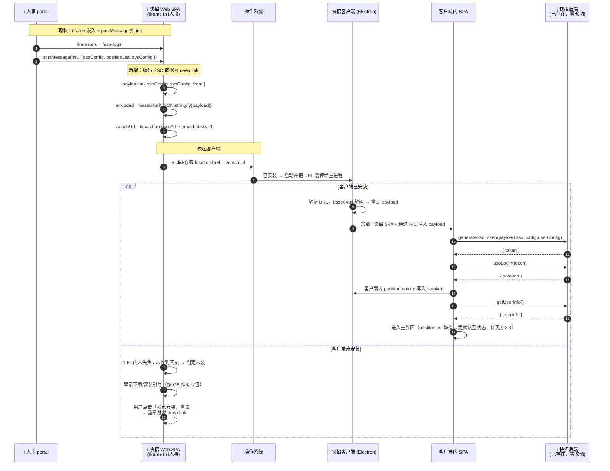

# i 人事 → 客户端唤起 + SSO 接力 + 插件能力迁移 计划（纯前端版）

> 目标：用户从 i 人事进入 `https://login.ihire365.com/sso-login` 时，自动唤起 i 快招 Electron 客户端并把 SSO 数据交接过去，登录在客户端内完成；客户端内完整实现原插件能力，不再展示任何"安装插件"提示。
>
> **范围声明**：本计划**不涉及后端改造**，所有改动落在 i 快招 Web SPA (`src/`) 与 Electron 客户端 (`electron/src/`) 两侧。SSO 数据通过 **deep link URL 直接编码**传递，不依赖后端中转接口。
>
> 适用分支：`feat/lewin`
>
> 制定时间：2026-05-06
>
> 关联文档：[`docs/ihr-integration.md`](./ihr-integration.md)、[`docs/plugin-bridge.md`](./plugin-bridge.md)

---

## 目录

- [1. 用户场景与目标](#1-用户场景与目标)
- [2. 整体流程](#2-整体流程)
- [3. 关键技术决策](#3-关键技术决策)
- [4. 任务拆解](#4-任务拆解)
- [5. 接口契约](#5-接口契约)
- [6. 验收标准](#6-验收标准)
- [7. 风险与回退](#7-风险与回退)
- [8. 里程碑与排期建议](#8-里程碑与排期建议)
- [9. 待确认事项](#9-待确认事项)

---

## 1. 用户场景与目标

### 1.1 三种用户路径

| # | 场景 | 现状 | 目标 |
| --- | --- | --- | --- |
| A | 用户在 i 人事 portal 里点"i 快招"菜单 | iframe 嵌入 `/sso-login` Web 页面，调用插件 | iframe 加载 `/sso-login` 后立即尝试唤起客户端；唤起成功后 iframe 内显示"已为您打开客户端"；唤起失败显示下载/手动打开界面 |
| B | 用户已装客户端，二次进入 | 同上（仍走 Web） | iframe 内自动 deep link → 客户端被唤起 → 客户端内完成 SSO |
| C | 用户首次安装客户端后，i 人事侧自动检测 | 无能力 | 客户端开 single-instance + 监听协议；deep link 触发后客户端从待机/最小化变前台 |

### 1.2 设计目标

1. **i 人事用户 0 学习成本**：不修改 i 人事侧的代码，他们仍按现在的方式 iframe 嵌入 `/sso-login` 即可。
2. **数据交接安全**：SSO 数据用 base64url 编码直接放在 URL 中（不含真正的密钥/satoken，只是一次性可消费的 SSO ticket payload）。
3. **客户端模式无插件提示**：客户端内嵌的 SPA 运行时可识别"我已经在 Electron 里"，全部插件相关 UI 短路。
4. **插件能力对齐**：原插件提供的 cookie / header 抓取、universalRequest、截图等能力，在 Electron 里全部以等价 API 实现。
5. **平稳过渡**：插件不立即下线，老版本浏览器（未装客户端）仍可降级走插件。
6. **不依赖后端改造**：本期只涉及 Web SPA + Electron 两侧。

### 1.3 非目标

- 不打算改 i 人事侧任何代码。
- **不打算让后端做任何改造**。所有现有 SSO 接口 (`generateSsoToken` / `ssoLogin` / `getUserInfo` / `createChat`) 沿用，调用方从"Web 浏览器"变成"Electron 客户端"，对后端透明。
- 暂不做客户端的"自动更新"（独立任务，本计划仅留 hook）。
- 不在本次计划内重构 SPA 的 SSO 业务流程。

---

## 2. 整体流程



---

## 3. 关键技术决策

### 3.1 自定义 URL Scheme

| 选项 | 决定 |
| --- | --- |
| Scheme 名称 | **`ikuaizhao://`**（已拍板）|
| 版本号位置 | **不**在协议名里加（不写 `ikuaizhao1://`），版本走 URL query `?v=1`（参考 `slack://` / `notion://` 业界惯例，避免协议升级时同时存在多个 scheme handler）|
| 路径设计 | `ikuaizhao://<action>?d=<base64url>&v=1` —— path 留作 action 区分（`sso` / `import-resume` / `open-chat` 等未来扩展）|
| 注册方式 | Electron `app.setAsDefaultProtocolClient('ikuaizhao')`，macOS 走 `open-url` 事件，Windows/Linux 走 `second-instance` + `process.argv` |
| 单实例 | `app.requestSingleInstanceLock()`，防止 deep link 触发多个客户端实例 |

### 3.2 客户端是否已安装的探测

浏览器没有可靠的同步 API 检测自定义协议是否注册（Chrome 113+ 的 `navigator.registerProtocolHandler` 不解决"已注册"探测，`getInstalledRelatedApps` 仅 PWA），常用是"尝试 + 超时"：

**采用方案：尝试唤起 + 多信号融合判定**

```js
// SPA 端伪代码
async function tryLaunchClient(launchUrl) {
  let launched = false;

  // 信号 1：blur / visibilitychange（客户端唤起后浏览器会失去焦点）
  const onBlur = () => { launched = true; cleanup(); };
  const onHidden = () => {
    if (document.visibilityState === 'hidden') { launched = true; cleanup(); }
  };
  window.addEventListener('blur', onBlur);
  document.addEventListener('visibilitychange', onHidden);

  // 信号 2：客户端启动后回 postMessage（最可靠 - 客户端启动后向 i 人事 portal 推送）
  // 客户端拿到 payload 后通过 BroadcastChannel 或 localStorage 标记
  // 详见 § 3.3 二次确认机制

  // 触发协议（用 anchor click 而非 location.href，绕过 iframe 限制）
  const a = document.createElement('a');
  a.href = launchUrl;
  a.style.display = 'none';
  document.body.appendChild(a);
  a.click();
  a.remove();

  // 1500ms 后判定
  await new Promise(r => setTimeout(r, 1500));
  cleanup();
  return launched;

  function cleanup() {
    window.removeEventListener('blur', onBlur);
    document.removeEventListener('visibilitychange', onHidden);
  }
}
```

> **iframe 兼容性**：`location.href = 'ikuaizhao://...'` 在 Chrome 已开始限制（third-party initiated navigation）。改用 `<a>` 元素 + 用户手势触发的 click 方式，浏览器把它视作用户主动行为，目前 Chrome / Edge / Firefox 都接受。如果实际测试发现仍被拦截，再考虑 § 7.3 的备选方案。

### 3.3 SSO 数据传递（核心：URL 编码 + 大小裁剪）

**协议**：

```
ikuaizhao://sso?d=<base64url-encoded-payload>&v=1
```

`payload` 是 JSON：

```json
{
  "ssoConfig": {
    "userConfig": {
      "tenantCode": "company_a",
      "apiKey": "...",
      "signature": "...",
      "thirdPartyUserId": "...",
      "userData": { "username": "...", "nickname": "...", "email": "...", "phone": "...", "avatar": null },
      "extendData": { "from": "recruit-assistant", "plan": "PlanA", "headcountId": "..." }
    }
  },
  "sysConfig": { "color": "#1976D2" },
  "from": "ihr-recruit-assistant",
  "ts": 1730889600000
}
```

**编码**：

```js
const json = JSON.stringify(payload);
const encoded = btoa(encodeURIComponent(json))
  .replace(/\+/g, '-').replace(/\//g, '_').replace(/=+$/, '');  // base64url
const launchUrl = `ikuaizhao://sso?d=${encoded}&v=1`;
```

**大小估算**（基于 SSOLogin.vue 现有数据结构）：

| 字段 | 原始字节 | base64 后 |
| --- | --- | --- |
| `ssoConfig.userConfig`（不含 jd） | ~600 B | ~800 B |
| `sysConfig.color` | ~30 B | ~50 B |
| `from` + `ts` | ~60 B | ~80 B |
| **合计**（不含 positionList） | **~700 B** | **~950 B** |

**URL 长度限制**：

| 平台 | 实测安全上限 | 说明 |
| --- | --- | --- |
| macOS | ~16KB | 通过 `NSAppleEventManager` 传递，宽松 |
| Windows | ~2KB | 通过注册表 + 命令行参数，最严 |
| Linux | ~4KB | 依赖 `.desktop` launcher |

**结论**：不带 `positionList` 的 payload (~950 B) 全平台安全通过。

### 3.4 positionList 退化处理

`positionList` 在原 iframe 流程中用于 `createChat(positionList)`，目的是首次登录时把 i 人事推送的招聘职位预创建成 chat。它体积可能很大（每条带 JD 文本，单条 2-5KB，多条累计 10-30KB），**塞不进 deep link**。

**MVP 退化策略**：客户端唤起时**不传 positionList**，登录后客户端 SPA 调用现有 `getChatList()` 拉取已有会话列表（如果用户之前在 web 端创建过的会话），不调用 `createChat`。

| 用户类型 | 退化前 (web 模式) | 退化后 (客户端模式 MVP) |
| --- | --- | --- |
| 首次进入的新用户 | 自动看到 N 个职位对应的 chat | 看到空列表，需手动新建或等下次进入时显示已存在的 |
| 老用户 | 自动看到原有 chat 列表 | 同样看到原有 chat 列表（来自 `getChatList`）|
| 在 i 人事内点过职位再来 | 看到 N 个职位的 chat | 同左（需后端配合，暂搁置） |

**升级路径**（后续不在本计划内）：

- v2 思路 A：让 i 人事主动调一次轻量 API 把 positionList 关联到当前用户，客户端登录后 `getChatList` 自然能查到。
- v2 思路 B：本机本地缓存（`chrome.storage` → `localStorage`）持久化 positionList，客户端启动时从本地缓存读取。但跨进程（Web 浏览器 ↔ Electron）的 storage 不互通，得通过 [§ 7.3](#73-顶层与-iframe-的协议触发) 描述的"localStorage 中转 + Electron 内嵌 webview 同源读取"方案，复杂度较高。

### 3.5 客户端识别"我在 Electron 里"

Electron preload 注入全局标识，SPA 启动时探测：

```ts
// electron/src/preload/index.ts (扩展)
contextBridge.exposeInMainWorld('__IKUAIZHAO_NATIVE__', {
  version: process.env.APP_VERSION,
  platform: process.platform,
  arch: process.arch,
  mode: 'electron',
});
contextBridge.exposeInMainWorld('api', {
  recruitBridge: { /* ... 见 plugin-bridge.md § 6 */ },
  handover: {
    getPendingPayload: () => ipcRenderer.invoke('handover:getPending'),
  },
  app: {
    relaunch: () => ipcRenderer.invoke('app:relaunch'),
    onDeepLink: (cb: (payload: any) => void) => {
      const handler = (_e: any, payload: any) => cb(payload);
      ipcRenderer.on('app:deep-link', handler);
      return () => ipcRenderer.removeListener('app:deep-link', handler);
    },
  },
});
```

SPA 启动 boot 阶段：

```js
// src/boot/runtime-mode.js (新增)
import { boot } from 'quasar/wrappers'

export default boot(({ store }) => {
  const isElectron = !!window.__IKUAIZHAO_NATIVE__;
  store.commit('runtime/setMode', isElectron ? 'electron' : 'browser');
  store.commit('runtime/setNativeInfo', window.__IKUAIZHAO_NATIVE__ ?? null);
});
```

### 3.6 客户端内 SPA 加载方式

客户端通过 `WebContentsView` 加载本地或远端的 i 快招 SPA。两种部署选择：

| 方案 | 优点 | 缺点 |
| --- | --- | --- |
| A：直接加载远端 `https://login.ihire365.com` | 0 部署成本，SPA 改动直接生效 | 要求用户在线；client / web 不同步时易出 bug |
| B：客户端内打包静态版本 | 离线可用，版本固定可控 | 每次 SPA 改动要重发客户端 |

**推荐方案 A 起步**，等稳定后再考虑 B 或者"主框架本地 + 内嵌 webview"的混合方案。

### 3.7 客户端内 SPA 进入入口

**简化原则**：客户端内行为与 web 浏览器访问保持一致——默认进主页 `/`，未登录就跳 `/login`，不做特殊 onboarding。

启动逻辑：

```ts
// electron/src/main/index.ts (伪代码)
async function decideStartUrl(deepLink: SsoHandoverPayload | null): Promise<string> {
  const baseUrl = isDev ? 'http://localhost:9000' : 'https://login.ihire365.com';

  if (deepLink) {
    // 通过 deep link 唤起：进 sso 接力页（带 source=client 标识）
    return `${baseUrl}/sso-login?source=client`;
  }

  // 用户主动打开客户端（双击图标 / dock）：直接进主页
  return `${baseUrl}/?source=client`;
}
```

加载后渲染端的处理：

1. 走 `runtime-mode` boot → 识别 `mode === 'electron'`，写入 vuex
2. SPA 路由守卫照常工作（`requiresAuth` 检查 satoken cookie）：
   - 已登录：进 `/`
   - 未登录：跳 `/login`
3. 如果是 deep link 唤起的（路径是 `/sso-login`），SSO 页调 `window.api.handover.getPendingPayload()` 拿到 payload 后走 `useSsoFlow`（M0.3 抽取出来的复用逻辑）→ 完成 SSO → `router.push('/')`

---

## 4. 任务拆解

### M0 准备工作（独立任务，不阻塞主线）

| ID | 内容 | 输出 |
| --- | --- | --- |
| M0.1 | 修复 `SSOLogin.vue` 中 `from === 'recruit-workflow'` 被拒绝的 bug（参考 `ihr-integration.md § 9.1`）| PR |
| M0.2 | 移除 / 隐藏 `/sso-login2` 路由，避免 `test3` 测试账号被生产环境暴露（参考 `ihr-integration.md § 9.2`）| PR |
| M0.3 | 抽取 `SSOLogin.vue` 中的 `handleSSOLogin(iframeMessage)` 为纯函数 hook（`useSsoFlow`），让 deep link 模式可以复用 | PR |

---

### ~~M1 后端改造~~（不做，已剔除）

> 已删除。本期不依赖任何新后端接口。SSO 数据完全通过 URL 编码传递。

---

### M2 Web SPA 改造

| ID | 内容 | 输出 |
| --- | --- | --- |
| M2.1 | `SSOLogin.vue` 重构：收到 `iframeMsg.on("init")` 后**先**尝试编码 payload + 唤起客户端；唤起成功显示"已为您打开客户端"页；唤起失败再 fallback 到原 SPA SSO 流程 | PR |
| M2.2 | 新增 `useClientLauncher.js` hook：实现 `tryLaunchClient(payload)` —— 内含 base64url 编码、anchor click 触发、blur/visibility 探测、超时回调 | 单测 |
| M2.3 | 新增 `pages/login/ClientLanding.vue`：唤起失败时显示的下载/重试页（按 `navigator.platform` 推 `.dmg` / `.exe` / `.AppImage`）；带"我已安装，重试"按钮 | UI 走查 |
| M2.4 | 新增 `src/boot/runtime-mode.js`：根据 `window.__IKUAIZHAO_NATIVE__` 写入 vuex `runtime/mode` | PR |
| M2.5 | 改 `PluginInstallDialog.vue`：`runtime.mode === 'electron'` 时强制不弹；改 `pluginVersion.js` 在客户端模式下直接返回客户端版本号 | PR |
| M2.6 | 改 `iframeMessenger`：客户端模式下 `targetWindow = null` 或 noop（i 快招在客户端里时没有"父 iframe"，所有 i 人事相关消息都在 deep link 之前已经接收完毕） | PR |
| M2.7 | 新增 `src/util/deepLinkCodec.js`：base64url 编解码 + 大小校验（超过 1.5KB warn，超过 4KB 拒绝），SPA 和 Electron 共用 | 单测 |

### M3 Electron 客户端：协议唤起 + SSO 接力

| ID | 内容 | 输出 |
| --- | --- | --- |
| M3.1 | `app.setAsDefaultProtocolClient('ikuaizhao')` + `app.requestSingleInstanceLock()` | PR |
| M3.2 | macOS：`app.on('open-url', (e, url) => …)`；Windows/Linux：`app.on('second-instance', (_e, argv) => …)` 解析 deep link | PR |
| M3.3 | 新增 `electron/src/main/handover.ts`：解析 deep link URL 中的 `?d=<base64url>` → 解码 → 缓存 pending payload；提供 `ipcMain.handle('handover:getPending', ...)` 给渲染端取数 | PR |
| M3.4 | macOS 冷启动 deep link 处理：在 `main.ts` 顶部立即 `app.on('open-url')` 注册 listener 并缓存 URL，等渲染端 `app:deep-link` 事件就绪后再 forward | PR |
| M3.5 | Windows/Linux 冷启动 deep link 处理：`app.whenReady` 后扫一遍 `process.argv`，找出 `ikuaizhao://...` 参数 | PR |
| M3.6 | 渲染端 boot：监听 `window.api.app.onDeepLink` → 解析 path/query → 调 `getPendingPayload` → 走 `useSsoFlow`（M0.3 抽取出来的）→ 调 `generateSsoToken` / `ssoLogin` → 把 satoken 写到对应 partition cookie | PR |
| M3.7 | 主窗口启动顺序优化：未触发 deep link 时显示"等待登录"或登录引导；触发 deep link 后自动 push 到主页 | PR |
| M3.8 | 客户端版本号通过 `process.env.APP_VERSION`（构建时注入 `package.json.version`） | PR |
| M3.9 | preload 暴露 `window.__IKUAIZHAO_NATIVE__` + `window.api.{handover,recruitBridge,app}` | PR |

### M4 Electron 客户端：插件能力替代

> 详细方案参考 `docs/plugin-bridge.md § 6 / § 7`，本里程碑只列任务条目。

| ID | 内容 | 输出 |
| --- | --- | --- |
| M4.1 | `electron/src/main/recruitBridge/site-sessions.ts`：为 4 个招聘网站创建 partition + 挂 webRequest header 拦截器（替代 `BASE_CONFIG/setBaseConfig`）| PR |
| M4.2 | 改 Origin 规则：`session.webRequest.onBeforeSendHeaders` 中改写 `Origin`（替代 `UPDATE_ROLES_CONFIG`）| PR |
| M4.3 | `recruit:universalRequest` IPC handler：用 `net.fetch({ session })` 实现，自动带 partition cookie | PR |
| M4.4 | `recruit:universalRequestInTab` IPC handler：在已加载招聘网站的 `BrowserView` 里 `webContents.executeJavaScript` 注入 fetch（少数网站需要的 fingerprint 兼容路径） | PR |
| M4.5 | `recruit:enableImageCapture` IPC handler：复用现有前端 `html2canvas` 路径优先；DOM 抠图分支在对应站点 `BrowserView` 里 `executeJavaScript` 跑 `html2canvas` | PR |
| M4.6 | 各招聘网站登录引导面板：客户端 UI 加"账号 → 登录 BOSS / 智联 / 猎聘 / 51Job"入口，每个点开嵌入对应 `BrowserView` | PR |
| M4.7 | Web SPA 侧 `RecruitBridge` 抽象层落地（`PluginAdapter` + `ElectronAdapter`，详见 `plugin-bridge.md`）；`BasePluginManager.i360Request` 改为内部转发到 bridge | PR |

### M5 客户端打包与发布

| ID | 内容 | 输出 |
| --- | --- | --- |
| M5.1 | `electron-builder.yml` 配置三平台目标：macOS（`.dmg`，arm64+x64 universal）、Windows（`.exe` NSIS x64）、Linux（`.AppImage`） | 配置 |
| M5.2 | 在 `build.protocols` 里声明 `ikuaizhao` scheme（macOS Info.plist + Windows 注册表 NSIS 段） | 配置 |
| M5.3 | **沿用现有插件下载站**：跟运维确认 `/plugin/getDownloadUrl` 接口当前返回的 URL 域名，在同一站点新增 `/client/` 子路径托管三平台安装包 + `manifest.json`。模板：`https://<download-host>/client/ikuaizhao-{version}-{platform}.{ext}` | 部署 |
| M5.4 | `pages/login/ClientLanding.vue` 拉取 `<download-host>/client/manifest.json`（**纯静态文件，无后端 API**），自动选当前 OS 对应包 | PR |
| M5.5 | 客户端启动时检查更新：fetch 同一份 `manifest.json` → 对比 `process.env.APP_VERSION < manifest.minVersion` → 复用现有 `ForceUpdateDialog.vue`（文案改"插件" → "客户端"）+ 跳转下载页 | PR |
| M5.6 | macOS 公证 / Windows 代码签名（详见 [`docs/client-signing-guide.md`](./client-signing-guide.md)） | 证书申请 + CI |

### M6 灰度与回滚

| ID | 内容 | 输出 |
| --- | --- | --- |
| M6.1 | **前端**环境变量 `VITE_CLIENT_LAUNCH_ENABLED`：构建时关闭客户端唤起逻辑（紧急回滚开关）| 配置 |
| M6.2 | 前端环境变量 `VITE_CLIENT_LAUNCH_TENANTS`：白名单租户列表，灰度发布时只对特定 `tenantCode` 启用唤起逻辑 | 配置 |
| M6.3 | 旧浏览器 / 老插件用户兜底：唤起失败 + 检测到 plugin → 回到 plugin 路径完成登录 | PR |
| M6.4 | 灰度策略：先放给特定 `tenantCode` 的客户，观察 1 周；再全量 | 文档 |

---

## 5. 接口契约

### 5.1 自定义协议格式

```
ikuaizhao://<action>?<query>
```

| action | query | 用途 |
| --- | --- | --- |
| `sso` | `d=<base64url-payload>&v=1` | SSO 接力（M3）|
| `open-chat` | `chatId=<>&positionId=<>&v=1` | 从外部直接打开某个 chat（未来扩展） |
| `import-resume` | `resumeId=<>&v=1` | 简历快速导入（未来扩展） |

未识别的 action：客户端默认行为是把窗口拉前台。

#### `sso` action 的 payload 结构

`d` 参数是对下面 JSON 做 `base64url(encodeURIComponent(JSON.stringify(payload)))` 后的字符串。

```ts
interface SsoHandoverPayload {
  ssoConfig: {
    userConfig: {
      tenantCode: string;
      apiKey: string;
      signature: string;
      thirdPartyUserId: string;
      userData: {
        username: string;
        nickname: string;
        email?: string;
        phone?: string;
        avatar?: string | null;
      };
      extendData?: {
        from?: 'recruit-assistant' | 'recruit-workflow';
        plan?: string;
        headcountId?: string;
        sendJdAuth?: boolean;
      };
    };
  };
  sysConfig?: {
    color?: string;
  };
  from: string;        // postMessage init 里的 context.from，原样透传
  ts: number;          // 签发时间戳（毫秒），客户端校验不超过 5 分钟
  // positionList: 不传输（见 § 3.4）
}
```

#### 编解码示例

```ts
// SPA 编码
function encodePayload(payload: SsoHandoverPayload): string {
  const json = JSON.stringify(payload);
  const b64 = btoa(unescape(encodeURIComponent(json)));
  return b64.replace(/\+/g, '-').replace(/\//g, '_').replace(/=+$/, '');
}

// Electron 解码（main 进程，Node 环境）
function decodePayload(d: string): SsoHandoverPayload {
  const b64 = d.replace(/-/g, '+').replace(/_/g, '/');
  const json = Buffer.from(b64, 'base64').toString('utf8');
  return JSON.parse(decodeURIComponent(escape(json)));
}
```

> 这两个函数会同时存在于 `src/util/deepLinkCodec.js` (SPA) 和 `electron/src/main/util/deepLinkCodec.ts` (Node)，需要保持算法一致。

### 5.2 客户端 ↔ 渲染进程 IPC

| Channel | 方向 | 用途 |
| --- | --- | --- |
| `handover:getPending` | renderer → main | 取出 main 进程缓存的 deep link payload（已解码）|
| `app:deep-link` | main → renderer | main 进程收到新的 deep link 时主动推送给已就绪的渲染端 |
| `app:relaunch` | renderer → main | 主动重启客户端 |
| `recruit:*` | renderer → main | 见 `plugin-bridge.md § 6.3`，共 6 个 |

### 5.3 SPA 全局对象

```ts
declare global {
  interface Window {
    __IKUAIZHAO_NATIVE__?: {
      version: string;
      platform: NodeJS.Platform;
      arch: string;
      mode: 'electron';
    };
    api?: {
      recruitBridge: { /* see plugin-bridge.md */ };
      handover: {
        getPendingPayload(): Promise<SsoHandoverPayload | null>;
      };
      app: {
        relaunch(): Promise<void>;
        onDeepLink(cb: (payload: SsoHandoverPayload) => void): () => void;
      };
    };
  }
}
```

### 5.4 沿用的现有后端接口（零改动）

下面接口在 web 模式下已存在，客户端模式继续直接调用，**后端无感知**：

| 接口 | 调用时机 | 说明 |
| --- | --- | --- |
| `generateSsoToken(userConfig)` | deep link payload 解析后第一步 | 同 web 模式 |
| `ssoLogin(token)` | 拿到 token 后 | 写 satoken 到 cookie |
| `getUserInfo()` | satoken 写入后 | 拉用户信息 + extendData |
| `getChatList()` | 进入主页前 | 替代 `createChat(positionList)`，避免依赖 positionList |
| `forceUpdateConfig()` | 客户端启动时探测最低版本 | 沿用现有的"插件强制升级"接口 |

---

## 6. 验收标准

### 6.1 功能验收

- [ ] **场景 A**（已装客户端，i 人事内打开）：iframe 加载 `/sso-login` 后 1.5s 内客户端自动启动并完成登录，跳转主页。
- [ ] **场景 B**（已装客户端，已最小化）：deep link 触发后客户端从 dock / 任务栏被拉到前台，已登录态直接进入主页（无需重新 SSO）。
- [ ] **场景 C**（未装客户端）：iframe 内显示下载引导页，自动识别 OS 推荐对应安装包，"我已安装"按钮可重试。
- [ ] **场景 D**（旧浏览器，未装客户端，已装插件）：`VITE_CLIENT_LAUNCH_ENABLED=false` 构建版本下回退到 web + 插件登录路径，行为与现状完全一致。
- [ ] **场景 E**（客户端内）：所有插件相关 UI（`PluginInstallDialog`、版本提示）不出现；BOSS/智联/猎聘/51Job 的列表查询、简历详情、截图功能与插件版结果一致。
- [ ] **场景 F**（payload 退化）：客户端首次登录后 chat 列表为空（或显示历史会话），不报错；用户可正常新建 chat。

### 6.2 安全验收

- [ ] payload 中 `ts` 超过 5 分钟视为过期，客户端拒绝处理并提示重试。
- [ ] payload 解码失败 / 格式不合法时不崩溃，提示用户重新发起。
- [ ] deep link URL 中**不**含 satoken；payload 中只含 i 人事原始 SSO ticket，与 web 模式下推送给 iframe 的内容一致（不是新增暴露面）。
- [ ] Electron preload 通过 `contextIsolation: true` 隔离，渲染端无法直接访问 `ipcRenderer`。
- [ ] 同一个 deep link **不**做去重保护（无后端时无法可靠去重）；但进入主页后切换已登录账号会显式覆盖 satoken，行为可预测。

### 6.3 性能验收

- [ ] 客户端冷启动到主页可见 ≤ 4s（M2 macbook 基准）。
- [ ] 客户端模式下，BOSS 列表查询 P95 ≤ 2s（与插件版同等量级）。
- [ ] deep link 解码 + SPA boot ≤ 200ms。

### 6.4 可观测性验收

- [ ] 客户端有 deep link 触发计数、SSO 成功率、各招聘站点 cookie 抓取成功率指标（前端 sentry / 自建埋点）。
- [ ] SPA 侧有"客户端唤起成功率"埋点（成功 / 失败 / 用户手动重试）。

> ⚠️ 由于不做后端改造，**ticket 签发/消费指标无法在后端聚合**，可观测性主要靠前端埋点 + 前端 APM。

---

## 7. 风险与回退

### 7.1 浏览器对自定义协议的拦截

部分企业内浏览器（钉钉、飞书内置 webview）会拦截自定义协议跳转。

**应对**：

- iframe 内尝试唤起失败 → 落回 ClientLanding 页。
- 如果检测到是钉钉 / 飞书内置 webview（`navigator.userAgent` 匹配），直接隐藏唤起按钮，全量走 ClientLanding。

### 7.2 deep link 数据丢失

macOS：客户端**冷启动**时 deep link URL 可能在 `app.whenReady()` 之前就到达，必须在 `main.ts` 顶部 `app.on('open-url')` 立即注册（不要放在 `whenReady` 内），先缓存 URL，等渲染端 ready 后再 forward。

Windows/Linux：deep link 走 `process.argv`，`second-instance` 事件回调里取 `argv` 即可，但**首次启动**时 deep link 也在 `argv` 里，要在 `app.whenReady` 后扫一遍 `process.argv`。

### 7.3 顶层与 iframe 的协议触发

iframe 内执行 `location.href = 'ikuaizhao://...'` 在 Chrome 已开始限制（被视为"third-party initiated navigation"）。

**应对（按可行性排序）**：

1. **首选**：iframe 内创建一个不可见 `<a href="ikuaizhao://...">` + `a.click()`，浏览器把它视为用户手势触发，目前 Chrome / Edge / Firefox 都接受。
2. **备选**：检测当前不在顶层 → 通过 `window.top.postMessage({ type: 'ikuaizhao:launch', url })` 通知 i 人事 portal —— 但**这要求改 i 人事侧**，与本计划"不改 i 人事"约束冲突，仅作为最终兜底。
3. **可观测**：M2.2 任务里加一个 1d 的 spike 子任务，用真实 i 人事 iframe 环境实测方案 1 在 Chrome / Edge 下的成功率。

### 7.4 payload 在 URL 中的过期与重放

不依赖后端时无法做"消费一次后失效"。**对策**：

- payload 里加 `ts` 字段，客户端校验 `Date.now() - ts < 5 * 60 * 1000`（5 分钟过期），过期拒绝。
- 同一个 payload 重复唤起 → 客户端检测当前已有 satoken 且未过期 → 直接进主页，不走 SSO；这天然抑制了"同 payload 重复登录"的副作用。
- 不防恶意攻击者拿到 deep link 后伪造，但威胁模型成立的前提是攻击者已能读取用户的 i 人事 portal 内容，此时已经丢了。

### 7.5 客户端被强制升级时的 UX

如果客户端版本低于 `forceUpdateConfig` 返回的最低版本：

- 客户端启动后 `forceUpdateConfig()` 探测，弹"需要升级"对话框 + 一键打开下载页。
- 此期间 deep link payload 缓存在 main 进程内存，等用户升级重启后还能消费（但 5 分钟过期）。

### 7.6 用户多账号场景

i 人事支持同一台机器下多个账号切换。客户端模式下每次唤起都用新 payload → 新 satoken，**这会覆盖前一个账号的登录态**。

**约定**：每次 deep link 都强制重新 SSO，覆盖既有 satoken；不在客户端做"账号切换"。如果用户想切，回到 i 人事 portal 切，再唤起一次即可。

### 7.7 positionList 缺失对体验的影响

参见 § 3.4。MVP 接受这个降级。如果实测 PM/客户反馈强烈，再走 v2 升级路径（届时可能需要后端配合）。

---

## 8. 里程碑与排期建议

> 单位：人日（按 1 个全栈 + 1 个客户端测算；后端 0 投入）

| 里程碑 | 关键任务 | 时长 | 累计 |
| --- | --- | --- | --- |
| **M0** | bug 修复 + `useSsoFlow` 抽取 | 1 | 1 |
| ~~M1~~ | ~~后端 ticket 接力~~ | ~~0~~ | 1 |
| **M2** | SPA 改造（`SSOLogin.vue`、`useClientLauncher`、`ClientLanding.vue`、`runtime-mode` boot、`deepLinkCodec`、隐藏插件提示） | 3 | 4 |
| **M3** | Electron 唤起 + 协议注册 + payload 解码 + SSO 接力 | 3 | 7 |
| **M4** | 插件能力迁移（`recruitBridge` + 4 站 partition + universalRequest + 截图） | 5 | 12 |
| **M5** | 三平台打包 + 下载站静态文件 + ClientLanding 拉版本 | 2 | 14 |
| **M6** | 灰度开关 + 回滚预案 + 旧插件兜底 + 验收 | 1 | 15 |

**关键路径**：M0 → M2 → M3 是必经之路；M4 可与 M2/M3 并行（不阻塞唤起 demo）；M5/M6 需要 M3+M4 都到位。

**最小可演示版（MVP）**：完成 M0+M2+M3 即可演示"i 人事 → 唤起客户端 → 客户端内 SSO 登录"完整链路，预计 **7 人日**（比有后端的版本省 1.5 天）。MVP 内客户端可暂时 fallback 到老的 web/plugin 路径完成业务功能，不阻塞演示。

---

## 9. 已拍板事项 + 待确认事项

### 9.1 已拍板（2026-05-06）

| # | 决策 | 落地位置 |
| --- | --- | --- |
| 1 | **协议名 `ikuaizhao://`，版本走 query `?v=1`** | § 3.1 |
| 2 | **下载站复用现有插件下载站**，运维需要在同站点下新增 `/client/` 路径托管三平台安装包 + `manifest.json` | M5.3 |
| 3 | **客户端首次启动跟 web 一样**：默认进主页，未登录跳 `/login`，**不做** onboarding | § 3.7 / M3.7 |
| 4 | **自动更新机制复用插件那套**：客户端 fetch 静态 manifest.json 自检版本，UI 复用现有 `ForceUpdateDialog.vue` | M5.5 |
| 5 | **保留 web + 插件流程**：客户端是**额外**路径，老的 web/plugin 不做减法，唤起失败 fallback 到 web/plugin 路径，浏览器模式下插件提示照常弹 | M6.3、§ 1.2 |
| 6 | **不依赖任何后端改造** | 全文 |

### 9.2 待确认事项

1. **macOS 公证 / Windows 签名证书**：谁去申请？预算多少？参考 [`docs/client-signing-guide.md`](./client-signing-guide.md) 的清单和成本估算。
2. **数据隔离层级**：4 个招聘站的 partition 是按"客户端实例 ×4"还是"用户 ×4"？多账号场景怎么处理？
3. **positionList 退化是否可接受 (MVP)**：客户端首次登录后看到空 chat 列表（只显示历史会话），用户需要手动点"新建 AI 聊天"。这个体验降级是否能在 MVP 阶段被接受？
4. **现有插件下载站具体域名**：需要去后端管理面板 / `/plugin/getDownloadUrl` 接口实际响应里抓出来，确认运维是否能在同站点新增 `/client/` 路径。

---

## 10. 与有后端版本的差异（备查）

如果未来有资源做后端改造，下面是可以升级的能力（**不在本期范围**）：

| 能力 | 纯前端版（本期） | 有后端版（v2）|
| --- | --- | --- |
| SSO 数据传输 | base64url URL 编码，~1KB 上限 | Redis 中转 ticket，无大小限制 |
| `positionList` | MVP 阶段缺省 | 完整传递 |
| ticket 一次性消费 | 仅 `ts` 5 分钟过期，无去重 | 真正的"消费即失效" |
| 多账号去重 | 无 | 后端按用户去重 |
| 可观测性 | 仅前端埋点 | 后端 + 前端联合监控 |
| 协议升级路径 | 改 `v` 字段，需双端改 | 后端版本协商 |

如果产品验收后觉得 MVP 体验有缺陷，最大概率的两个升级触发点是：

1. `positionList` 缺失影响首次体验 → 需要后端接 `/handover` 接口
2. 安全合规要求"一次性 ticket 真去重" → 需要后端 Redis
