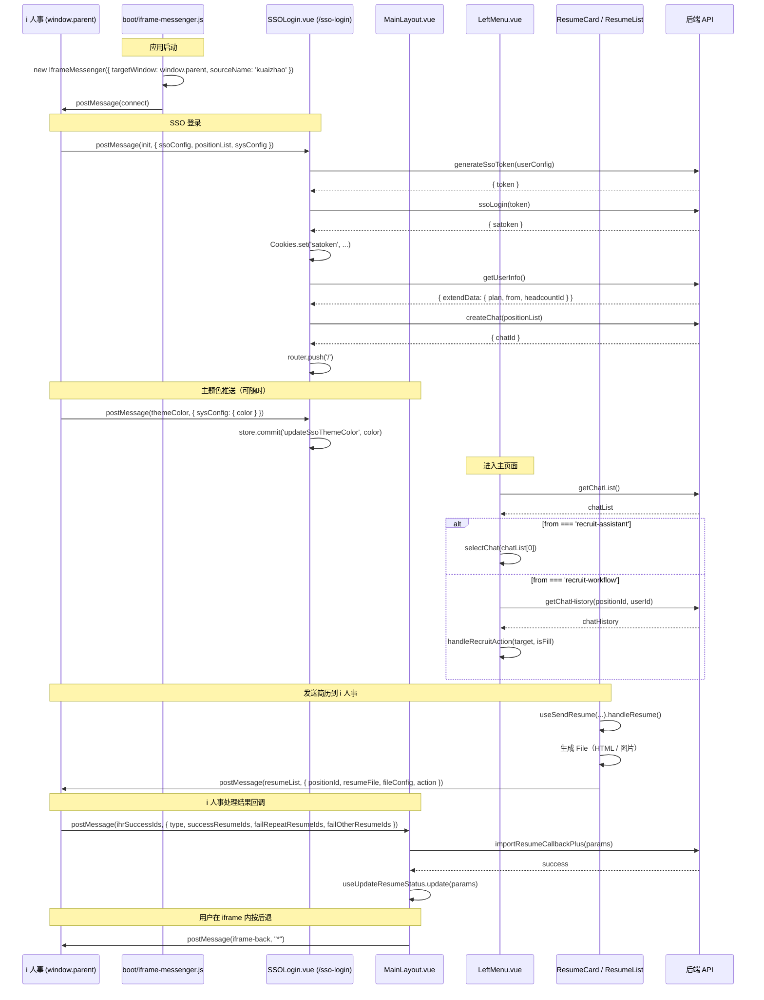

# i 快招 × i 人事融合架构梳理

> 当前文档面向 `irecruiting360-web-static` 仓库，整理"i 快招"以 iframe 形式被嵌入"i 人事"系统时所有相关代码、协议、Vuex 数据流和潜在问题，用于后续重构、维护、以及向 Electron 客户端迁移的参考。
>
> 适用分支：`feat/lewin`（Quasar 版本）
>
> 最近一次代码扫描时间：2026-05-06

---

## 目录

- [1. 通信底座：iframe postMessage 通道](#1-通信底座iframe-postmessage-通道)
- [2. 身份识别：当前是不是"在 i 人事里"](#2-身份识别当前是不是在-i-人事里)
- [3. 入口：SSO 登录](#3-入口sso-登录)
- [4. UI 行为切换](#4-ui-行为切换)
- [5. 数据双向流](#5-数据双向流)
- [6. postMessage 协议清单（接口契约）](#6-postmessage-协议清单接口契约)
- [7. Vuex 相关入口](#7-vuex-相关入口)
- [8. 全文件清单](#8-全文件清单)
- [9. 已知问题与重构机会](#9-已知问题与重构机会)
- [10. 整体时序图](#10-整体时序图)

---

## 1. 通信底座：iframe postMessage 通道

整个融合的根基是 `IframeMessenger`：i 快招做为 iframe，宿主页面（i 人事）作为 `window.parent`，双向异步消息通信。

### 1.1 Messenger 类（`src/util/iframeMessenger.js`）

特性：

- 校验 `event.data` 必须有 `type` + `from`，不在白名单 origin 的消息直接丢弃。
- 有 `messageId` 的消息走"请求-响应"模式，默认 15s 超时（`pendingMessages` 维护回调与定时器）。
- 优先用 `_lastReceivedOrigin`（最近一次收到的 origin）回发，避免无脑用 `*`，提升安全性。
- `connect()` / `disconnect()` 只发不等响应，destroy 时移除 message listener、清理 pending 定时器。

### 1.2 启动注入（`src/boot/iframe-messenger.js`）

通过 Quasar boot 文件全局注入到 `app.config.globalProperties.$iframeMessenger`：

- `targetWindow: window.parent`
- `sourceName: 'kuaizhao'`（i 快招对外的身份标识）
- 允许通信的宿主域名白名单：

  | 类别 | 规则 |
  | --- | --- |
  | 本地开发 | `http://192.168.50.225:3000` |
  | i 人事主站 | `^https://([\w-]+\.)?ihr360\.com$` |
  | i 人事测试域 | `^https://([\w-]+\.)?try-handy\.com$` |
  | i 人事另一测试域 | `^https://([\w-]+\.)?lethic\.cn$` |
  | 钉钉应用 | `^https://app\d+\.eapps\.dingtalkcloud\.com$` |

任何 Vue 组件内可通过 `getCurrentInstance().proxy.$iframeMessenger.on(...)` / `.post(...)` 与父系统通信。

---

## 2. 身份识别：当前是不是"在 i 人事里"

用户身份和模式判断都来自后端 `getUserInfo` 返回的 `extendData`，关键字段：

| 字段 | 含义 |
| --- | --- |
| `extendData.plan` | 套餐，`PlanA` 表示 i 人事融合企业 |
| `extendData.from` | 入口来源：`recruit-assistant`（菜单入口）/ `recruit-workflow`（候选人详情入口） |
| `extendData.headcountId` | 候选人详情页带过来的目标职位 id |
| `extendData.sendJdAuth` | 用户是否有"发送 JD"权限（影响 LeftMenu 招聘按钮 tooltip 文案） |

衍生判断（散落多处但语义一致）：

- **`visibleThirdSwitchPlus`** ≡ `extendData.plan === 'PlanA'`，融合模式总开关。
- **`isFromThirdMenu`** ≡ `extendData.from === 'recruit-assistant'`，从主菜单进入。
- **`isFromCandidateList`** ≡ `extendData.from === 'recruit-workflow'`，从候选人详情进入。

可复用工具：`src/hooks/usePlanVisibility.js`

```js
import { usePlanVisibility, isFromMenu, isFromCandidateList, isVisibleThirdA } from 'src/hooks/usePlanVisibility';

const { isVisible: visibleThirdSwitchPlus } = usePlanVisibility({
  visibleForPlans: ['PlanA'],
  defaultVisible: false,
});
```

> ⚠️ 当前 `visibleThirdSwitchPlus` 的等价判断在 `MainLayout.vue` / `LeftMenu.vue` / `AISearch.vue` / `ChatCard.vue` / `FloatingActionPanel.vue` 多处重复手写，并未统一走 `usePlanVisibility`。重构时建议替换。

---

## 3. 入口：SSO 登录

i 人事 iframe 加载 `/sso-login` 路由（`src/router/routes.js`），命中 `src/pages/login/SSOLogin.vue`：

### 3.1 监听父系统消息

```js
// src/pages/login/SSOLogin.vue
iframeMsg.on("init", (data, context) => {
  if (context.from !== "ihr-recruit-assistant") return;
  store.commit('changeAppStatus', { isSingleSignOn: true, sourceKey: context.from });
  iframeParams.value = data;
  updateGloalColor(data?.sysConfig?.color);
  handleSSOLogin(data);
  return Promise.resolve(true);
});

iframeMsg.on("themeColor", (data, context) => {
  if (context.from !== "ihr-recruit-assistant") return;
  return updateGloalColor(data?.sysConfig?.color);
});
```

### 3.2 SSO 登录流程

`handleSSOLogin(iframeMessage)` 三步走：

1. `generateSsoToken(ssoConfig.userConfig)` —— 用 i 人事推过来的 `userConfig` 换一次性 token。
2. `ssoLogin(token)` —— 用 token 换 satoken，写入 cookie：`Cookies.set('satoken', data, { path: '/', expires: 30 })`。
3. `getUserInfo()` → `store.commit('changeUserInfo', ...)` → `createChat(positionList)` → 保存 chatId → `router.push('/')`。

### 3.3 旁路：`/sso-login2`

`src/pages/login/SSOLogin2.vue` 把整个 SSO 请求体写死成 `test3` 测试账号、`onMounted` 自动跑——**仅供本地自测，生产环境不应暴露**。

---

## 4. UI 行为切换

被 `visibleThirdSwitchPlus` 触发的差异化渲染。

### 4.1 `src/layouts/MainLayout.vue`

- 顶部 `q-header` 的 class 在 `layout-header`(48px) / `layout-headerA`(0) 之间切换 → 融合模式下 header 完全隐藏。
- `onMounted` 时把 `headerHeight` 写到 vuex 用于下游组件重算位置。
- 监听 `popstate`，把浏览器后退转发给 i 人事：`iframeMsg.post("iframe-back", "*")`。
- 监听 `ihrSuccessIds` 消息（见 [5.2](#52-i-人事--i-快招通知导入结果)）。

### 4.2 `src/layouts/menu/LeftMenu.vue`

融合模式下：

- 顶部「新建 AI 聊天」按钮**隐藏**。
- 顶部换成「招聘中职位」标题 + 灰色提示条：「点击职位唤起 AI 招聘助理进行聚合简历推荐」（关闭后 `tipsStatus = false`）。
- 列表项右侧的「重命名 / 删除」更多操作**隐藏**。
- 改为右侧显示**招聘按钮**（`next_week` 图标），点击 → `handleRecruitAction(item)` → 把当前 chat item 的 `jd` 自动塞进 AI 输入框。
- Tooltip 文案根据 `planInfo.sendJdAuth` 动态变化。

聊天列表加载完成后的"自动选中"逻辑：

| 来源 | 行为 |
| --- | --- |
| `isFromThirdMenu` (`from === 'recruit-assistant'`) | 自动 `selectChat(formattedChatList[0])` |
| `isFromCandidateList` (`from === 'recruit-workflow'`) | 找 `positionId === headcountId` 的 chat，查询历史，若空则自动填 JD |

加上一个 1s 延迟、3 次重试的兜底机制（`tryAutoSelectFirstChat`），防止异步顺序导致没选中。

### 4.3 其他组件的偏移修正

因为 header 高度 48 → 0，下面这些组件需要重新计算定位：

| 文件 | 调整 |
| --- | --- |
| `src/components/resume/ResumeList.vue` | `styleTop = visibleThirdSwitchPlus ? "62px" : "110px"` |
| `src/components/common/FloatingActionPanel.vue` | 顶部偏移、宽度、`left/right` 全套偏移公式 |
| `src/components/common/ChatCard.vue` | 展开时占满除左侧菜单外整宽：`width: calc(100% - 280px); left: 280px` |
| `src/pages/search/AISearch.vue` | `styleTop = visibleThirdSwitchPlus ? "0px" : "48px"` |

---

## 5. 数据双向流

### 5.1 i 快招 → i 人事：发简历

`src/hooks/useSendResume.js` 是唯一的"出站业务"通道。

**核心载荷**：

```js
const payload = {
  positionId,            // 当前职位
  resumeFile: results,   // [{ id, file, channel, fileType, ... }]
  fileConfig: {
    type: 'html' | 'image',
    count
  },
  ...extraParams,        // 例如 { action: 'assign-position' | 'talent-pool' | 导入动作类型 }
};

return iframeMessenger.post(messageType, payload);
```

**简历内容生成**：

| 渠道 | DOM 生成器 |
| --- | --- |
| BOSS 直聘 | `bossDomGenerator()` |
| 智联招聘 | `zhiLianDomGenerator()` |
| 前程无忧 | `job51DomGenerator()` |
| 猎聘 | （待补，当前未在 hook 内分组） |

简历可选 HTML 文件 (`createHtmlFile` 内置完整 HTML 模板 + CSS + 可选压缩) 或图片 (`mergeBase64ToFile`)。

**调用方**：

| 文件 | 调用场景 | extraParams.action |
| --- | --- | --- |
| `src/components/resume/ResumeList.vue` | 批量导入 | 由调用处传入 |
| `src/components/resume/ResumeCard.vue` | 单条「分配职位」 | `'assign-position'` |
| `src/components/resume/ResumeCard.vue` | 单条「加入人才库」 | `'talent-pool'` |

### 5.2 i 人事 → i 快招：通知导入结果

唯一的"入站业务"通道，注册在 `MainLayout.vue`：

```js
iframeMsg.on("ihrSuccessIds", async (data, context) => {
  if (context.from !== "ihr-recruit-assistant") return;

  const params = [
    ...(data?.successResumeIds      || []).map(id => ({ id, type: data.type, status: "1", errorMsg: "" })),
    ...(data?.failRepeatResumeIds   || []).map(id => ({ id, type: data.type, status: "0", errorMsg: data.type === "ASSIGN_POSITIONS" ? "分配职位失败（重复简历）" : "加入人才库失败（重复简历）" })),
    ...(data?.failOtherResumeIds    || []).map(id => ({ id, type: data.type, status: "0", errorMsg: data.type === "ASSIGN_POSITIONS" ? "分配职位失败（其他原因）" : "加入人才库失败（其他原因）" })),
  ];

  const { success } = await importResumeCallbackPlus(params);
  if (success === "success") update(params);

  return Promise.resolve(true);
});
```

i 人事处理完简历后回调 `successResumeIds` / `failRepeatResumeIds` / `failOtherResumeIds`，i 快招调 `importResumeCallbackPlus` 把状态写回数据库，并通过 `useUpdateResumeStatus` 更新前端列表。

---

## 6. postMessage 协议清单（接口契约）

把所有 `iframeMsg.on(...)` 和 `iframeMessenger.post(...)` 串起来，就是这个融合系统对外的接口契约：

| 方向 | type | 触发位置 | 数据结构 | 说明 |
| --- | --- | --- | --- | --- |
| i 人事 → i 快招 | `init` | `SSOLogin.vue` | `{ ssoConfig: { userConfig }, positionList, sysConfig: { color } }` | 推送 SSO 配置和职位列表，触发 SSO 登录 + 创建 chat |
| i 人事 → i 快招 | `themeColor` | `SSOLogin.vue` | `{ sysConfig: { color } }` | 主题色变更，写入 `userColor` |
| i 人事 → i 快招 | `ihrSuccessIds` | `MainLayout.vue` | `{ type, successResumeIds, failRepeatResumeIds, failOtherResumeIds }` | 简历导入结果回调 |
| i 快招 → i 人事 | `connect` / `disconnect` | `iframeMessenger.connect()` 自动 | `{ status: 'connected' \| 'disconnected' }` | 生命周期信号 |
| i 快招 → i 人事 | `iframe-back` | `MainLayout.vue` (popstate) | `"*"` | 用户在 iframe 内按浏览器后退 |
| i 快招 → i 人事 | `resumeList` | `ResumeList.vue` / `ResumeCard.vue` | `{ positionId, resumeFile: [{ id, file, channel, fileType, ... }], fileConfig, action }` | 发送简历 File 列表 |

> 所有从 i 人事推送的消息，**`from` 字段必须为 `"ihr-recruit-assistant"` 才会被处理**（见 [9. 已知问题](#9-已知问题与重构机会) 第 1 条）。
> 所有从 i 快招发出的消息，`from` 固定为 `"kuaizhao"`（在 boot 文件里指定）。

---

## 7. Vuex 相关入口

| store key | 写入位置 | 读取位置 |
| --- | --- | --- |
| `getUserInfo.extendData` (`plan`/`from`/`headcountId`/`sendJdAuth`/...) | SSO 后 `getUserInfo()` 写入 | 几乎所有融合判断 |
| `changeAppStatus({ isSingleSignOn, sourceKey })` | `SSOLogin.vue` | （只在 SSO 完成那一刻 commit，目前没看到下游读取——存疑） |
| `updateSsoThemeColor(color)` | `SSOLogin.vue`（`themeColor` handler）| `src/store/modules/UserConfig.js` 的 `state.userColor`，主题相关组件读取 |
| `getLatestPositionId` / `getLatestChatId` | `LeftMenu.vue` 的 `selectChat` / `setVuexData` | `useSendResume` 拼 payload、各搜索组件 |
| `chatList` | `LeftMenu.vue` 的 `loadChatList` | `LeftMenu.vue` 渲染、自动选中逻辑 |
| `headerVisible` / `headerHeight` | `MainLayout.vue` 滚动监听 | 浮层定位组件 |

---

## 8. 全文件清单

迁移 / 重构时的完整文件列表（按职责分类）。

### 通信底层（必须迁）

- `src/util/iframeMessenger.js`
- `src/boot/iframe-messenger.js`

### 身份识别

- `src/hooks/usePlanVisibility.js`
- `src/router/routes.js`（`/sso-login`、`/sso-login2`）

### SSO 入口

- `src/pages/login/SSOLogin.vue`
- `src/pages/login/SSOLogin2.vue`（开发自测，可删）
- `src/pages/login/Logout.vue`
- `src/api/user/UserApi.js` 的 `generateSsoToken` / `ssoLogin` / `getUserInfo`
- `src/api/chat/ChatApi.js` 的 `createChat`

### 布局 / UI 差异化

- `src/layouts/MainLayout.vue`（隐藏 header、popstate、`ihrSuccessIds` 监听）
- `src/layouts/menu/LeftMenu.vue`（招聘中职位列表、自动选中、`handleRecruitAction`）
- `src/pages/search/AISearch.vue`
- `src/components/resume/ResumeList.vue`
- `src/components/resume/ResumeCard.vue`
- `src/components/common/FloatingActionPanel.vue`
- `src/components/common/ChatCard.vue`

### 出站 / 入站业务

- `src/hooks/useSendResume.js`（核心：把简历变 File 发出去）
- `src/api/jobList/JobListApi.js` 的 `importResumeCallbackPlus`

### Vuex

- `src/store/modules/UserConfig.js`（`updateSsoThemeColor`、`userColor`）
- 还有未找到定义文件的 `changeAppStatus` mutation（需补齐）

---

## 9. 已知问题与重构机会

### 9.1 [Bug] `SSOLogin.vue` 拒绝 `from === 'recruit-workflow'` 的 init

```js
iframeMsg.on("init", (data, context) => {
  if (context.from !== "ihr-recruit-assistant") return;
  // ...
});
```

但下游 `LeftMenu.vue` 里 `isFromCandidateList` 又依赖 `from === 'recruit-workflow'`，意味着候选人详情入口现在走不通 SSO，相关分支形同虚设。

**建议修复**：

```js
const ALLOWED_FROMS = ['ihr-recruit-assistant', 'recruit-workflow'];
iframeMsg.on("init", (data, context) => {
  if (!ALLOWED_FROMS.includes(context.from)) return;
  // ...
});
```

或者由 i 人事侧统一为 `ihr-recruit-assistant`，把"入口来源"放进 payload。

### 9.2 [Security] `SSOLogin2.vue` 写死了测试账号

`src/pages/login/SSOLogin2.vue` 中 `tokenData` 写死了 `test3` 测试账号，`onMounted` 自动登录。生产环境一旦暴露 `/sso-login2` 路由 = 全员免登。

**建议**：

```js
// src/router/routes.js
...(process.env.DEV ? [{
  path: '/sso-login2',
  component: () => import('pages/login/SSOLogin2.vue'),
}] : []),
```

或直接删除该文件，本地用环境变量 + `/sso-login` 真实流程跑。

### 9.3 [Refactor] `visibleThirdSwitchPlus` 重复定义

下面 5 个文件里都各自手写一遍：

```js
let visibleThirdSwitchPlus = computed(() =>
  ['PlanA'].includes(store.getters.getUserInfo?.extendData?.plan)
);
```

但 `usePlanVisibility` 已经准备好了。统一成：

```js
const { isVisible: visibleThirdSwitchPlus } = usePlanVisibility({
  visibleForPlans: ['PlanA'],
  defaultVisible: false,
});
```

涉及文件：`MainLayout.vue` / `LeftMenu.vue` / `AISearch.vue` / `ChatCard.vue` / `FloatingActionPanel.vue` / `ResumeList.vue`。

### 9.4 [Bug?] `changeAppStatus` mutation 找不到定义

`SSOLogin.vue` 里 commit `changeAppStatus`，但 grep 整个 `src/store/` 没找到 mutation 定义。如果 vuex 是严格模式应该会报警。需要确认是否漏了文件，或者干脆删掉这个 commit。

### 9.5 [Refactor] popstate 监听卸载时用错了 API

```js
// src/layouts/MainLayout.vue
onUnmounted(() => {
  window.removeEventListener('scroll', handleScroll);
  visibleThirdSwitchPlus.value && window.addEventListener('popstate', handleIframeBack);
  //                              ^^^^^^^^^^^^^^^^^^^^^^^ 应该是 removeEventListener
});
```

复制粘贴 bug，应是 `removeEventListener`。当前会导致每次组件卸载都多注册一次 popstate 监听器（虽然在 SPA 内 MainLayout 通常只挂载一次，问题不严重，但语义错误）。

---

## 10. 整体时序图



---

## 附：搬迁到 Electron 客户端时的对应关系

如果之后要把这套机制搬到 Electron 桌面客户端（取代 iframe 嵌入），可以这样映射：

| 当前（Web in iframe） | Electron 客户端 |
| --- | --- |
| `window.parent.postMessage(...)` | `ipcRenderer.send / invoke` 到 main 进程，再由 main 中转给 i 人事服务（或反过来） |
| `IframeMessenger` 全局注入 | preload 暴露 `window.electronAPI.bridge`，渲染进程封装成同样的 `on/post` API |
| origin 白名单 | main 进程做 IPC 调用方校验 + URL 白名单 |
| `iframe-back` | `BrowserWindow.webContents` 自身的导航事件，不再需要转发 |
| SSO 登录 | 不变，仍走 `generateSsoToken` / `ssoLogin`，但 satoken 改成 `session.fromPartition('persist:ihr360').cookies.set` 持久化 |
| 简历 File 上送 | 直接 HTTP POST 到后端，跳过 i 人事中转（因为客户端就是端到端） |

