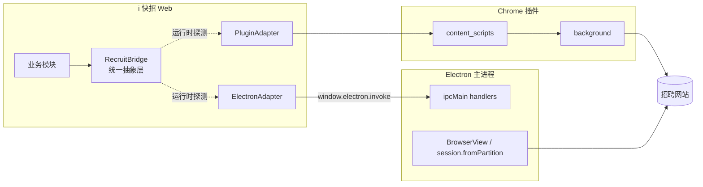

# i 快招 × 浏览器插件 / Electron 桥接架构

> 当前文档面向 `irecruiting360-web-static` 仓库，梳理 Web 端与浏览器插件 (`irecruiting360-plugin`) 的通信机制，并设计向 Electron 客户端迁移的双通道（插件 + Electron 双后端）抽象方案。
>
> 适用分支：`feat/lewin`
>
> 最近一次代码扫描时间：2026-05-06

---

## 目录

- [1. 总体架构](#1-总体架构)
- [2. 通信链路与协议](#2-通信链路与协议)
- [3. 插件能力清单（group / action）](#3-插件能力清单group--action)
- [4. 调用方梳理（业务模块 → 插件能力）](#4-调用方梳理业务模块--插件能力)
- [5. 当前 Electron 雏形](#5-当前-electron-雏形)
- [6. 迁移策略：双通道抽象](#6-迁移策略双通道抽象)
- [7. 各能力的 Electron 实现映射](#7-各能力的-electron-实现映射)
- [8. 落地路线图](#8-落地路线图)
- [9. 已知坑点](#9-已知坑点)

---

## 1. 总体架构

### 1.1 当前架构（仅插件）

```mermaid
flowchart LR
    subgraph Web[i 快招 Web (Quasar SPA)]
        Biz[业务模块 BossJobInfoManager / ZhiLianJobInfoManager / ...]
        BPM[BasePluginManager.i360Request]
        PM[PluginMessenger.sendMessage]
        Biz --> BPM --> PM
    end

    subgraph Plugin[Chrome 扩展 (Plasmo)]
        CS[content_scripts/job.ts]
        BG[background/index.ts]
        CS --> BG
    end

    PM -- "window.postMessage(payload)" --> CS
    CS -- "chrome.runtime.sendMessage" --> BG
    BG -- "fetch / chrome.storage / scripting" --> Sites[(BOSS / 智联 / 猎聘 / 51Job)]
    BG -- "msgResponse(responseData)" --> CS
    CS -- "window.postMessage(responseData)" --> PM
    PM -- "Promise.resolve" --> BPM
```

链路：**Web → window.postMessage → 插件 content script → chrome.runtime.sendMessage → 插件 background → fetch/chrome.storage → 原路返回**。

### 1.2 目标架构（插件 + Electron 双通道）



抽象层 `RecruitBridge` 对业务模块只暴露稳定 API（`getBossHeader()`、`bossUserStatus()`、`enableImageCapture()` 等），底层通过两套 Adapter 选择走插件还是 Electron。

---

## 2. 通信链路与协议

### 2.1 Web → 插件：`window.postMessage`

入口在 `src/pluginSrc/util/PluginSendMsg.js`：

```js
class PluginMessenger {
  static sendMessage(action, payload, timeout = 5000) {
    const messageId = uuidv4();
    payload.id = messageId;
    payload.action = action;

    return new Promise((resolve, reject) => {
      const responseHandler = (event) => {
        if (event.source !== window) return;
        if (event.origin !== window.location.origin) return;
        if (event.data?.action === 'response' + action && event.data.id === messageId) {
          cleanup();
          resolve(event.data);
        }
      };
      window.addEventListener('message', responseHandler);

      const timer = setTimeout(() => { cleanup(); reject(new Error('Request timed out')); }, timeout);
      window.postMessage(payload, window.location.origin);
      // ...
    });
  }
}
```

要点：

- 协议是 `window.postMessage`（**与父子 iframe 的 `iframeMessenger` 是不同通道**——i 人事用 `window.parent.postMessage`，插件用 `window.postMessage` 自己给自己）。
- 请求体里有 `id` (uuid) 和 `action`，响应的 action 必须是 `'response' + action`，通过 `id` 匹配 pending Promise。
- origin 校验：`event.origin !== window.location.origin` 直接丢弃（双方都在同一页面 window 内通信，所以 origin 相同）。
- 默认超时 5s。

调用门面：

```js
// src/pluginSrc/util/BasePluginManager.js
export const i360Request = async (action, emptyRequestTemplate, timeout = 5000) => {
  return await PluginMessenger.sendMessage(action, emptyRequestTemplate, timeout);
};
```

业务方都通过 `i360Request(action, payload)` 调用插件，**这是抽象层下沉时唯一需要替换的函数**。

### 2.2 插件内部：content script ↔ background

`irecruiting360-plugin/src/contents/job.ts` 监听 Web 端 postMessage，并转发给 background：

```ts
window.addEventListener('message', (event) => {
  if (!event.data?.action || event.data.action.startsWith('response')) return;
  if (event.source !== window) return;
  if (event.origin !== window.location.origin) return;

  const requestData = _.cloneDeep(event.data);
  const responseData = _.cloneDeep(requestData);
  responseData.action = 'response' + requestData.action;

  pluginOperation(requestData, responseData, event);
});

function pluginOperation(requestData, responseData, event) {
  chrome.runtime.sendMessage({ requestData, responseData, action: event.data.action }, (response) => {
    window.postMessage(response, event.origin);
  });
}
```

`content_scripts.matches` 决定哪些页面能用插件——目前白名单（`irecruiting360-plugin/src/contents/job.ts` config）：

```
http://127.0.0.1:8080/*
http://localhost:8080/*
http://localhost:8081/*
http://192.168.50.152:8080/*
http://192.168.50.225:{8080,3000}/*
http://192.168.20.214:{8080,8081}/*
http://192.168.20.225:80/*
http://124.220.47.104:80/*
http://117.72.40.2:80/*
http://192.168.110.200:8080/*
http://192.168.0.103:8080/*
https://124.220.47.104:80/*
https://login.ihire365.com/*
```

⚠️ 这是个白名单维护负担，每加一个新部署环境都要重打包发布插件。

### 2.3 background：路由分发

`irecruiting360-plugin/src/background/index.ts` 注册 `chrome.runtime.onMessage`：

```ts
const backRoundManagersConfig = {
  BASE_CONFIG: baseConfigManage,
  UNIVERSAL_REQUEST: universalRequestManage,
  UNIVERSAL_REQUEST_BACKGROUND_MAIN: universalRequestBackgroundMainManage,
  UPDATE_ROLES_CONFIG: UpdateRolesConfigFn,
  GET_PLUGIN_VERSION: getPluginVersion,
  ENABLE_IMAGE_CAPTURE: enableImageCaptureFn,
};

chrome.runtime.onMessage.addListener((message, sender, msgResponse) => {
  if (message?.requestData?.group && backRoundManagersConfig[message.requestData.group]) {
    backRoundManagersConfig[message.requestData.group](message, msgResponse);
  }
  return true;  // 允许异步响应
});
```

通过 `requestData.group` 字段路由到不同的 manager。

### 2.4 协议数据结构

请求/响应的统一模板（`getPluginEmptyRequestTemplate()`）：

```ts
{
  header: [],
  type: '',
  group: 'UNIVERSAL_REQUEST',           // 路由 key
  action: 'universalRequest',           // 业务动作
  id: '<uuid>',                         // 由 PluginMessenger 写入
  responseData: {
    data: null,
    success: false
  },
  parameters: null,                     // 业务参数 (任意 JSON)
  requestHeader: null,                  // 转发 HTTP 时的 headers
  requestPath: null,                    // 转发 HTTP 时的 URL
  tabUrl: null,                         // 借用哪个 tab 的上下文 (UNIVERSAL_REQUEST_BACKGROUND_MAIN 用)
  requestType: 'POST',
  requestCredentials: 'include',
  success: false
}
```

响应统一在 `responseData.responseData.data` 里返回，`responseData.success === true && responseData.responseData.success === true` 才算成功（参见 `pluginResultProcessor`）。

---

## 3. 插件能力清单（group / action）

| group | action | 用途 | 文件 |
| --- | --- | --- | --- |
| `BASE_CONFIG` | `setBaseConfig` | 注册 webRequest header 拦截器（保存 BOSS `zp_token`、智联 `X-Zp-Ai-Token`、猎聘 `X-Fscp-*`、51Job `Accesstoken` 等到 `chrome.storage.local`） | plugin: `background/config/BaseConfig.ts` |
| `BASE_CONFIG` | `setCookieConfig` | 注册 cookie 监听器，把各招聘站的 cookie 存到 storage | 同上 |
| `BASE_CONFIG` | `setDynamicRulesConfig` | 通过 `declarativeNetRequest` 改写 Origin 头（绕 CORS） | plugin: 暂时被注释，由 `UPDATE_ROLES_CONFIG` 替代 |
| `BASE_CONFIG` | `getBaseConfig` | 读 storage 取 headers / cookies | 同上 |
| `UNIVERSAL_REQUEST` | `universalRequest` | 在插件 background 上下文里发 `fetch`，**自动用浏览器原始 cookie**（受同源限制约束） | plugin: `background/request/UniversalRequest.ts` |
| `UNIVERSAL_REQUEST_BACKGROUND_MAIN` | `universalRequest` / `universalRequestRtText` | 在**目标网站的 tab 里**通过 `chrome.scripting.executeScript({ world: 'MAIN' })` 注入 `fetch`，能拿到那个 tab 的 cookie 和 storage —— 这是绕开 CORS 和拿登录态的核心招式 | plugin: `background/index.ts: universalRequestBackgroundMainManage` |
| `UPDATE_ROLES_CONFIG` | （隐式）| 通过 `chrome.declarativeNetRequest.updateDynamicRules` 注册 Origin 改写规则 | plugin: 由 `setPluginRules` 触发 |
| `GET_PLUGIN_VERSION` | （隐式）| 返回 `chrome.runtime.getManifest().version`，用作"插件已安装"探针 + 版本检查 | plugin: `background/index.ts: getPluginVersion` |
| `ENABLE_IMAGE_CAPTURE` | `enableImageCapture` | 让插件在指定 URL 列表上执行截图（boss/智联/猎聘/51job content scripts），返回 base64 数组 | plugin: `background/image/imageCapture.ts` + `contents/imageCapture*.ts` |

### 3.1 各招聘站点用到的 storage key

| 站点 | header storage | cookie storage | 抓取的 header |
| --- | --- | --- | --- |
| BOSS | `BoosStorageKey` | `BoosCookieStorageKey` | `zp_token` |
| 智联 | `ZHILIANRequestStorageKey` / `ZHILIANResponseStorageKey` | `ZHILIANCookieStorageKey` | `X-Zp-Ai-Token`、`X-Zp-Page-Code`、`Y-Zp-Business-Type`、`X-zp-page-request-id`(响应) |
| 猎聘 | `LIEPINRequestStorageKey` | `LIEPINCookieStorageKey` | `X-Fscp-Bi-Stat`、`X-Fscp-Std-Info`、`X-Xsrf-Token` |
| 51Job | `JOB51RequestStorageKey` / `JOB51URLASStorageKey` | `JOB51CookieStorageKey` | `Accesstoken`、`Guid`、`Terminaltype` |

每个站点的标准取数流程都是：

1. `getXxxHeaderInfo()` —— 调 `getBaseConfig` 拿 header storage
2. `getBaseConfig` —— 拿 cookie storage，合并到 `headers.Cookie`
3. 拼出完整 headers
4. 调 `universalRequest` 或 `universalRequestRtText` 转发 `fetch`

---

## 4. 调用方梳理（业务模块 → 插件能力）

| 业务能力 | 文件 | 用到的 group / action |
| --- | --- | --- |
| 检测插件是否安装 + 版本号 | `src/pluginSrc/util/pluginVersion.js: getPluginVersion()` / `needForceUpdate()` | `GET_PLUGIN_VERSION` |
| 启动时配置 webRequest 拦截 | `src/pluginSrc/config/PluginRequestManager.js: getPluginBaseConfig()` | `BASE_CONFIG` / `setBaseConfig` |
| 启动时配置 cookie 监听 | 同上 | `BASE_CONFIG` / `setCookieConfig` |
| 启动时改写 Origin 头 | `src/pluginSrc/util/BasePluginManager.js: setDefaultPluginRules()` | `UPDATE_ROLES_CONFIG` |
| BOSS 列表 / 简历详情 / 收藏 | `src/pluginSrc/channels/BossJobInfoManager.js` | `BASE_CONFIG/getBaseConfig` + `UNIVERSAL_REQUEST_BACKGROUND_MAIN` |
| 智联列表 / 简历详情 | `src/pluginSrc/channels/ZhiLianJobInfoManager.js` | 同 BOSS |
| 猎聘列表 / 简历详情 | `src/pluginSrc/channels/LIEPINJobInfoManager.js` | 同 BOSS |
| 51Job 列表 / 简历详情 | `src/pluginSrc/channels/Job51InfoManager.js` | 同 BOSS |
| 简历截图（多站点统一入口） | `src/pluginSrc/channels/ImageChannel.js: enableImageCapture()` | `ENABLE_IMAGE_CAPTURE` |
| 简历 HTML → 图片 base64（前端本地，不走插件） | `src/pluginSrc/channels/ImageChannel.js: htmlToImageBase64() / batchHtmlToImageBase64()` | 仅 `html2canvas`，不依赖插件 |

### 4.1 安装/版本检测的展示

`PluginInstallDialog.vue` 在 `AISearch.vue` 里被引用，触发条件是 `getPluginVersion()` 返回 null（说明 5s 内没收到响应 → 插件未装）。后续会引导用户去 Chrome 商店装。

---

## 5. 当前 Electron 雏形

`electron/` 子项目已经搭好了 `electron-vite` 模板：

- `electron/src/main/index.ts`：创建一个 `BrowserWindow` (900×670) + 一个 `WebContentsView` 直接加载 `https://login.ihire365.com`，用 `session.fromPartition('persist:mySiteSession')` 持久化登录态。
- `electron/src/preload/index.ts`：通过 `contextBridge.exposeInMainWorld('electron', electronAPI)` 暴露 `@electron-toolkit/preload` 提供的标准 API。**当前 `api = {}` 是空的，没有自定义业务 API**。
- `electron/src/main/ViewManager.ts`：管理弹出新窗口时的 `WebContentsView`，把外部 `window.open` 转成主窗口里嵌套的视图。

### 5.1 现状评估

- **架构正确**：Electron 当前就是把 `login.ihire365.com` 当成 iframe 套了一层壳，相当于"自己装了浏览器"。
- **缺业务 API**：preload 没有暴露任何"模拟插件"的 API，业务侧无法替换 `i360Request`。
- **没有 cookie / header 抓取通路**：插件的 `BASE_CONFIG` / `UNIVERSAL_REQUEST_BACKGROUND_MAIN` 在 Electron 这边都还没实现。

---

## 6. 迁移策略：双通道抽象

### 6.1 新增 `RecruitBridge` 适配层

**目标**：业务模块（`pluginSrc/channels/*`）不直接调 `i360Request`，改为调 `recruitBridge.universalRequest(...)`，由 bridge 内部根据运行时环境选择走插件还是 Electron。

```js
// src/recruitBridge/index.js (新增)
import { PluginAdapter } from './adapters/PluginAdapter';
import { ElectronAdapter } from './adapters/ElectronAdapter';

let activeAdapter = null;
let detectionPromise = null;

async function detectAdapter() {
  // 1. 先看 window.electron 是否存在（preload 注入）
  if (typeof window !== 'undefined' && window.electron && window.api?.recruitBridge) {
    return new ElectronAdapter();
  }

  // 2. 再用 GET_PLUGIN_VERSION ping 一次插件，2s 内有响应即认为已装
  const plugin = new PluginAdapter();
  if (await plugin.ping(2000)) {
    return plugin;
  }

  // 3. 都没有 → 引导用户安装插件或客户端
  return null;
}

export const recruitBridge = {
  async ready() {
    if (!detectionPromise) detectionPromise = detectAdapter();
    activeAdapter = await detectionPromise;
    return activeAdapter;
  },
  get mode() {
    return activeAdapter?.mode ?? 'none';   // 'plugin' | 'electron' | 'none'
  },

  // 统一 API（业务方调这些）
  async getVersion()                              { return (await this.ready()).getVersion(); },
  async getCapturedHeaders(storageKey)            { return (await this.ready()).getCapturedHeaders(storageKey); },
  async getCapturedCookies(storageKey)            { return (await this.ready()).getCapturedCookies(storageKey); },
  async universalRequest(req)                     { return (await this.ready()).universalRequest(req); },
  async universalRequestInTab(req)                { return (await this.ready()).universalRequestInTab(req); },
  async enableImageCapture(urls, timeoutMs)       { return (await this.ready()).enableImageCapture(urls, timeoutMs); },
};
```

### 6.2 PluginAdapter（包装现有逻辑）

```js
// src/recruitBridge/adapters/PluginAdapter.js
import { i360Request } from 'src/pluginSrc/util/BasePluginManager';
import {
  getPluginEmptyRequestTemplate,
  getPluginBaseConfigEmptyDTO,
  pluginAllGroup,
  pluginAllActions,
  pluginEnableImageCapture,
} from 'src/pluginSrc/config/PluginRequestManager';

export class PluginAdapter {
  mode = 'plugin';

  async ping(timeout = 2000) {
    const req = getPluginEmptyRequestTemplate();
    req.group = pluginAllGroup.Sys.GET_PLUGIN_VERSION;
    try {
      const r = await i360Request(req.action, req, timeout);
      return r?.responseData?.success === true;
    } catch { return false; }
  }

  async getVersion() {
    const req = getPluginEmptyRequestTemplate();
    req.group = pluginAllGroup.Sys.GET_PLUGIN_VERSION;
    const r = await i360Request(req.action, req);
    return r?.responseData?.data ?? null;
  }

  async getCapturedHeaders(storageKey) {
    const req = getPluginBaseConfigEmptyDTO();
    req.parameters = storageKey;
    const r = await i360Request(req.action, req);
    return r?.responseData?.data?.headersData ?? null;
  }

  async getCapturedCookies(storageKey) {
    const req = getPluginBaseConfigEmptyDTO();
    req.parameters = storageKey;
    const r = await i360Request(req.action, req);
    return r?.responseData?.data?.cookieData ?? null;
  }

  async universalRequest({ url, method, headers, body, credentials, tabUrl }) {
    const req = getPluginEmptyRequestTemplate();
    req.group = tabUrl
      ? pluginAllGroup.Sys.UNIVERSAL_REQUEST_BACKGROUND_MAIN
      : pluginAllGroup.Sys.UNIVERSAL_REQUEST;
    req.requestPath = url;
    req.requestType = method;
    req.requestHeader = headers;
    req.parameters = body;
    req.requestCredentials = credentials || 'include';
    req.tabUrl = tabUrl;
    return i360Request(req.action, req);
  }

  async enableImageCapture(urls, timeoutMs) {
    const config = pluginEnableImageCapture();
    return i360Request(config.action, { ...config, parameters: urls }, timeoutMs);
  }
}
```

### 6.3 ElectronAdapter（preload bridge）

**preload 侧**新增业务 API：

```ts
// electron/src/preload/index.ts
import { contextBridge, ipcRenderer } from 'electron'
import { electronAPI } from '@electron-toolkit/preload'

const recruitBridge = {
  getVersion:           () => ipcRenderer.invoke('recruit:getVersion'),
  getCapturedHeaders:   (storageKey: string) => ipcRenderer.invoke('recruit:getCapturedHeaders', storageKey),
  getCapturedCookies:   (storageKey: string) => ipcRenderer.invoke('recruit:getCapturedCookies', storageKey),
  universalRequest:     (req: any) => ipcRenderer.invoke('recruit:universalRequest', req),
  universalRequestInTab:(req: any) => ipcRenderer.invoke('recruit:universalRequestInTab', req),
  enableImageCapture:   (urls: any[], timeoutMs?: number) => ipcRenderer.invoke('recruit:enableImageCapture', urls, timeoutMs),
}

if (process.contextIsolated) {
  contextBridge.exposeInMainWorld('electron', electronAPI)
  contextBridge.exposeInMainWorld('api', { recruitBridge })
} else {
  // @ts-ignore
  window.electron = electronAPI
  // @ts-ignore
  window.api = { recruitBridge }
}
```

**main 侧** main 进程实现 IPC handlers：

```ts
// electron/src/main/recruitBridge/index.ts (新增)
import { ipcMain, session, BrowserWindow, WebContentsView } from 'electron'

const SITE_PARTITIONS = {
  BoosStorageKey:           'persist:ihr-boss',
  ZHILIANRequestStorageKey: 'persist:ihr-zhilian',
  LIEPINRequestStorageKey:  'persist:ihr-liepin',
  JOB51RequestStorageKey:   'persist:ihr-job51',
}
const capturedHeaders = new Map<string, Record<string, string>>()

// 在 main 侧用 session.webRequest 抓取 headers（等价于插件的 webRequest.onBeforeSendHeaders）
function attachHeaderCapture(partition: string, storageKey: string, watchHeaders: string[], urlFilter: string) {
  const ses = session.fromPartition(partition)
  ses.webRequest.onBeforeSendHeaders({ urls: [urlFilter] }, (details, callback) => {
    const picked: Record<string, string> = {}
    for (const h of watchHeaders) {
      const k = Object.keys(details.requestHeaders).find(x => x.toLowerCase() === h.toLowerCase())
      if (k) picked[h] = details.requestHeaders[k] as string
    }
    if (Object.keys(picked).length > 0) capturedHeaders.set(storageKey, picked)
    callback({ requestHeaders: details.requestHeaders })
  })
}

export function registerRecruitBridge() {
  // 启动时给每个站点的 session 挂上 webRequest 监听
  attachHeaderCapture('persist:ihr-boss',    'BoosStorageKey',           ['zp_token'],                    'https://www.zhipin.com/*')
  attachHeaderCapture('persist:ihr-zhilian', 'ZHILIANRequestStorageKey', ['X-Zp-Ai-Token','X-Zp-Page-Code','Y-Zp-Business-Type'], 'https://rd6.zhaopin.com/*')
  attachHeaderCapture('persist:ihr-liepin',  'LIEPINRequestStorageKey',  ['X-Fscp-Bi-Stat','X-Fscp-Std-Info','X-Xsrf-Token'],     'https://api-lpt.liepin.com/*')
  attachHeaderCapture('persist:ihr-job51',   'JOB51RequestStorageKey',   ['Accesstoken','Guid','Terminaltype'],                   'https://ehirej.51job.com/*')

  ipcMain.handle('recruit:getVersion', () => app.getVersion())

  ipcMain.handle('recruit:getCapturedHeaders', (_e, storageKey: string) => {
    return capturedHeaders.get(storageKey) ?? null
  })

  ipcMain.handle('recruit:getCapturedCookies', async (_e, storageKey: string) => {
    const partition = SITE_PARTITIONS[storageKey]
    if (!partition) return null
    // 取该 partition 下的全部 cookie 拼成 "k=v; k=v" 串（与插件返回格式一致）
    const ses = session.fromPartition(partition)
    const url = SITE_URLS[storageKey]
    const cookies = await ses.cookies.get({ url })
    return cookies.map(c => `${c.name}=${c.value}`).join('; ')
  })

  ipcMain.handle('recruit:universalRequest', async (_e, req) => {
    // main 进程直接发 fetch，不需要 cookie/origin 限制
    const partition = SITE_PARTITIONS[detectSiteFromUrl(req.url)]
    const ses = session.fromPartition(partition)
    // 用 net.fetch 走 session（自动带 cookie）
    const { net } = await import('electron')
    const resp = await net.fetch(req.url, {
      method: req.method,
      headers: req.headers,
      body: req.body ? JSON.stringify(req.body) : undefined,
      credentials: 'include',
    })
    return { responseData: { success: resp.ok, data: await resp.json() }, success: resp.ok }
  })

  ipcMain.handle('recruit:universalRequestInTab', async (_e, req) => {
    // 找已加载该网站的 BrowserWindow / WebContentsView，executeJavaScript 注入 fetch
    const view = findViewBySiteUrl(req.tabUrl)
    if (!view) return { success: false, responseData: { success: false } }
    const result = await view.webContents.executeJavaScript(`
      (async () => {
        const r = await fetch(${JSON.stringify(req.url)}, ${JSON.stringify({
          method: req.method, headers: req.headers, body: req.body, credentials: 'include'
        })});
        return await r.json();
      })()
    `)
    return { responseData: { success: true, data: result }, success: true }
  })

  ipcMain.handle('recruit:enableImageCapture', async (_e, urls, timeoutMs) => {
    // 在每个 url 对应的 BrowserView 里打开页面 → 注入 html2canvas → 拿 base64
    // 此能力 90% 可以在渲染进程用 html2canvas 直接做（已有 batchHtmlToImageBase64），
    // 不一定要走 main，详见 § 7.5
  })
}
```

### 6.4 业务方代码改动量

**最小迁移成本**做法：直接重写 `src/pluginSrc/util/BasePluginManager.js` 里的 `i360Request`，让它内部走 bridge：

```js
// src/pluginSrc/util/BasePluginManager.js (改造后)
import { recruitBridge } from 'src/recruitBridge';

export const i360Request = async (action, emptyRequestTemplate, timeout = 5000) => {
  await recruitBridge.ready();

  // 把现有的 group/action 模板转换成 bridge 参数
  switch (emptyRequestTemplate.group) {
    case 'GET_PLUGIN_VERSION': {
      const v = await recruitBridge.getVersion();
      return wrapResponse({ data: v });
    }
    case 'BASE_CONFIG': {
      if (emptyRequestTemplate.action === 'getBaseConfig') {
        // parameters 是 storageKey 字符串
        const isCookie = emptyRequestTemplate.parameters?.includes('Cookie');
        const data = isCookie
          ? { cookieData: await recruitBridge.getCapturedCookies(emptyRequestTemplate.parameters) }
          : { headersData: await recruitBridge.getCapturedHeaders(emptyRequestTemplate.parameters) };
        return wrapResponse({ data });
      }
      // setBaseConfig / setCookieConfig 在 Electron 下是启动时自动注册的，no-op
      return wrapResponse({ data: true });
    }
    case 'UNIVERSAL_REQUEST':
    case 'UNIVERSAL_REQUEST_BACKGROUND_MAIN': {
      const r = await (emptyRequestTemplate.tabUrl
        ? recruitBridge.universalRequestInTab({ ... })
        : recruitBridge.universalRequest({ ... }));
      return r;
    }
    case 'ENABLE_IMAGE_CAPTURE': {
      return recruitBridge.enableImageCapture(emptyRequestTemplate.parameters, timeout);
    }
    case 'UPDATE_ROLES_CONFIG':
      // Electron 下用 session.webRequest 改 header，启动时一次性配置；no-op
      return wrapResponse({ data: true });
  }
};
```

这样**业务方（`pluginSrc/channels/*`）一行不用改**，仅 `BasePluginManager.js` 内部改造一次。

---

## 7. 各能力的 Electron 实现映射

### 7.1 `BASE_CONFIG/setBaseConfig` (header 拦截)

| 插件 | Electron |
| --- | --- |
| `chrome.webRequest.onBeforeSendHeaders.addListener` | `session.fromPartition(p).webRequest.onBeforeSendHeaders` |
| `chrome.storage.local.set({ [storageKey]: { headersData } })` | 主进程内存 `Map<storageKey, headersData>` 即可（不需要持久化，每次启动会重新捕获） |

注：插件版那种 `extraHeaders` 模式拿到的是发送时刻的最终值，Electron 的 `webRequest.onBeforeSendHeaders` 行为一致。

### 7.2 `BASE_CONFIG/setCookieConfig` (cookie 抓取)

| 插件 | Electron |
| --- | --- |
| `chrome.cookies.getAll({ url })` 拼 `"k=v; k=v"` | `session.fromPartition(p).cookies.get({ url })` 同样格式 |

### 7.3 `UPDATE_ROLES_CONFIG` (Origin 改写)

| 插件 | Electron |
| --- | --- |
| `chrome.declarativeNetRequest.updateDynamicRules` 改 `Origin` | `session.fromPartition(p).webRequest.onBeforeSendHeaders` 中直接改 `details.requestHeaders.Origin = ...` |

### 7.4 `UNIVERSAL_REQUEST` / `UNIVERSAL_REQUEST_BACKGROUND_MAIN`

| 插件 | Electron |
| --- | --- |
| `fetch` in plugin background (插件域 cookie，受同源约束) | **`net.fetch(url, { session: ... })`** —— 自动带 partition 的 cookie，无 CORS |
| `chrome.scripting.executeScript({ world: 'MAIN', func: fetch })` 在目标 tab 的上下文里发 | `view.webContents.executeJavaScript('(async () => fetch(...))()')` 在加载该站点的 `WebContentsView` 里发，等价 |

**Electron 通常只需要 `net.fetch` 一种就够**——`UNIVERSAL_REQUEST_BACKGROUND_MAIN` 这种"借 tab 上下文"在 Electron 里没必要，因为 `net.fetch` 已经走了 session 的 cookie。如果某些站点对 fingerprint / TLS 校验严，就 fallback 到 `executeJavaScript` 方案。

### 7.5 `ENABLE_IMAGE_CAPTURE` (简历截图)

这个能力**最复杂**，涉及在招聘网站页面里跑 `html2canvas` 截图：

| 阶段 | 插件实现 | Electron 实现 |
| --- | --- | --- |
| 在目标站点的页面里执行 | content_scripts (`imageCaptureBoss.ts` / `imageCaptureZhiLian.ts` / `imageCaptureLiePin.ts` / `imageCapture51Job.ts`) | 在 `WebContentsView` 里 `executeJavaScript` 注入 html2canvas + 站点专属 DOM 选择器 |
| 把 base64 传回 | `chrome.runtime.sendMessage` | `executeJavaScript` 的返回值（直接拿 Promise 结果） |

**简化思路**：现在 i 快招前端已经有 `batchHtmlToImageBase64` (`src/pluginSrc/channels/ImageChannel.js`)，是用 `html2canvas` 在主页面渲染 HTML 抠图。如果 `bossDomGenerator()` / `zhiLianDomGenerator()` / `job51DomGenerator()` 已经能在前端拼出完整 HTML，那么截图就**不需要插件**——直接前端跑 `html2canvas` 即可，这部分 Electron 上完全等价（甚至更稳，因为没有跨域 iframe）。

留意：仅当某些字段必须从原网页 DOM 直接抠（HTML 模板拼不出来），才需要 Electron 在 `WebContentsView` 里跑 `html2canvas`。

### 7.6 `GET_PLUGIN_VERSION` (探针)

`recruitBridge.mode` 直接告诉业务侧当前是 `'plugin'` / `'electron'` / `'none'`。`PluginInstallDialog.vue` 改成在 `'none'` 时弹出，且增加"下载客户端"按钮。

---

## 8. 落地路线图

### Phase 1：基础设施（不破坏现有逻辑）

- [ ] 新建 `src/recruitBridge/` 目录，写 `index.js` + `PluginAdapter.js`，**`PluginAdapter` 完全包装现有 `i360Request` 行为**。
- [ ] 业务方先不动，仅在启动时通过 `recruitBridge.ready()` 探测一次，校验包装层和原有路径行为一致。

### Phase 2：Electron 适配器

- [ ] `electron/src/preload/index.ts` 暴露 `window.api.recruitBridge`。
- [ ] `electron/src/main/recruitBridge/` 新建模块，实现 7 个 IPC handler。
- [ ] 在 main 启动时：
  - 为每个站点创建独立 `session.fromPartition('persist:ihr-{site}')`
  - 给每个 partition 挂 `webRequest.onBeforeSendHeaders` 抓 headers
  - 给每个 partition 挂 `webRequest.onBeforeSendHeaders` 改 Origin（替代 `declarativeNetRequest`）
- [ ] 写一个 `ElectronAdapter.js` 对接 `window.api.recruitBridge`。

### Phase 3：业务切换

- [ ] 改 `src/pluginSrc/util/BasePluginManager.js` 的 `i360Request` 内部转发到 bridge。
- [ ] 全量回归：BOSS / 智联 / 猎聘 / 51Job 的列表 / 简历详情 / 截图。
- [ ] `PluginInstallDialog.vue` 增加"客户端模式"分支。

### Phase 4：登录态导引

Electron 模式下用户首次使用要先在客户端里登录各招聘站，这是关键体验点。建议：

- 在 i 快招主页面加"账号面板"：BOSS / 智联 / 猎聘 / 51Job 各自一个登录状态指示，点击展开就嵌入对应的 `BrowserView` 让用户登录。
- 状态判断：`recruitBridge.getCapturedHeaders('BoosStorageKey')` 返回非空且关键 header 存在 ⇒ 已登录。

### Phase 5：清理

- [ ] 推 Electron 客户端到稳定后，可以考虑插件转为"轻量补丁"（仅保留 cookie 抓取等不便在 Electron 实现的部分），或者完全停止插件分发。
- [ ] `src/pluginSrc/channels/*` 重命名 `src/recruitChannels/*`，去掉"plugin"耦合命名。

---

## 9. 已知坑点

### 9.1 `PluginMessenger.sendMessage` 的 timeout 默认值不一致

- `BasePluginManager.i360Request`：默认 5000ms
- `PluginStatus.pluginRequest`：默认 1000ms（并且把这个文件冷藏在 `src/pluginSrc/config/PluginStatus.js`，没其他地方用）

迁移到 bridge 时统一为 **5s 普通请求 / 30s 截图请求**（截图本来就 `urls.length * 15000`）。

### 9.2 `actions` 白名单形同虚设

```js
// src/pluginSrc/util/PluginSendMsg.js
const actions = ['HasPluginInstalled','BoosGetJobList','BoosGeekInfo'];
```

只列了 3 个，但实际业务用了一堆 `setBaseConfig` / `getBaseConfig` / `universalRequest` / `enableImageCapture`，这个数组完全没有起到校验作用。建议在 bridge 里改为按 group 白名单，不再维护 actions 列表。

### 9.3 `responseHandler` 的 origin 校验

```js
if (event.origin !== window.location.origin) return;
```

这条在 i 人事 iframe 嵌入场景下有效（i 快招自己页面 ↔ 自己页面），但如果 i 快招以后跨域嵌入（比如部署到 CDN），这条会把响应拒绝掉。注意。

### 9.4 `universalRequestBackgroundMainManage` 用的 `getTabId` 是 startsWith 匹配

只要任意 tab 的 URL 以 baseUrl 开头就被选中，多 tab 时谁先开谁先抢——可能拿到错误的 cookie。Electron 这边可以用 `partition` 严格隔离避免这个问题。

### 9.5 插件 `matches` 白名单维护成本

每加一个新部署环境（比如客户私有化部署到 `https://recruit.client-a.com`）就要重新打插件 + 让所有用户更新插件。Electron 直接根据 `recruitBridge.mode === 'electron'` 跳过该限制。

### 9.6 截图能力的真实归属

`ImageChannel.js` 里 `htmlToImageBase64` / `batchHtmlToImageBase64` 是**前端 html2canvas 跑的**，根本不依赖插件；只有 `enableImageCapture` 才走插件（让插件在原招聘网站页面里截）。建议梳理清楚每个简历哪个分支走的哪条路径，迁移 Electron 时优先复用前端纯 JS 路径。

---

## 附：完整文件依赖图

```
src/pluginSrc/
├── util/
│   ├── PluginSendMsg.js          ← postMessage 通信底层（迁移成 PluginAdapter）
│   ├── BasePluginManager.js      ← i360Request 门面（改造为 bridge）
│   ├── pluginVersion.js          ← 版本探测
│   ├── AsyncTaskQueue.js         ← 通用异步队列（与桥接无关）
│   ├── AsyncTaskQueueManager.js
│   ├── AsyncResumeProcessor.js
│   ├── ChannelUrlUtil.js         ← URL 工具（无关桥接）
│   ├── CannelManager.js
│   └── SearchParamUtils.js
├── config/
│   ├── PluginRequestManager.js   ← group/action/url 集中配置
│   └── PluginStatus.js           ← 重复的轻量门面，可删
├── verifyes/
│   └── PluginProcessor.js        ← 响应结构校验
└── channels/
    ├── BossJobInfoManager.js     ← 业务方
    ├── ZhiLianJobInfoManager.js
    ├── LIEPINJobInfoManager.js
    ├── Job51InfoManager.js
    ├── ALLJobInfoManager.js
    └── ImageChannel.js           ← 截图入口（部分前端、部分插件）

irecruiting360-plugin/src/
├── contents/
│   ├── job.ts                    ← postMessage 入口
│   ├── imageCaptureBoss.ts       ← BOSS 页面截图
│   ├── imageCaptureZhiLian.ts
│   ├── imageCaptureLiePin.ts
│   └── imageCapture51Job.ts
├── background/
│   ├── index.ts                  ← chrome.runtime 路由
│   ├── config/BaseConfig.ts
│   ├── boos/boos.ts
│   ├── image/imageCapture.ts
│   └── request/UniversalRequest.ts
└── popup.tsx                     ← 插件 popup UI（可保留）

electron/src/
├── main/
│   ├── index.ts                  ← 主窗口 + WebContentsView
│   └── ViewManager.ts            ← 多窗口管理
└── preload/
    └── index.ts                  ← contextBridge 注入（待加 recruitBridge）
```
